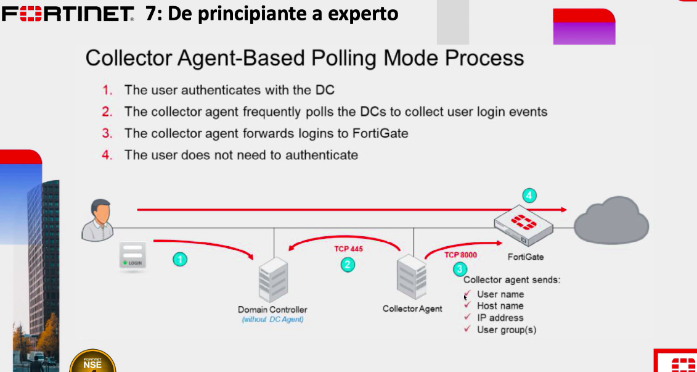
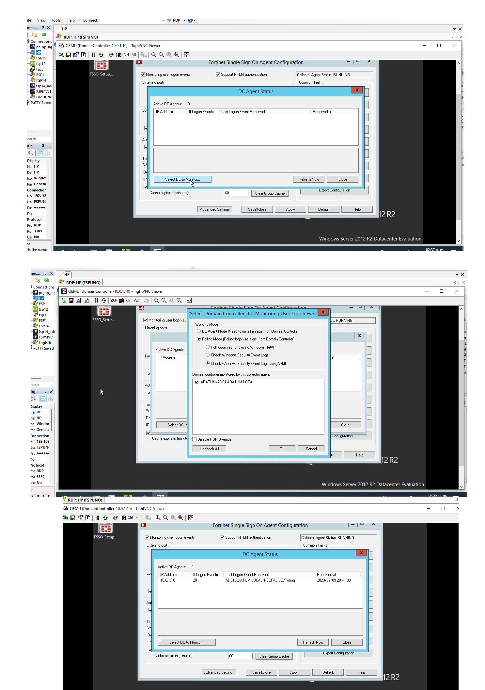
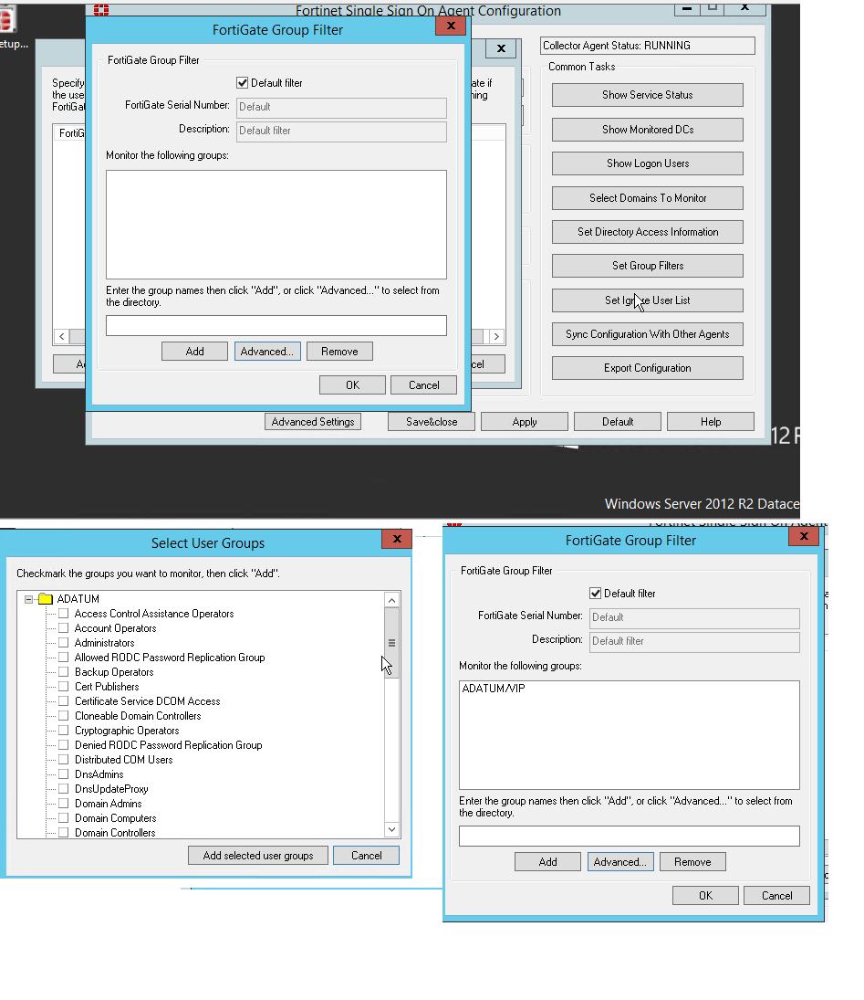

# Collector Agent-Based Polling Mode Process



En esta prueba usamos el mismo external connectors de la anterior prueba.

Para esta practica desde el usaurio administrator en el servidor vamos a desintalar el DC Agent (unistallar DC Agent) pero el collecto lo vamos a dejar, también requiere reinicio del controlador de dominio

Después del reinicio abrimos nuestro Agent configuration y vamos a dar click en Show Monitored DCs, click en Select DC

Ahí seleccionamos Pollig mode y check Windows (WMI) ya que es la más actual y hace un check cada 3 min.

Click en ok y después en Refresh



```
Ahora click en set group filter->Add->check Default filter->click en Advance->desplegamos la lista de ADATUM y check en VIP->click en Add selected user groups
```




También podemos configurar la opcion ignore user list
click en Add User->user2, aquí no funciona este filtro debido a que el filtro da prioridad a la ip y no al nombre de usuario.
