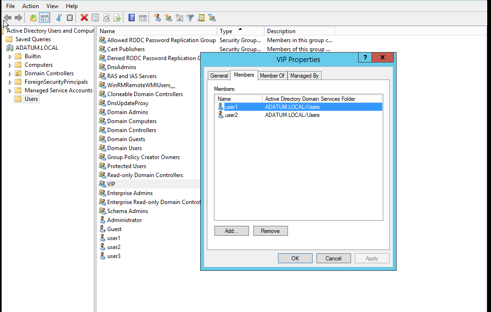
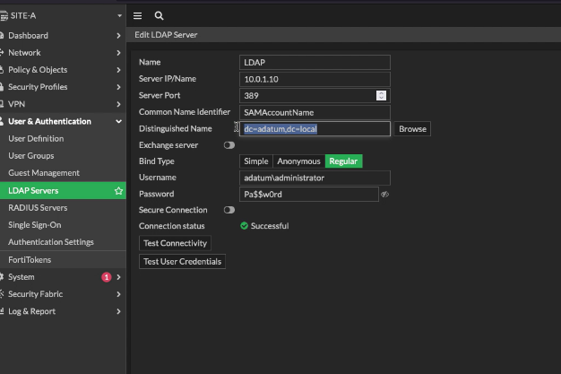
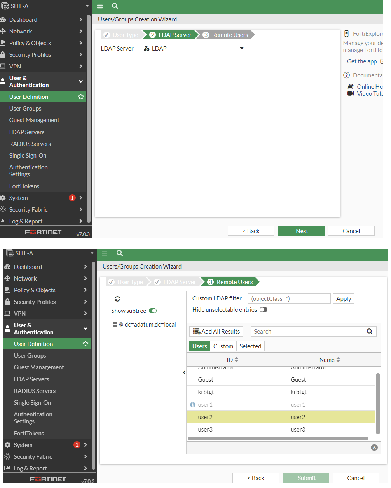
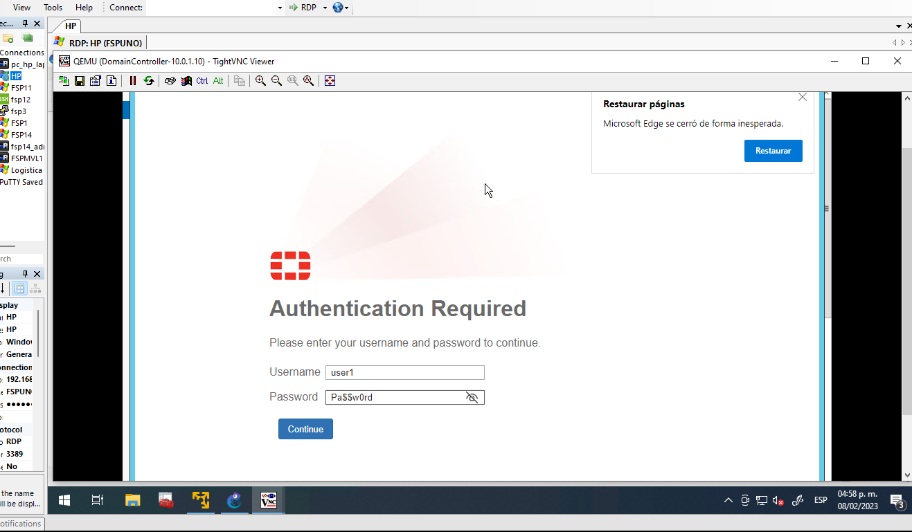

# Active directory

En el siguiente ejemplo se realizará a través de un controlador de dominio.

En nuestro laborario, ya existen en el servidor en el grupo user dos usuarios llamado user1,user2 y user3 esto lo vemos desde el active directory user and computers, y dentro de este directorio hay un grupo llamado VIP en el cual están los usuarios 1 y 2, pero no al 3.



```
Ahora nos vamos al FG User&Authentication->LDAP Servers->Create New

Name:LDAP
SERVER IP/NAME:10.0.1.10
Server port:389
Common Name Identifier:SAMAccountName
Bind Tyoe: Regular
username:ADATUM\Administrator (dato del servidor)
Pass:Pa$$w0rd (dato del servidor)

Click en Testconnectivity, revisamos que diga Successful

Luego regresamos a en donde dice:Disinguished Name: click en browse y seleccionamos la raiz del dominio o el primer dato mostrado.

click en ok
```


```
Ahora en User defition -> Remote LDAP user
Next 
Seleccionamos el servidor LDAP que acabamos de agregar

Y ahora buscamos los usuarios y agregamos los usaurios y click en submit
```



```
Después vamos a Firewall policy y source click en editar,user y seleccionamos de la lista LDAP el usario agregado(s)
```
```
Después vamos al servidor y al tratar de navegar nos pide el usuario y contraseña, lo ponemos y nos regresamos a nuestro FG y nos vamos a user&devices y podremos ver el usuario.
```
A veces no redirecciona correctamente a la pagina web así que tenemos que hacer refresh o buscar una pagina y ya no nos pedira el password

