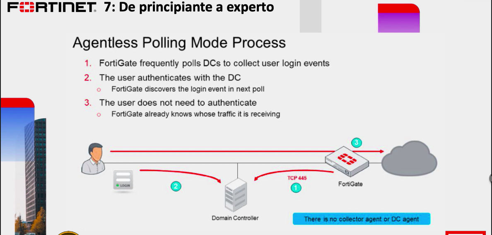
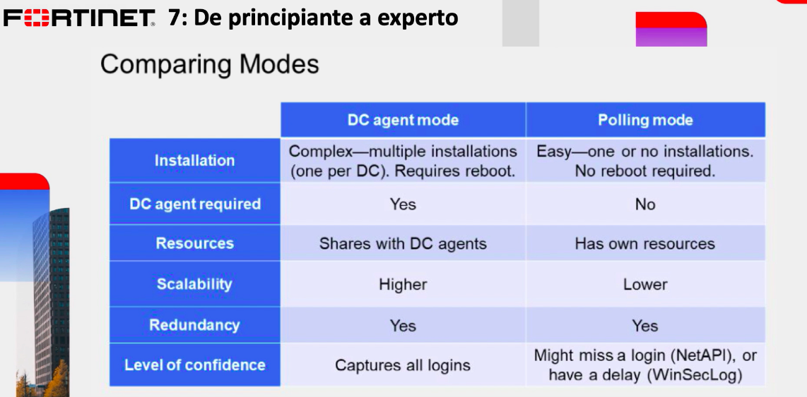

# Agentless Polling Mode Process



Aquí no hay software 

Para esta pruba vamos a desintalar Fortinet SSOy en la parte de external conectors no necesitamos la anterior ya que vamos a crear uno.

```
External Connector->New->Poll ACtive Directory Server
IP:10.0.1.10
user:adatum\administrator
Password:Pa$$w0rd
LDAP SERVER:lADP (el mismo de clases anteriores.)
Enable poling:enable
user/groups-> click en edit

Aquí podemos escoger un grupo o un usuario.

click en ok, de nuevo se pondrá como activo
```

```
Firewall policy->source->user->Local FSSO Agent-> seleccionamos los dos
```