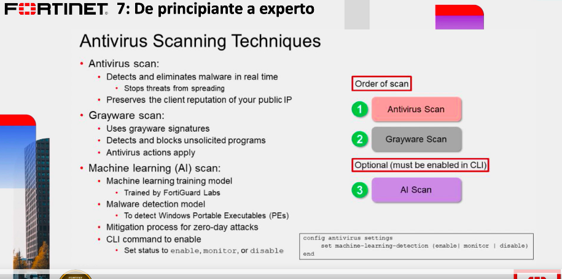
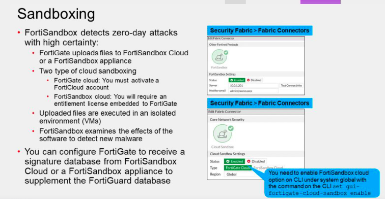
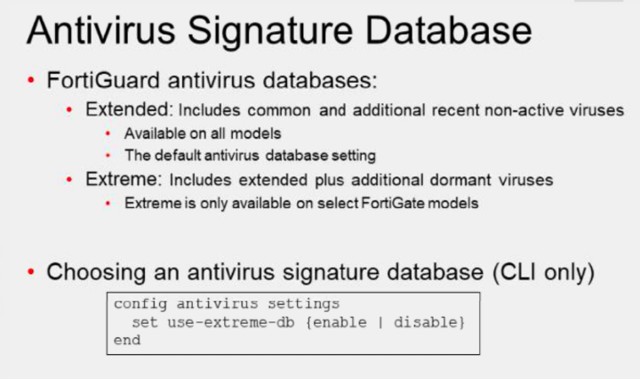
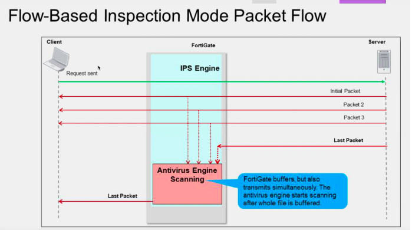
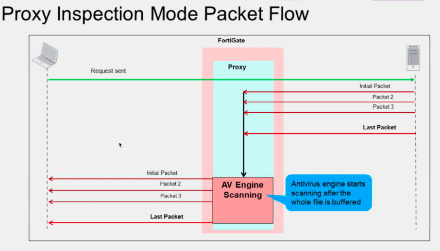

# Antivirus.

No viene en el examen NSE4, es un producto aparte, se puede instalar de manera local(Virtual y equipo local FG) y hay servicios en la nube(Requiere licencia)

El antivirus tiene la BD localmente en el FG, para revisar que nuestro FG incluya la bd extreme debemos revisar la data sheet del modelo de FG y para activarlo usamos este comando en la CLI.

Existen dos modos de inspección

eircar.org pagina para hacer test con el antivirus de FG
