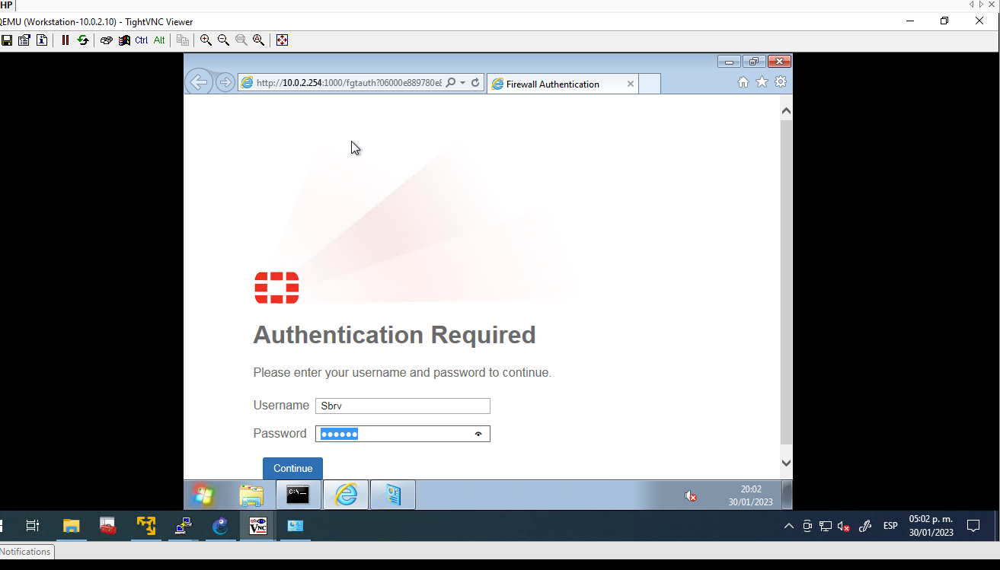

# Autenticación Activa
Para crear el primer ejemplo nos vamos a:
```
User&Autentication->User Definition->Local User->Ponemos un usuario y contraseña->User Account Status

Luego establecemos una politica
Firewall policy-> Aquí ya existe una politica llamada Internet-SDWAN(ya se había establecido con anterioridad) en la parte de source tenemos Active directory pues aquí vamos a agregar a nuestro usarios creado en este caso llamado Sbrv.

```
Como vemos nos pide usario y contraseña para poder navegar
