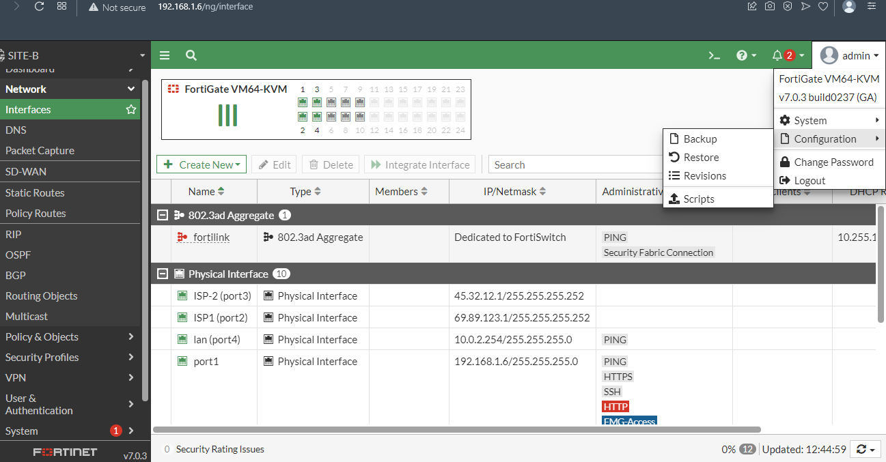

# Backups & Restore

### Opción web

Ir a configuración, luego backup y si se requiere, podemos restaurar.


En caso de querer editar el archivo backup para pasarlo a otro equipo similar de dónde se realizado la copia debemos tener en cuenta, la cantidad de puertos y la versión del firewall tiene que ser el mismo del equipo original.

```
#config-version= FGVMK6-7.0.3-FW-build0237-211207:opmode=0:vdom=0:user=admin

#conf_file_ver=282763466964943
#buildno=0237
#global_vdom=1
config system global
    set alias "FortiGate-VM64-KVM"
    set hostname "SITE-A"
    set timezone 04
end
```
## Ahora a traves de la linea de comandos

Lista de opción con ? 
```
SITE-B # execute backup ?
config           config
disk             disk
full-config      full-config
ipsuserdefsig    ipsuserdefsig
memory           memory
```

### Con el siguiente comando respaldamos a través de un servidor FTP

***excute backup config ftp "Nombre que asiganaremos al archivo" "IP del servidor FTP" "Usuario" "Password"***

```
SITE-B # execute backup config ftp SITE-B-27092022 200.212.31.2 ftp ftp
Please wait...

Connect to ftp server 200.212.31.2 ...
Send config file to ftp server OK.

```

### Con siguiente comando resturamos el backup con el comando restore


***excute restore config ftp "Nombre del archivo" "IP del servidor FTP" "Usuario" "Password"***

Al hacer esto el equipo se va reiniciar automáticamente
```
SITE-B # execute restore config ftp SITE-B-27092022 200.212.31.2 ftp ftp
This operation will overwrite the current setting and could possibly reboot the system!
Do you want to continue? (y/n)y

Please wait...

Connect to ftp server 200.212.31.2 ...
Get config file from ftp server OK.
File check OK.
```
Si uno tiene dudas si se reinició o no el equipo el comando para revisar es el siguiente
```
SITE-B # get system performance status
CPU states: 0% user 2% system 0% nice 94% idle 1% iowait 3% irq 0% softirq
CPU0 states: 0% user 2% system 0% nice 94% idle 1% iowait 3% irq 0% softirq
Memory: 1021528k total, 714496k used (69.9%), 163128k free (16.0%), 143904k freeable (14.1%)
Average network usage: 1 / 0 kbps in 1 minute, 1 / 0 kbps in 10 minutes, 0 / 0 kbps in 30 minutes
Average sessions: 14 sessions in 1 minute, 17 sessions in 10 minutes, 12 sessions in 30 minutes
Average session setup rate: 0 sessions per second in last 1 minute, 0 sessions per second in last 10 minutes, 0 sessions per second in last 30 minutes
Virus caught: 0 total in 1 minute
IPS attacks blocked: 0 total in 1 minute
Uptime: 0 days,  0 hours,  5 minutes

```
### Renovar licencia de laboratorio, en la vida real se contrata un partner.

En este caso como es laboratorio tenemos que revisar cuando vence la experiencia para renovarlo, para ello realice un respaldo antes.

En este caso vence el 6 de octubre
```
admin@192.168.1.170's password:
SITE-A # execute backup config ftp sitea2809 200.212.31.2 ftp ftp
Please wait...

Connect to ftp server 200.212.31.2 ...
Send config file to ftp server OK.

SITE-A # get sys status
Version: FortiGate-VM64-KVM v7.0.3,build0237,211207 
License Status: Valid
Evaluation License Expires: Thu Oct  6 07:11:01 2022
VM Resources: 1 CPU/1 allowed, 997 MB RAM/2048 MB 
```
#### Con este comando reiniciamos a default el equipo FTG de su caja pero solo en la versión de laboratorio permite restaurar las licencias otros 15 días más de prueba
En este caso tendremos que configurar de nuevo la configuración de interfaces una vez que restauremos el backup.
```
SITE-A # execute factoryreset
```
#### Pero si ejectamos este otro comando nos permite restaurar el equipo a default pero con la excepción de que no borra la configuración de la red.

```
SITE-A # execute factoryreset2
```
#### ejecutamos comando, tener en cuenta que tardará unos minutos.
```
SITE-A # exec factoryreset2
This operation will reset the system to factory default except system.global.vdom-mode/system.global.long-vdom-name/VDOMs/system.virtual-switch/system.interface/system.settings/router.static/router.static6!
Do you want to continue? (y/n)y
```

Si nos volvemos a conectar a través de la terminal no pedira nuevamente que coloquemos una contraseña nueva
```
login as: admin
You are forced to change your password. Please input a new password.
```
Si revisamos de nuevo el equipo veremos que el nombre del eequipo cambió así como la fecha de fin de licencia y que los puertos configurados continuan.

```
FortiGate-VM64-KVM # get syst stat
Version: FortiGate-VM64-KVM v7.0.3,build0237,211207 (GA)
Evaluation License Expires: Thu Oct 13 12:33:32 2022
System time: Wed Sep 28 12:43:39 2022
Last reboot reason: warm reboot
```

Si revisamos la configuración de los puertos vermos que continuán gracias a que fue un exec resetfactory2

```

FortiGate-VM64-KVM # show syst inte
config system interface
    edit "port1"
        set vdom "root"
        set ip 192.168.1.170 255.255.255.0
        set allowaccess ping https ssh http fgfm
        set type physical
        set alias "MGMT"
        set device-identification enable
        set lldp-transmission enable
        set role lan
        set snmp-index 1
        config ipv6
            set ip6-send-adv enable
            set ip6-other-flag enable
        end
        set dns-server-override disable
    next
    edit "port2"
        set vdom "root"
        set ip 200.212.31.1 255.255.255.252
        set type physical
        set alias "ISP1"
        set lldp-reception enable
        set role wan
        set snmp-index 2
        config ipv6
            set ip6-send-adv enable
            set ip6-other-flag enable
        end
    next
    edit "port3"
        set vdom "root"
        set ip 180.45.22.1 255.255.255.252
        set type physical
        set alias "ISP2"
        set lldp-reception enable
        set role wan
        set snmp-index 3
        config ipv6
            set ip6-send-adv enable
            set ip6-other-flag enable
        end
    next
    edit "port4"
        set vdom "root"
        set ip 10.0.1.254 255.255.255.0
        set allowaccess ping
        set type physical
        set alias "LAN"
        set device-identification enable
--More--

```

Ahora vamos a restaurar el respaldo antes realizado.

```
FortiGate-VM64-KVM # exec rest conf ftp sita2809 200.212.31.2 ftp ftp
This operation will overwrite the current setting and could possibly reboot the system!
Do you want to continue? (y/n)

```

### Revisiones

Son Backups locales guardadas en los equipos de FTG, no es recomendable debido a que si falla el equipo y no almacenamos externamente podemos perder el backup.