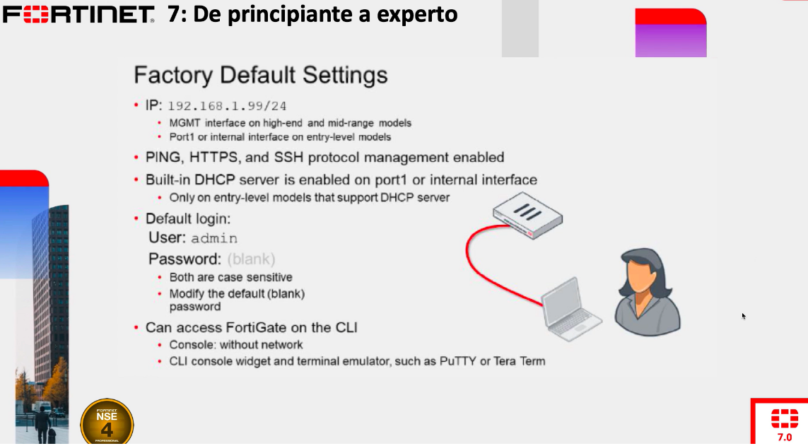
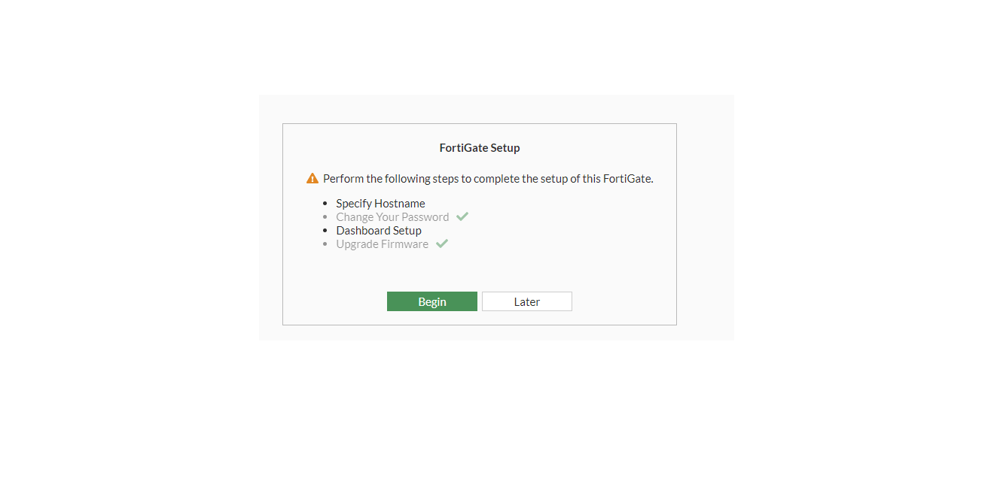
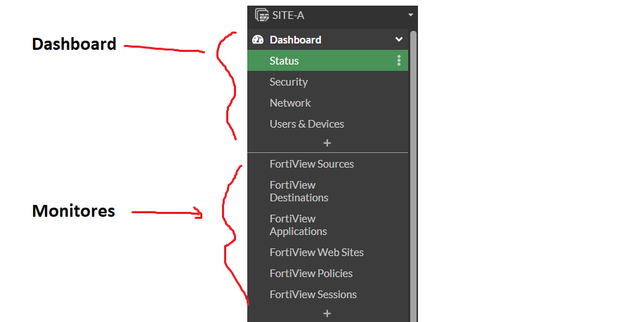

#
Temas que se van a ver en esta primera parte:


Primer acceso a nuestro firewall:


Nos vamos a conectar a un equipo fortinet, usuario:admin y password:(blank), nos pedirá que cambiemos la contraseña:


#
Primeros comandos:
Tenemos que ingresar a ver la ip del equipo:

FortiGate-VM64-KVM # get system interface
== [ port1 ]
name: port1   mode: dhcp    ip: 192.168.1.170 255.255.255.0   status: up    netbios-forward: disable    type: physical   ring-rx: 0   ring-tx: 0   netflow-sampler: disable    sflow-sampler: disable    src-check: enable    explicit-web-proxy: disable    explicit-ftp-proxy: disable    proxy-captive-portal: disable    mtu-override: disable    wccp: disable    drop-overlapped-fragment: disable    drop-fragment: disable
== [ port2 ]
== [ port3 ]
== [ port4 ]

*Después veremos la configuración del equip
FortiGate-VM64-KVM # conf sys interface

*Ahora vamos activar http para ingresar a través de la web
FortiGate-VM64-KVM (interface) # edit port1

FortiGate-VM64-KVM (port1) # show
config system interface
    edit "port1"
        set vdom "root"
        set mode dhcp
        set allowaccess ping https ssh fgfm
        set type physical
        set snmp-index 1
    next
end

*Con este puerto se permite el acceso a través del http
FortiGate-VM64-KVM (port1) # append allowaccess http

* show para confirmar que el puerto este activo
FortiGate-VM64-KVM (port1) # show
config system interface
    edit "port1"
        set vdom "root"
        set mode dhcp
        set allowaccess ping https ssh http fgfm
        set type physical
        set snmp-index 1
    next
end

*Para guardar cambios con end
FortiGate-VM64-KVM (port1) # end

Comprobamos con el navegador, ingresamos el usuario y contraseña


Opcional: En este caso seleccione begin


Nombramos el equipo como SITE-A y click en ok


Seleccionamos Optimal y click en ok


Dashboard de inicio


Configuramos de la misma manera el SITE-B.

En ambos equipos Fortigate el puerto 1 será para la administración y el puerto 2 y 3 similarán ser direcciones IP Pueblicas (ISP) y el puerto 4 será la LAN de las Pc's.

Ahora si hacemos un ping a google a través del CLI que se encuentra en el dashboard en ambos equipos nos dará salida:

SITE-A # exec ping google.com
PING google.com (142.251.34.206): 56 data bytes
64 bytes from 142.251.34.206: icmp_seq=0 ttl=117 time=13.4 ms
SITE-B # exec ping google.com

¿Por qué pasa esto si aún no hemos configurado? (laboratorio)se debe a que el puerto 1 tiene configuración DHCP

Para ello vamos a ingresar vía web a uno de los forti y nos vamos a Network-> Interfaces y vermos que ahí está tomando la DNS configurado en nuestro router, entonces tenemos que deshabilitar la opción que dice Rerieve default gateway from server y la que dice override Internal DNS, 


Ahora si volver hacer ping ya no nos permitira hacer ping y está bien porqué el puerto uno es para la configuración y administración.

admin@192.168.1.170's password:
SITE-A # exec ping google.com
Unable to resolve hostname.

SITE-A #

Ahora vamos a ingresar a configurar la zona horaria a través de la interfaz gráfica:
System->Settings 

En esta misma sección tenemos que darle el máximo tiempo de conexión antes de que se cierre la sesión que es de 480 minutos(solo se aplica en laboratorio)

Idle timeout : 480

Auto file system check: check
(esto en caso de que se apague mal el equipo)

Ahora vamos hacer una pequeña revisión:


¿Que és un dashboard?
Colección de widget, encontraremos información del sistema, estado de licencias
¿Qué es un monitor?
nos muestra tráfico o destino, cosas que el forti está procesando o preceso, es como ver un widget

En el menú en la parte de NEtwork: no serán vistas en el curso debido a que no es el scope del curso, ya que no se toman en cuentan las certificaciones.
RIP,OSPF,BGP,Routing Objets, Multicas

Vamos a empezar poniendo una IP fija a nuestros dos dispositivos forti

1.- Forma web
Una vez ingresando a nuestro dispositivo vamos a network->interfaces->Port1->seleccionamos la opción manual y le ponemos la ip que deseamos.


Dejaré los mismos que me dió por default y click en ok


2.- Ahora a través de la consola con el comando set ip 192.168.1.6/24
```
edit port
set mode static
show
set ip ip/ip mask
show
end
```
```
SITE-B (interface) # edit port1

SITE-B (port1) # show
config system interface
    edit "port1"
        set vdom "root"
        set mode dhcp
        set allowaccess ping https ssh http fgfm
        set type physical
        set snmp-index 1
        config ipv6
            set ip6-send-adv enable
            set ip6-other-flag enable
        end
        set defaultgw disable
        set dns-server-override disable
    next
end

SITE-B (port1) # set mode static

SITE-B (port1) # show
config system interface
    edit "port1"
        set vdom "root"
        set ip 192.168.1.172 255.255.255.0
        set allowaccess ping https ssh http fgfm
        set type physical
        set snmp-index 1
        config ipv6
            set ip6-send-adv enable
            set ip6-other-flag enable
        end
        set dns-server-override disable
    next
end

SITE-B (port1) # set ip 192.168.1.6

incomplete command in the end
Command fail. Return code -160

SITE-B (port1) # set ip 192.168.1.6/24

SITE-B (port1) # show
config system interface
    edit "port1"
        set vdom "root"
        set ip 192.168.1.6 255.255.255.0
        set allowaccess ping https ssh http fgfm
        set type physical
        set snmp-index 1
        config ipv6
            set ip6-send-adv enable
            set ip6-other-flag enable
        end
        set dns-server-override disable
    next
end

SITE-B (port1) #
```

Con get system status, revisamos cuando vencen las licencias.

```

SITE-A # get system status
Version: FortiGate-VM64-KVM v7.0.3,build0237,211207 (GA)
Virus-DB: 1.00000(2018-04-09 18:07)
Extended DB: 1.00000(2018-04-09 18:07)
Extreme DB: 1.00000(2018-04-09 18:07)
AV AI/ML Model: 0.00000(2001-01-01 00:00)
IPS-DB: 6.00741(2015-12-01 02:30)
IPS-ETDB: 6.00741(2015-12-01 02:30)
APP-DB: 6.00741(2015-12-01 02:30)
INDUSTRIAL-DB: 6.00741(2015-12-01 02:30)
IPS Malicious URL Database: 1.00001(2015-01-01 01:01)
Serial-Number: FGVMEV3NOACKGWED
License Status: Valid
Evaluation License Expires: Thu Oct  6 07:11:01 2022
VM Resources: 1 CPU/1 allowed, 997 MB RAM/2048 MB allowed
Log hard disk: Available
Hostname: SITE-A
Operation Mode: NAT
Current virtual domain: root
Max number of virtual domains: 1
Virtual domains status: 1 in NAT mode, 0 in TP mode
Virtual domain configuration: disable
FIPS-CC mode: disable
Current HA mode: standalone
Branch point: 0237
Release Version Information: GA
FortiOS x86-64: Yes
System time: Mon Sep 26 15:29:21 2022
Last reboot reason: warm reboot
```