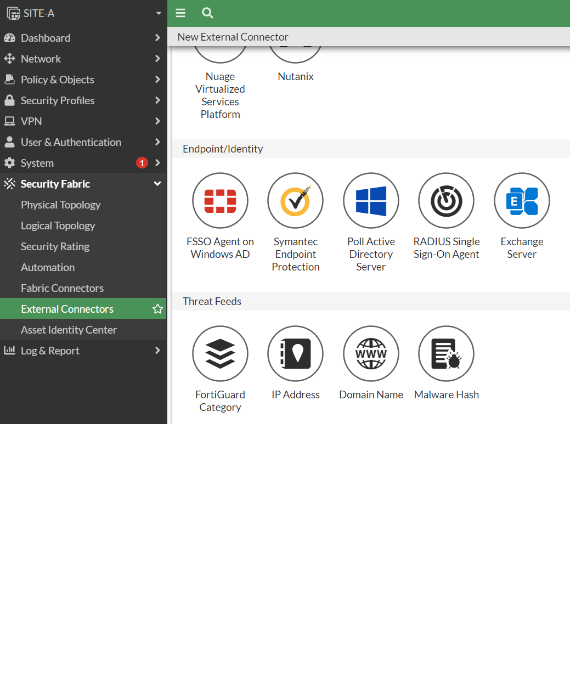

#  Fortinet Single Sign-On (FSSO)-Usando DC Agent y Collector Agent

### Dc Agent Mode Process(el mas útilzado)


Los 2 elementos (1 DC Agent y 2 Collector Agent)se instalan en el controlador de domino

Para instala el sofware en el escritorio del servidior hay un archivo llamado FFSO_Setup ejecutamos nos pedira el usuario del administrador del dominio, corremos con los archivos seleccionador por default siguiente


Finish(launch habilitado), siguiente(datos por default si es el mismo equipo que estamos ejecutando o sino la ip correspondiente), en este labortatorio es next en caso real depende que dominios y usuarios deseamos monitorear


En esta parte nos cuestiona en que modo deseamos trabajar en este caso DC Agent


Nota: Tomar en cuenta que en modo productivo nos solicita reiniciar el equipo.


Una vez que sereiniciao buscamos el aplicactivo que se llama configure fortinet sign on


Check en Authentication y la password:1234567,Dead entry timeout interval:60
```
Ahora ingresamos al FG-A y nos vamos a Security Fabric->External connectors->Create New->Selec FSSO de FG
```

```
Name:AD
Primary fSSO agent:10.0.1.10
Pass:1234567 (debe de ser el passw del programa de FG no el password de administrador del equipo)
user groupsource:Collector Agent
Click en apply &Refresh y nos mostrará la cantidad de usuario o grupos que encontró
```

```
Una vez que ya se puso en verde el icono del FFSO nos vamos ahora a
Firewall Policy->vamos a editar el source y seleccionamos la opción User->seleccionamos ADATUM/VIP y click en ok

Ahora cualquier usuario que pertenezca al grupo VIP podra navegar (usuaio 1,2)

ahora vamos al servidor e iniciamos con otro usuario y probamos

Regresamos al forti
Log&Report->eventos->Userevents podremos ver que el usuario 1 ya ingreso

También lo podemos ver desde dashboard->User&Devices->Firewallusers->click en show all FFSO logons

Si hacemos prueba con el usuario 3, no nos dejará navegar.
```


