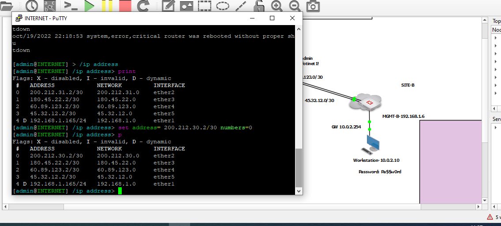

# Healthy Link Monitor

Sirven para programar monitoreo sobre los enlaces, esto quiere decir algún enlace SP1 o SP2 tiene alguna falla por ejemplo que el cable se rompa, podemos utilizar el otro servicio disponible o backup.

Para hacer esta prueba vamos a ingresar a nuestro mikrotik 

Una vez dentro presionamos enter y luego /ip addres, después print para saber los valores de los puertos.
y cambios la IP funcional
```
set address = 200.212.31.2/30 numbers=0
```
Por esta.
```
set address = 200.212.30.2/30 numbers=0
```


Despues realizamos un ping a google y no inidicará que no hace ping, y es aquí dónde preguntamos ¿porqué no hace el cambio automático?
```
SITE-A # exec ping google.com
Unable to resolve hostname.
```
Enonces lo que tenemos que hacer son unos cambios a través del CLI(única opción) ingresmaos con los siguientes comandos

```
SITE-A # conf syst link-monitor 

SITE-A (link-monitor) # show
config system link-monitor
end

SITE-A (link-monitor) # edit 1
new entry '1' added

SITE-A (1) # get 
name                : 1
addr-mode           : ipv4 
srcintf             : 
server-config       : default 
server              :
protocol            : ping 
gateway-ip          : 0.0.0.0
route               :
source-ip           : 0.0.0.0
interval            : 500
probe-timeout       : 500
failtime            : 5
recoverytime        : 5
probe-count         : 30
ha-priority         : 1
update-cascade-interface: enable 
update-static-route : enable 
update-policy-route : enable 
status              : enable 
diffservcode        : 000000
class-id            : 0
service-detection   : disable 
         

SITE-A (1) # set protocol 
ping        PING link monitor.
tcp-echo    TCP echo link monitor.
udp-echo    UDP echo link monitor.
http        HTTP-GET link monitor.
twamp       TWAMP link monitor.
 
SITE-A (1) # set srcintf port2

SITE-A (1) # set server 8.8.8.8

SITE-A (1) # set gateway-ip 200.212.31.2

SITE-A (1) # show
config system link-monitor
    edit "1"
        set srcintf "port2"
        set server "8.8.8.8"
        set gateway-ip 200.212.31.2
    next
end

SITE-A (1) # end
```
Después volvemos hacer ping y ya recibimos respuesta y revisamos con el CLI y podremos ver que le puerto 2 esta inactivo, y ahora el que está en uso es el puerto 3.

```
SITE-A # get router  info routing-table database 
Codes: K - kernel, C - connected, S - static, R - RIP, B - BGP
       O - OSPF, IA - OSPF inter area
       N1 - OSPF NSSA external type 1, N2 - OSPF NSSA external type 2
       E1 - OSPF external type 1, E2 - OSPF external type 2
       i - IS-IS, L1 - IS-IS level-1, L2 - IS-IS level-2, ia - IS-IS inter area
       > - selected route, * - FIB route, p - stale info

Routing table for VRF=0
S    *> 0.0.0.0/0 [15/0] via 180.45.22.2, port3, [5/0]
S       0.0.0.0/0 [10/0] via 200.212.31.2, port2 inactive, [5/0]
C    *> 10.0.1.0/24 is directly connected, port4
C    *> 180.45.22.0/30 is directly connected, port3
C    *> 192.168.1.0/24 is directly connected, port1
C    *> 200.212.31.0/30 is directly connected, port2


SITE-A # 
```