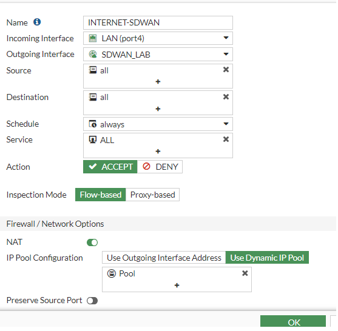

# Configurar NAT mediante IP Pools

```
Vamos a Policy&Objects->IP POOLS

Name:Pool
Type: existen 4 tipos 
- Overload
-One to One
-Fixed port range
-Port block allocation

*Overload:200.212.31.20-200.212.31.30
Siempre vamos a tener más redes privadas en uso que las públicas.
Muchas direcciones privadas -> pocas redes públicas

aceptamos el objeto y en la policy hacemos lo siguiente:
en donde dice Ip pool configuation->Use Dynamic IP Pool y seleccionamos la pool que nos muestra

ARP:ENABLE(por default)
```


Ahora vamos a equipo de internet.
```
Que es un mikrotik
User:admin
Pass:Fortinet1!

y módificamos lo siguiente la IP del indicador 0

[admin@INTERNET] > /ip address
[admin@INTERNET] /ip address> print
Flags: X - disabled, I - invalid, D - dynamic
 #   ADDRESS            NETWORK         INTERFACE
 0   200.212.31.2/30    200.212.31.0    ether2
 1   180.45.22.2/30     180.45.22.0     ether3
 2   60.89.123.2/30     60.89.123.0     ether4
 3   45.32.12.2/30      45.32.12.0      ether5
 4 D 192.168.1.167/24   192.168.1.0     ether1
[admin@INTERNET] /ip address> set address=200.212.31.254/24 numbers=0
[admin@INTERNET] /ip address> print
Flags: X - disabled, I - invalid, D - dynamic
 #   ADDRESS            NETWORK         INTERFACE
 0   200.212.31.254/24  200.212.31.0    ether2
 1   180.45.22.2/30     180.45.22.0     ether3
 2   60.89.123.2/30     60.89.123.0     ether4
 3   45.32.12.2/30      45.32.12.0      ether5
 4 D 192.168.1.167/24   192.168.1.0     ether1
[admin@INTERNET] /ip address>
```
```
Ahora ingresamos a nuestro FG-A ->SD-WAN ->modificamos el gateway del ISP1(port2) y deshabilitamos el ISP2

A continuación nos vamos a nuestro controlador de dominio (server) y probamos la salida a internet y debemos tener salida.

Y podemos rectificarlo en nuestor FG-A con el siguiente comando:
SITE-A # get syste session list
PROTO   EXPIRE SOURCE           SOURCE-NAT       DESTINATION      DESTINATION-NAT 
tcp     3570   10.0.1.10:49378  200.212.31.1:49378 172.217.3.131:443 -               
tcp     3570   10.0.1.10:49395  200.212.31.1:49395 172.217.3.142:443 -               


sin nos fijamos está utilzando en la source nat una de las ip que pusimos en el pool.
```
```
*One-to-One:200.212.31.20-200.212.31.20 (en este modo se utiliza una sola ip, aunque usemos una sola ip debemos expresarlo en modo de rango)

Para esta practica vamos a matar todas las sesiones y para eso nos vamos Dashboard->Fortview sessions->botón derecho->end all sessions

y para matar las sesiones a través de la CLI (FG-A)SITE-A # diagnose sys session clear
```
Ahora vamos agregar un sw y una pc.


Y como vemos solo puede navegar el controlador de dominio y no la pc agregadam,ademas en la policy nos indicará que todas las IP han sido utilizadas y no tenemos ni una ip disponible en el pool, ahora si deamos aumentar la ip disponibles:
200.212.31.20-200.212.31.21, podremos salir a internet en ambos equipos
```
*Fixed pport Range:200.212.31.20-200.212.31.21
Internet Ip Range:10.0.1.15-10.0.1.16
es similar a One-to-one la diferencia rádica en que podemos restringir las ip privadas que tendrán salida a internet. 
```

```
*Port Block Allocation:200.212.31.20-200.212.31.21 (ip publicas)
Block Size:128 (cuentos puertos puede utilizar el pool) por defecto son 128
Block Per User:8 (Por cada dirección privda de nuestra red cuantos puertos de esos 128 puede utilizar esa ip, o cuantas sesiones puede crear cada computadora de nuestra lan)
```