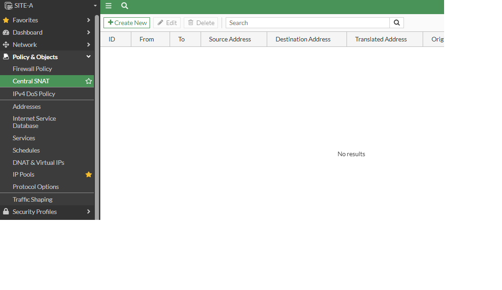

# Caso Práctico:IPSEC entre empresa con la misma subet

qué pasa cuando queremos establecer un tunel IPSEC entre dos redes cuya red privada tiene el mismo segmento de red.
ejemplo: 192.168.0.0/24

Lo recomendable es segmetar las redes privadas de cada sitio por ejemplo podemos usar otro:192.168.89.0/24

Entonces para este ejemplo Los FORTIES FG-A y FG-B tendran la mismo gateway 10.0.1.254, así mismo como el controlador de domino (windows server) y la pc (windows 7) 10.0.1.10

```
FG-B
Ahora nos vamos a IPsec Wizard->Custom
Name:Site-A
Remote Gateway:Static IP Address
IP Address:200.212.31.1
Interface:ISP-1(Port2)
NAT Transversal:Disable
Dead Peer Detection:On Demand
DPD retry count:3
DPD retry:20
Pre-sharedkey:1234567
Version:1
Mode: Main(ID Protection)
DES/MD5:2
Ojo, Aquí no funcionaría debido a que son iguales 
Local Address: subnet: 10.0.1.10/24
Remote Address:subnet 10.0.1.10/24

Entonces para solucionar el problema tenemos que asignar IP ficticias y apuntado hacía toda la red local contra toda la red remota

Local Address: subnet: 172.22.0.0/24 (SITE B)
Remote Address:subnet 172.21.0.0/24 (SITE A)

Advance:
DES/MD5:2
Enable Replay Detection:check
Enable perfect forward secrecy (PFS):check
Local Port:all
Remote port :all
Protocol:all
autonegotiate:check
```
```
Ahora configuramos la static route
FG-B
subnet:172.21.0.0/24
Interface:Site-A (el que se creo anteriormente)
```
### Configuración de la policy en el FG-B

```
FG-B IDA
Name:To Site-A
Incoming:LAN(Port4)
Outcoming:Site-A
all
all
all

NAT:Enable
IP Pool Configuration: IPSEC-SITE-B
el secreto está aquí, en vez de usar use outgoing interface addres, debemos seleccionar use Dynamic IP POOL-> Create New IP Pool->Fixed port Range
Name: IPSEC-SITE-B
Type:Fixed Port Range:172.22.0.1-172.22.0.254
Internal IP Range:10.0.1.1-10.0.1.254
ARP:enable
```
```
FG-B Vuelta
Name:From Site-A
Incoming:LAN(Port4)
Outcoming:Site-A (debeía ya estar en verde o levatado el servicio)
Source:all
Destination:create->Virtual IP Server
->Name:IPSEC VIP
Interface:Site-A
Type:Static NAt
External IP address/range:172.22.0.1-172.22.0.254
Map to:10.0.1.1(solo hay que poner la primera IP, el sistema lo llena por dafault hasta el 254)
optional Filter:disable
Port forwarding:disable
botón ok
Service:all

NAT:disable
```


### Ahora lo mismo se hace en el FG-A
```
FG-A
Ahora nos vamos a IPsec Wizard->custom
Name:Site-B
Remote Gateway:Static IP Address
IP Address:60.89.123.1
Interface:ISP-1(Port2)
NAT Transversal:Disable
Dead Peer Detection:On Demand
DPD retry count:3
DPD retry:20
Pre-sharedkey:1234567
Version:1
Mode: Main(ID Protection)
DES/MD5:2

Local Address: subnet: 172.21.0.0/24 (SITE A)
Remote Address:subnet 172.22.0.0/24 (SITE B)

Advance:
DES/MD5:2
Enable Replay Detection:check
Enable perfect forward secrecy (PFS):check
Local Port:all
Remote port :all
Protocol:all
autonegotiate:check
```
```
### Ahora configuramos la static route
FG-A
subnet:172.22.0.0/24
Interface:Site-B (el que se creo anteriormente)
```
### Ahora nos vamos a las policy del FG-A

```
FG-A IDA
Name:To Site-B
Incoming:LAN(Port4)
Outcoming:Site-B
all
all
all

NAT:Enable
IP Pool Configuration: IPSEC SITE A
el secreto está aquí, en vez de usar use outgoing interface addres, debemos seleccionar use Dynamic IP POOL-> Create New IP Pool
Name: IPSEC SITE-A
Type:Fixed Port Range:172.21.0.1-172.21.0.254
Internal IP Range:10.0.1.1-10.0.1.254
ARP:enable
```
```
FG-A Vuelta
Name:From Site-B 
Incoming:LAN(Port4)
Outcoming:Site-B(ya debería estar en verde o habilitado el servicio)
Source:all
Destination:create->Virtual IP Server
->Name:IPSEC VIP
Interface:Site-B
Type:Static NAT
External IP address/range:172.21.0.1-172.21.0.254
Map to:10.0.1.1(solo hay que poner la primera IP, el sistema lo llena por dafault hasta el 254)
optional Filter:disable
Port forwarding:disable
botón ok

Service:all

NAT:disable

```

## Central NAT

Es una opción que podemos utilizar por separado y ya no estária en las Firewall policy como NAT:Enable/Disable, esto raramente se utiliza en la vida real, para activarlo nos vamos a 

```
Activar Central NAT
System->Setting->y tenemos que buscar y habilitar la opció que dice CENTRAL SNAT

O a través del del CLI:

SITE-A # config system set
SITE-A (settings) # set central-nat enable 
SITE-A (settings) # end
SITE-A # 
```


