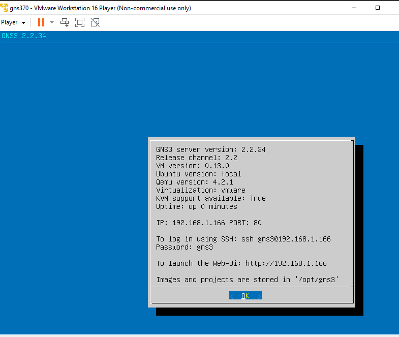
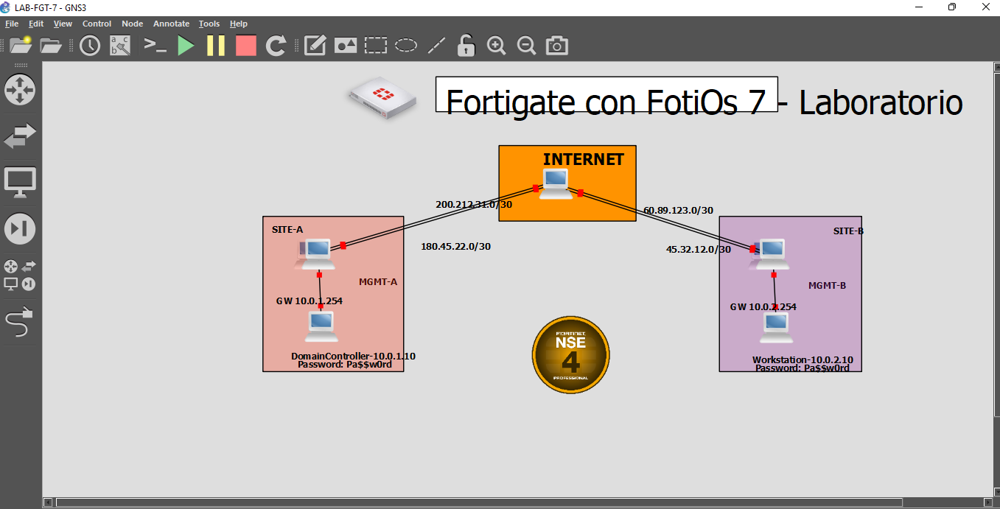
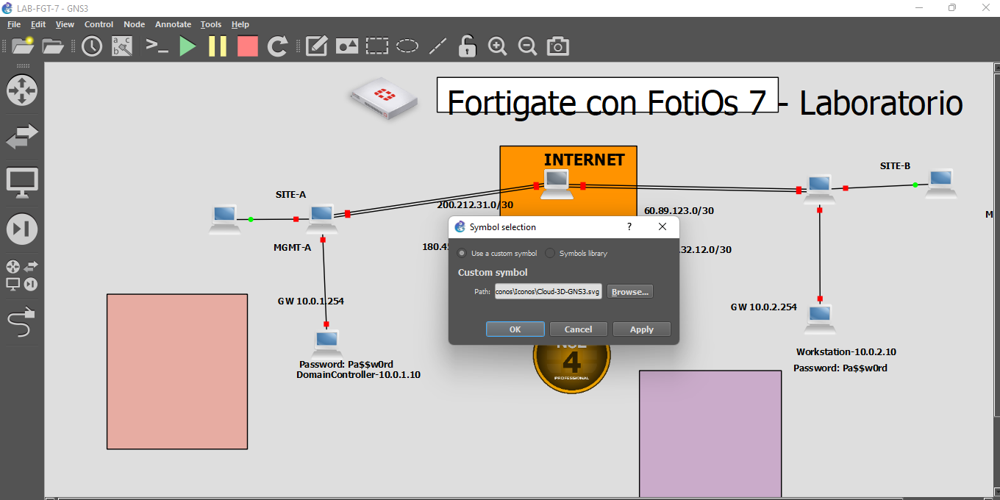
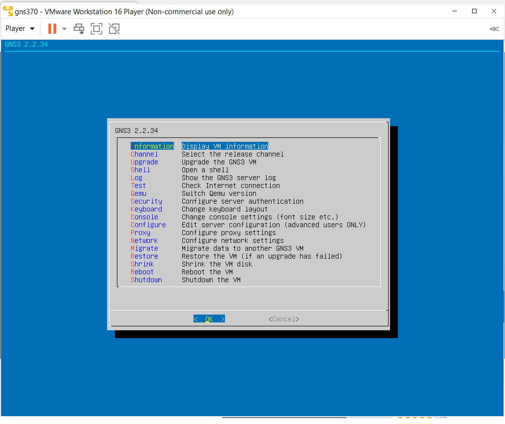
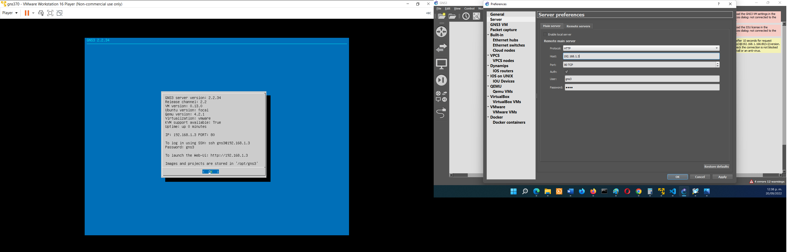
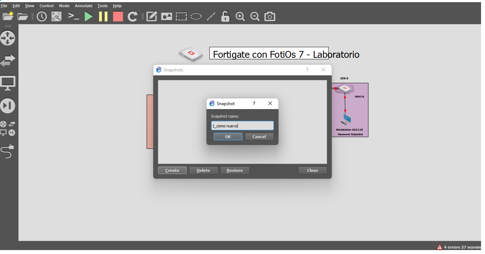

 Laboratorio Fortinet 7.0
 
Estos son apuntes personales del curso Fortinet 7

En este curso se require los siguientes programas para el laboratorio:
* [GNS3](https://gns3.com/software) descargar la versión servidor y cliente

* [VMWARE](https://www.vmware.com/products/workstation-player/workstation-player-evaluation.html)

Una vez descargado los programas vamos a configurar el Vmware:

Para conectarnos al GNS3 y que nos permita jalar el laboratorio tenemos que copiar los datos de la ip que en este caso es la 192.168.1.166 y al puerto 80, el usuario es gns3 al igual que el password

Lo primero que vamos hacer es acomador los equipos superpuestos y a cambia el icono de los equipos fortinet para hacer eso presionamos botón derecho del mouse y click en cambiar simbolos.

Después seleccionar usar simbolo personalizado y click en examinar, seleccionamos el icono y click en aplicar y ok, tenemos que hacer lo cambios en todos los dispositivos que se muestran en el laboratorio(LB)

una vez aplicado los cambios tenemos que cerrar y volver abrir el LB y click en start para arrancar todos los dispositivos.

Cambiar IP DHCP por una estatica:
Abrimos GNS3 luego click en ok y nos dirigimos a la sección de Network y nos pedirá reiniciar una vez echo los cambios, presionamos yes

Ahora de donde dice #networ hacía abajo vamos a quitar el comentario y remplazar la iP y el gateway:

Debemos respetar la identación, y una vez hecho los cambios con cntrl + x para salir y click en yes, y nos saldrá un cuadro de dialogo que nos indica que se modificara el archivo presionamos enter

Una vez que se reinicio el equipo nos aparecerá la modificación y en el GNS 3 también tenemos que modicar la ip de conexión en edición->Preference->Server

Snapshots
Se realiza con los equipos FGT apagados, vamos a edit-> manangment spanshots, click en crear 

Es importante crearlos en cada modificación importante, ya que en caso de borrar algún dispositivo forti podremos restaurarlo.

Y para restauralo son los mismos pasos excepto que en vez de presionar crear, debemos presionar restore

