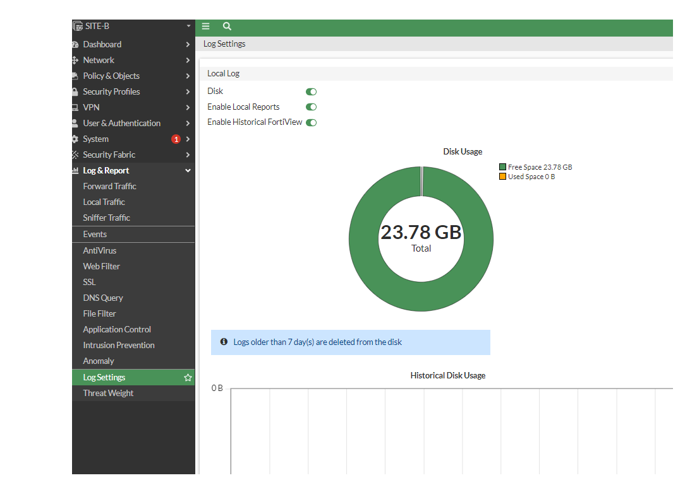
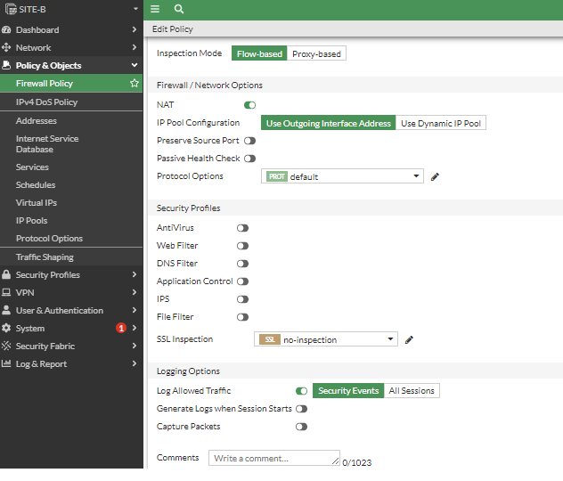

# Configuración de Logs

Importante para la certificación NSE4

 ```
 Lo encontramos en el menú principal 
 Log & Report->Log Settings
 No todo los equipos tienen disco para almacenar logs, solo en equipos de media o alta, fortinet recomienda utilizar Forti fortianalyzer

 En el cual podremos habilitar/deshabilitar Disk
 El cual sirve para habilitar el almacenamiento de los logs en el disco si lo deshabilitamos lo guarda en memoria cache, que significa que una vez que se reinicie el equipo FG se borrarán los logs

 Además nos inidica que el almacenamiento de logs es de 7 días, una vez pasado los 7 días se sobreescribirá el disco. Esto se puede modificar a través del CLI raíz.

SITE-B # conf log disk setting 

SITE-B (setting) # get
status              : enable 
ips-archive         : enable 
max-policy-packet-capture-size: 100
log-quota           : 0
dlp-archive-quota   : 0
report-quota        : 0
maximum-log-age     : 7
upload              : disable 
full-first-warning-threshold: 75
full-second-warning-threshold: 90
full-final-warning-threshold: 95
max-log-file-size   : 20
roll-schedule       : daily 
roll-time           : 00:00
diskfull            : overwrite 

SITE-B (setting) # set maximum-log-age 
maximum-log-age    Enter an integer value from <0> to <3650> (default = <7>).

 ```
En CLI podemos configurar más cosas que no aparecen en la opción web.

 ```
 SITE-B # config log 
custom-field           Configure custom log fields.
disk                   Configure disks.
eventfilter            Configure log event filters.
fortianalyzer          Configure first FortiAnalyzer device.
fortianalyzer-cloud    Configure cloud FortiAnalyzer device.
fortianalyzer2         Configure second FortiAnalyzer device.
fortianalyzer3         Configure third FortiAnalyzer device.
fortiguard             Configure log for FortiCloud.
gui-display            Configure how log messages are displayed on the GUI.
memory                 Configure memory log.
null-device            Configure logging for statistics collection for when no external logging destination, such as FortiAnalyzer, is present (data is not saved).
setting                Configure general log settings.
syslogd                Configure first syslog device.
syslogd2               Configure second syslog device.
syslogd3               Configure third syslog device.
syslogd4               Configure fourth syslog device.
tacacs+accounting      tacacs+accounting
tacacs+accounting2     tacacs+accounting2
tacacs+accounting3     tacacs+accounting3
threat-weight          Configure threat weight settings.
webtrends              Configure Web trends.


Aquí podemos ingresar a una opción y revisar que podemos deshabilitar para que no nos consuma demasiado espacio en los logs.

SITE-B # config log eventfilter 

SITE-B (eventfilter) # get
event               : enable 
system              : enable 
vpn                 : enable 
user                : enable 
router              : enable 
wireless-activity   : enable 
wan-opt             : enable 
endpoint            : enable 
ha                  : enable 
security-rating     : enable 
fortiextender       : enable 
connector           : enable 
sdwan               : enable 
cifs                : enable 
switch-controller   : enable

Aquí podemos poner el usuario ananimo para generar reportes sin la información del usuario
SITE-B (setting) # get
resolve-ip          : disable 
resolve-port        : enable 
log-user-in-upper   : disable 
fwpolicy-implicit-log: disable 
fwpolicy6-implicit-log: disable 
log-invalid-packet  : disable 
local-in-allow      : disable 
local-in-deny-unicast: disable 
local-in-deny-broadcast: disable 
local-out           : disable 
daemon-log          : disable 
neighbor-event      : disable 
brief-traffic-format: disable 
user-anonymize      : disable 
expolicy-implicit-log: disable 
log-policy-comment  : disable 
custom-log-fields   
```
  


```
El siguiente comando nos permite generar logs de todas las categorías.

  SITE-B # diagnose log test 
masks:
        Virus: 0X0001
        URL: 0X0002
        DLP: 0X0004
        IPS: 0X0008
        BOTNET: 0X0010
        ANOMALLY: 0X0020
        APP: 0X0040
        APP6: 0X0080
        Deep App: 0X0100
        Email: 0X0200
        CR Web: 0X0400
        SSH: 0X0800
        SSL: 0X1000
diag log test <repeat> [<sleep-duration(milliseconds)> <# of srcip> <# of dstip> <gen-traffic-log> <seed> <masks>]
diag log test (repeat: 1)  (sleep-duration(milliseconds): 10) (# of srcip: 10) (# of dstip: 10) (gen-traffic-log:True) (seed: 1676995455) (masks: ffffffff)
generating a system event message with level - warning
generating authentication event messages
1: generating an infected virus message with level - warning
1: generating a blocked virus message with level - warning
1: generating a URL block message with level - warning
1: generating a DLP message with level - warning
1: generating an IPS log message
1: generating an botnet log message
1: generating an anomaly log message
1: generating an application control IM message with level - information
1: generating an IPv6 application control IM message with level - information
1: generating deep application control logs with level - information
1: generating an antispam message with level - notification
1: generating a URL block message with level - warning
1: generating an ssh-command pass log with level - notification
1: generating an ssh-channel block with level - warning
1: generating an ssl-cert_blocklisted log with level - warning
```
```
### Forward Traffic - Nos muestra logs totalmente random, tráfico de aplicaciones, tráfico de usaurios.
La información mostratada es más informativo que analisis.

### Local Traffic - encontramos todo tipo de tráfico generado por nuestro FG

### Events - Podemos encontrar lo logs de usuarios, eventos del sistemas, logging fallidos.

### Antivirus -  Nos muestras la amenzas y podemos revisarlo

### Web Filter - 

### SSL

### DNS Query

### File Filter

### Aplication control

### Intrusion prevention

### Anomaly

*** Threat Width podemos hacer modificaciones a la lista anterior, no es común hacer modificaciones.
```
En nuestas policy o policies podemos habilitar los logs.

```
Firewall Policy-> en la parte inferior podemos encontrar la opción de habilitar Loggin Options.
```


```
Podemos realizar un backup de los logs a tráves de la CLI

SITE-B # execute backup disk alllogs ftp 
<ftp server>[:ftp port]    FTP server IPv4, IPv6, or FQDN can be attached with port.

SITE-B # execute backup disk alllogs ftp 60.89.123.2 ftp ftp
Please wait...

Connect to ftp server 60.89.123.2 ...
Sent log file tlog.65535 to ftp server as disk-tlog_FGVMEV9J73UB2G58_root_20230221_080520_65535 OK.
Please wait...

Connect to ftp server 60.89.123.2 ...
Sent log file elog.65529 to ftp server as disk-elog_FGVMEV9J73UB2G58_root_20230221_150001_65529 OK.
Please wait...

Connect to ftp server 60.89.123.2 ...
Sent log file elog.65530 to ftp server as disk-elog_FGVMEV9J73UB2G58_root_20230221_000001_65530 OK.
Please wait...

Connect to ftp server 60.89.123.2 ...
Sent log file elog.65531 to ftp server as disk-elog_FGVMEV9J73UB2G58_root_20230217_000000_65531 OK.
Please wait...

Connect to ftp server 60.89.123.2 ...
Sent log file elog.65532 to ftp server as disk-elog_FGVMEV9J73UB2G58_root_20230216_000000_65532 OK.
Please wait...

Connect to ftp server 60.89.123.2 ...
Sent log file elog.65533 to ftp server as disk-elog_FGVMEV9J73UB2G58_root_20230214_000001_65533 OK.
Please wait...

Connect to ftp server 60.89.123.2 ...
Sent log file vlog.65535 to ftp server as disk-vlog_FGVMEV9J73UB2G58_root_20230221_080416_65535 OK.
Please wait...

Connect to ftp server 60.89.123.2 ...
Sent log file wlog.65535 to ftp server as disk-wlog_FGVMEV9J73UB2G58_root_20230221_080416_65535 OK.
Please wait...

Connect to ftp server 60.89.123.2 ...
Sent log file alog.65535 to ftp server as disk-alog_FGVMEV9J73UB2G58_root_20230221_080416_65535 OK.
Please wait...

Connect to ftp server 60.89.123.2 ...
Sent log file slog.65535 to ftp server as disk-slog_FGVMEV9J73UB2G58_root_20230221_080416_65535 OK.
Please wait...

Connect to ftp server 60.89.123.2 ...
Sent log file mlog.65535 to ftp server as disk-mlog_FGVMEV9J73UB2G58_root_20230221_081001_65535 OK.
Please wait...

Connect to ftp server 60.89.123.2 ...
Sent log file plog.65535 to ftp server as disk-plog_FGVMEV9J73UB2G58_root_20230221_081001_65535 OK.
Please wait...

Connect to ftp server 60.89.123.2 ...
Sent log file dlog.65535 to ftp server as disk-dlog_FGVMEV9J73UB2G58_root_20230221_080416_65535 OK.
Please wait...

Connect to ftp server 60.89.123.2 ...
Sent log file rlog.65535 to ftp server as disk-rlog_FGVMEV9J73UB2G58_root_20230221_080416_65535 OK.
Please wait...

Connect to ftp server 60.89.123.2 ...
Sent log file flog.65535 to ftp server as disk-flog_FGVMEV9J73UB2G58_root_20230215_235958_65535 OK.
Please wait...

Connect to ftp server 60.89.123.2 ...
Sent log file glog.65535 to ftp server as disk-glog_FGVMEV9J73UB2G58_root_20230215_235958_65535 OK.
Please wait...

Connect to ftp server 60.89.123.2 ...
Sent log file olog.65535 to ftp server as disk-olog_FGVMEV9J73UB2G58_root_20230221_080416_65535 OK.
Please wait...

Connect to ftp server 60.89.123.2 ...
Sent log file hlog.65535 to ftp server as disk-hlog_FGVMEV9J73UB2G58_root_20230221_080416_65535 OK.
Please wait...

Connect to ftp server 60.89.123.2 ...
Sent log file ssllog.65535 to ftp server as disk-ssllog_FGVMEV9J73UB2G58_root_20230221_080520_65535 OK.
Please wait...

Connect to ftp server 60.89.123.2 ...
Sent log file fflog.65535 to ftp server as disk-fflog_FGVMEV9J73UB2G58_root_20230215_235958_65535 OK.
Please wait...

Connect to ftp server 60.89.123.2 ...
Sent log file gclog.65535 to ftp server as disk-gclog_FGVMEV9J73UB2G58_root_20230215_235958_65535 OK.
Please wait...

Connect to ftp server 60.89.123.2 ...
Sent log file ztnalog.65535 to ftp server as disk-ztnalog_FGVMEV9J73UB2G58_root_20230215_235958_65535 OK.
Please wait...

Connect to ftp server 60.89.123.2 ...
Sent log file sctplog.65535 to ftp server as disk-sctplog_FGVMEV9J73UB2G58_root_20230215_235958_65535 OK.
```