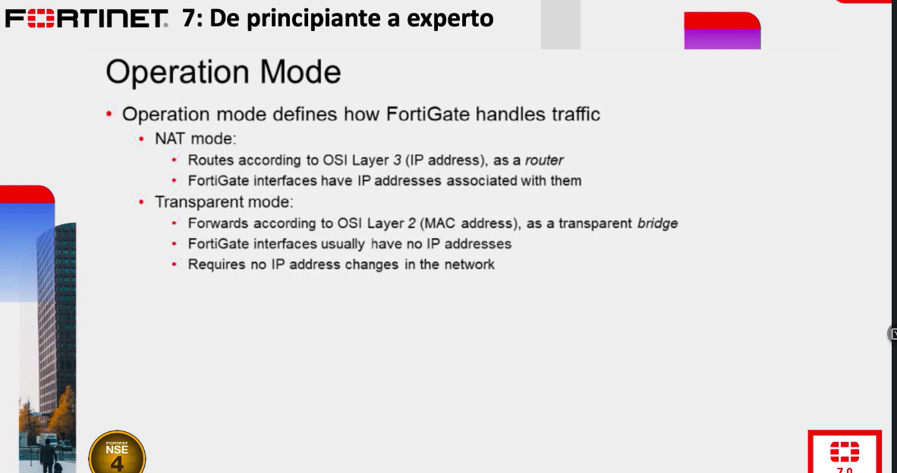
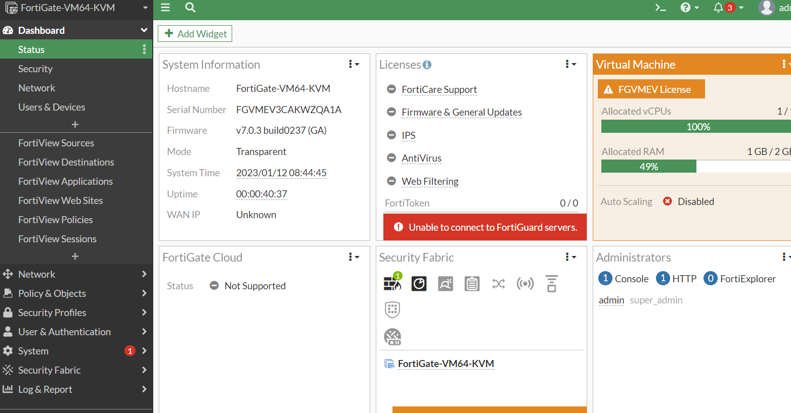
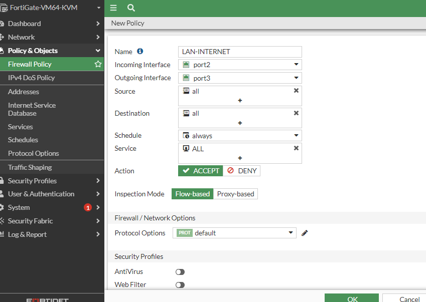
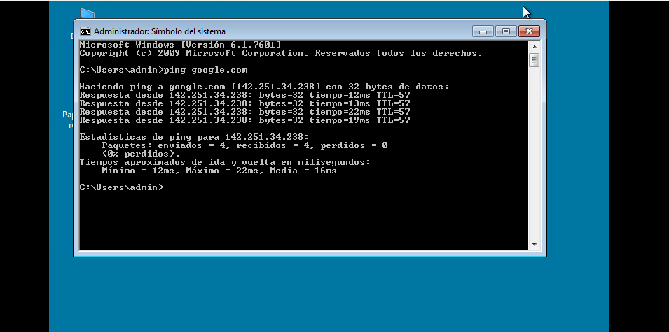
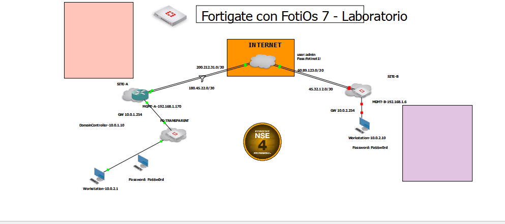
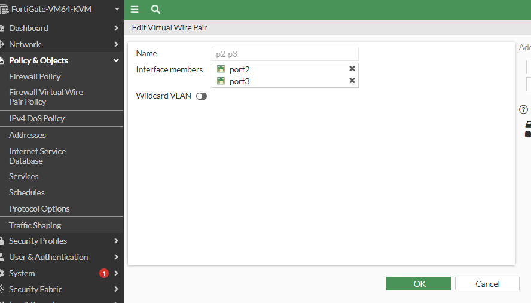
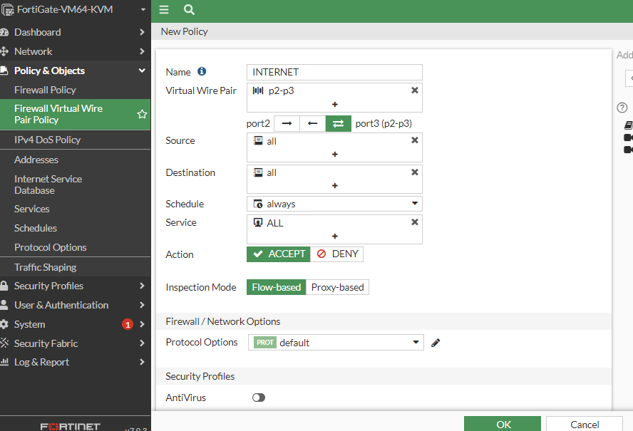

# Modo de operación
### El modo NAT es que hemos utilizado hasta el momento en el curso.

### Modo Transparente
Solo se utiliza para hacer uso de las funcionalidades de seguridad



```
SITE-B # execute factoryreset
This operation will reset the system to factory default!
Do you want to continue? (y/n)y


System is resetting to factory default...


The system is going down NOW !!

SITE-B #
Please stand by while rebooting the system.
Restarting system.

System is starting...
Serial number is FGVMEV3CAKWZQA1A


FortiGate-VM64-KVM login: admin
Password:
Login incorrect


FortiGate-VM64-KVM login: admin
Password:
You are forced to change your password. Please input a new password.
New Password:
Confirm Password:
Welcome!

WARNING: File System Check Recommended! An unsafe reboot may have caused an inconsistency in the disk drive.
It is strongly recommended that you check the file system consistency before proceeding.
Please run 'execute disk list' and then 'execute disk scan <ref#>'.
Note: The device will reboot and scan the disk during startup. This may take up to an hour.
FortiGate-VM64-KVM # config system interface

FortiGate-VM64-KVM (interface) # edit port1

FortiGate-VM64-KVM (port1) # append allowaccess http

FortiGate-VM64-KVM (port1) # end

FortiGate-VM64-KVM # conf system settings

FortiGate-VM64-KVM (settings) # set opmode

incomplete command in the end
Command fail. Return code -160

FortiGate-VM64-KVM (settings) # set opmode transparent

FortiGate-VM64-KVM (settings) # emd
Unknown action 0

FortiGate-VM64-KVM (settings) # end
Cannot change to Transparent mode because this vdom contains managed switches and switchctl-vlans.
Please clear managed-switches, disable fortilink and retry.
node_check_object fail! for opmode transparent
Attribute 'opmode' value 'transparent' checking fail -7610
Command fail. Return code -7610

FortiGate-VM64-KVM # conf system  interface

FortiGate-VM64-KVM (interface) # show
config system interface
    edit "port1"
        set vdom "root"
        set mode dhcp
        set allowaccess ping https ssh http fgfm
        set type physical
        set snmp-index 1
    next
    edit "port2"
        set vdom "root"
        set type physical
        set snmp-index 2
    next
    edit "port3"
        set vdom "root"
        set type physical
        set snmp-index 3
    next
    edit "port4"
        set vdom "root"
        set type physical
        set snmp-index 4
    next
    edit "port5"
        set vdom "root"
        set type physical
        set snmp-index 5
    next
    edit "port6"
        set vdom "root"
        set type physical
        set snmp-index 6
    next
    edit "port7"
        set vdom "root"
        set type physical
        set snmp-index 7
    next
    edit "port8"
        set vdom "root"
        set type physical
        set snmp-index 8
    next
    edit "port9"
        set vdom "root"
        set type physical
        set snmp-index 9
    next
    edit "port10"
        set vdom "root"
        set type physical
        set snmp-index 10
    next
    edit "naf.root"
        set vdom "root"
        set type tunnel
        set src-check disable
        set snmp-index 11
    next
    edit "l2t.root"
        set vdom "root"
        set type tunnel
        set snmp-index 12
    next
    edit "ssl.root"
        set vdom "root"
        set type tunnel
        set alias "SSL VPN interface"
        set snmp-index 13
    next
    edit "fortilink"
        set vdom "root"
        set fortilink enable
        set ip 10.255.1.1 255.255.255.0
        set allowaccess ping fabric
        set type aggregate
        set lldp-reception enable
        set lldp-transmission enable
        set snmp-index 14
    next
end

FortiGate-VM64-KVM (interface) # delete fortilink
The entry is used by other 2 entries
Command fail. Return code -23

FortiGate-VM64-KVM (interface) # end

FortiGate-VM64-KVM # show | grep -fi fort
command parse error before '|'

FortiGate-VM64-KVM # show | grep -fi forti
command parse error before '|'

FortiGate-VM64-KVM # show | grep -fi fortilink
config system interface
    edit "fortilink" <---
        set vdom "root"
        set fortilink enable <---
        set ip 10.255.1.1 255.255.255.0
        set allowaccess ping fabric
        set type aggregate
        set lldp-reception enable
        set lldp-transmission enable
        set snmp-index 14
    next
end
config system ntp
    set ntpsync enable
    set server-mode enable
    set interface "fortilink" <---
end
config system dhcp server
    edit 1
        set ntp-service local
        set default-gateway 10.255.1.1
        set netmask 255.255.255.0
        set interface "fortilink" <---
        set vci-match enable
        set vci-string "FortiSwitch" "FortiExtender"
    next
end
config switch-controller storm-control-policy
    edit "auto-config"
        set description "storm control policy for fortilink-isl-icl port" <---
        set storm-control-mode disabled
    next
end

FortiGate-VM64-KVM # confi system ntp

FortiGate-VM64-KVM (ntp) # set ntpsync disable

FortiGate-VM64-KVM (ntp) # set server-mode disable

FortiGate-VM64-KVM (ntp) # show
config system ntp
end

FortiGate-VM64-KVM (ntp) # end

FortiGate-VM64-KVM # confi system dhcp server

FortiGate-VM64-KVM (server) # show
config system dhcp server
    edit 1
        set ntp-service local
        set default-gateway 10.255.1.1
        set netmask 255.255.255.0
        set interface "fortilink"
        config ip-range
            edit 1
                set start-ip 10.255.1.2
                set end-ip 10.255.1.254
            next
        end
        set vci-match enable
        set vci-string "FortiSwitch" "FortiExtender"
    next
end

FortiGate-VM64-KVM (server) # delte 1
Unknown action 0

FortiGate-VM64-KVM (server) # delete 1

FortiGate-VM64-KVM (server) # show
config system dhcp server
end

FortiGate-VM64-KVM (server) # end

FortiGate-VM64-KVM # Timeout


FortiGate-VM64-KVM login: admin
Password:
Welcome!

WARNING: File System Check Recommended! An unsafe reboot may have caused an inconsistency in the disk drive.
It is strongly recommended that you check the file system consistency before proceeding.
Please run 'execute disk list' and then 'execute disk scan <ref#>'.
Note: The device will reboot and scan the disk during startup. This may take up to an hour.
FortiGate-VM64-KVM # get system interface
== [ port1 ]
name: port1   mode: dhcp    ip: 192.168.1.174 255.255.255.0   status: up    netbios-forward: disable    type: physical   ring-rx: 0   ring-tx: 0   netflow-sampler: disable    sflow-sampler: disable    src-check: enable    explicit-web-proxy: disable    explicit-ftp-proxy: disable    proxy-captive-portal: disable    mtu-override: disable    wccp: disable    drop-overlapped-fragment: disable    drop-fragment: disable
== [ port2 ]
name: port2   mode: static    ip: 0.0.0.0 0.0.0.0   status: up    netbios-forward: disable    type: physical   ring-rx: 0   ring-tx: 0   netflow-sampler: disable    sflow-sampler: disable    src-check: enable    explicit-web-proxy: disable    explicit-ftp-proxy: disable    proxy-captive-portal: disable    mtu-override: disable    wccp: disable    drop-overlapped-fragment: disable    drop-fragment: disable
== [ port3 ]
name: port3   mode: static    ip: 0.0.0.0 0.0.0.0   status: up    netbios-forward: disable    type: physical   ring-rx: 0   ring-tx: 0   netflow-sampler: disable    sflow-sampler: disable    src-check: enable    explicit-web-proxy: disable    explicit-ftp-proxy: disable    proxy-captive-portal: disable    mtu-override: disable    wccp: disable    drop-overlapped-fragment: disable    drop-fragment: disable
== [ port4 ]
name: port4   mode: static    ip: 0.0.0.0 0.0.0.0   status: up    netbios-forward: disable    type: physical   ring-rx: 0   ring-tx: 0   netflow-sampler: disable    sflow-sampler: disable    src-check: enable    explicit-web-proxy: disable    explicit-ftp-proxy: disable    proxy-captive-portal: disable    mtu-override: disable    wccp: disable    drop-overlapped-fragment: disable    drop-fragment: disable
== [ port5 ]
name: port5   mode: static    ip: 0.0.0.0 0.0.0.0   status: up    netbios-forward: disable    type: physical   ring-rx: 0   ring-tx: 0   netflow-sampler: disable    sflow-sampler: disable    src-check: enable    explicit-web-proxy: disable    explicit-ftp-proxy: disable    proxy-captive-portal: disable    mtu-override: disable    wccp: disable    drop-overlapped-fragment: disable    drop-fragment: disable
== [ port6 ]
name: port6   mode: static    ip: 0.0.0.0 0.0.0.0   status: up    netbios-forward: disable    type: physical   ring-rx: 0   ring-tx: 0   netflow-sampler: disable    sflow-sampler: disable    src-check: enable    explicit-web-proxy: disable    explicit-ftp-proxy: disable    proxy-captive-portal: disable    mtu-override: disable    wccp: disable    drop-overlapped-fragment: disable    drop-fragment: disable
== [ port7 ]
name: port7   mode: static    ip: 0.0.0.0 0.0.0.0   status: up    netbios-forward: disable    type: physical   ring-rx: 0   ring-tx: 0   netflow-sampler: disable    sflow-sampler: disable    src-check: enable    explicit-web-proxy: disable    explicit-ftp-proxy: disable    proxy-captive-portal: disable    mtu-override: disable    wccp: disable    drop-overlapped-fragment: disable    drop-fragment: disable
== [ port8 ]
name: port8   mode: static    ip: 0.0.0.0 0.0.0.0   status: up    netbios-forward: disable    type: physical   ring-rx: 0   ring-tx: 0   netflow-sampler: disable    sflow-sampler: disable    src-check: enable    explicit-web-proxy: disable    explicit-ftp-proxy: disable    proxy-captive-portal: disable    mtu-override: disable    wccp: disable    drop-overlapped-fragment: disable    drop-fragment: disable
== [ port9 ]
name: port9   mode: static    ip: 0.0.0.0 0.0.0.0   status: up    netbios-forward: disable    type: physical   ring-rx: 0   ring-tx: 0   netflow-sampler: disable    sflow-sampler: disable    src-check: enable    explicit-web-proxy: disable    explicit-ftp-proxy: disable    proxy-captive-portal: disable    mtu-override: disable    wccp: disable    drop-overlapped-fragment: disable    drop-fragment: disable
== [ port10 ]
name: port10   mode: static    ip: 0.0.0.0 0.0.0.0   status: up    netbios-forward: disable    type: physical   ring-rx: 0   ring-tx: 0   netflow-sampler: disable    sflow-sampler: disable    src-check: enable    explicit-web-proxy: disable    explicit-ftp-proxy: disable    proxy-captive-portal: disable    mtu-override: disable    wccp: disable    drop-overlapped-fragment: disable    drop-fragment: disable
== [ naf.root ]
name: naf.root   ip: 0.0.0.0 0.0.0.0   status: up    netbios-forward: disable    type: tunnel   netflow-sampler: disable    sflow-sampler: disable    src-check: disable    explicit-web-proxy: disable    explicit-ftp-proxy: disable    proxy-captive-portal: disable    wccp: disable
== [ l2t.root ]
name: l2t.root   ip: 0.0.0.0 0.0.0.0   status: up    netbios-forward: disable    type: tunnel   netflow-sampler: disable    sflow-sampler: disable    src-check: enable    explicit-web-proxy: disable    explicit-ftp-proxy: disable    proxy-captive-portal: disable    wccp: disable
== [ ssl.root ]
name: ssl.root   ip: 0.0.0.0 0.0.0.0   status: up    netbios-forward: disable    type: tunnel   netflow-sampler: disable    sflow-sampler: disable    src-check: enable    explicit-web-proxy: disable    explicit-ftp-proxy: disable    proxy-captive-portal: disable    wccp: disable
== [ fortilink ]
name: fortilink   mode: static    ip: 10.255.1.1 255.255.255.0   status: up    netbios-forward: disable    type: aggregate   netflow-sampler: disable    sflow-sampler: disable    src-check: enable    explicit-web-proxy: disable    explicit-ftp-proxy: disable    proxy-captive-portal: disable    mtu-override: disable    wccp: disable    drop-overlapped-fragment: disable    drop-fragment: disable


FortiGate-VM64-KVM # conf system  settings

FortiGate-VM64-KVM (settings) # set opmode transparent

FortiGate-VM64-KVM (settings) # end
Cannot change to Transparent mode because this vdom contains managed switches and switchctl-vlans.
Please clear managed-switches, disable fortilink and retry.
node_check_object fail! for opmode transparent
Attribute 'opmode' value 'transparent' checking fail -7610
Command fail. Return code -7610

FortiGate-VM64-KVM # show | grep -fi fortilink
config system interface
    edit "fortilink" <---
        set vdom "root"
        set fortilink enable <---
        set ip 10.255.1.1 255.255.255.0
        set allowaccess ping fabric
        set type aggregate
        set lldp-reception enable
        set lldp-transmission enable
        set snmp-index 14
    next
end
config switch-controller storm-control-policy
    edit "auto-config"
        set description "storm control policy for fortilink-isl-icl port" <---
        set storm-control-mode disabled
    next
end

FortiGate-VM64-KVM # show | grep -fi fortilink
config system interface
    edit "fortilink" <---
        set vdom "root"
        set fortilink enable <---
        set ip 10.255.1.1 255.255.255.0
        set allowaccess ping fabric
        set type aggregate
        set lldp-reception enable
        set lldp-transmission enable
        set snmp-index 14
    next
end
config switch-controller storm-control-policy
    edit "auto-config"
        set description "storm control policy for fortilink-isl-icl port" <---
        set storm-control-mode disabled
    next
end

FortiGate-VM64-KVM # delete for
command parse error before 'delete'

FortiGate-VM64-KVM # delete fortilink
Unknown action 0

FortiGate-VM64-KVM # show | grep -fi fortilink
config system interface
    edit "fortilink" <---
        set vdom "root"
        set fortilink enable <---
        set ip 10.255.1.1 255.255.255.0
        set allowaccess ping fabric
        set type aggregate
        set lldp-reception enable
        set lldp-transmission enable
        set snmp-index 14
    next
end
config switch-controller storm-control-policy
    edit "auto-config"
        set description "storm control policy for fortilink-isl-icl port" <---
        set storm-control-mode disabled
    next
end

FortiGate-VM64-KVM # conf sys interface

FortiGate-VM64-KVM (interface) # delete fortilink

FortiGate-VM64-KVM (interface) # end

FortiGate-VM64-KVM # show | grep -fi fortilink
config switch-controller storm-control-policy
    edit "auto-config"
        set description "storm control policy for fortilink-isl-icl port" <---
        set storm-control-mode disabled
    next
end

FortiGate-VM64-KVM # set opmode transparent
Unknown action 0


FortiGate-VM64-KVM # config system settings

FortiGate-VM64-KVM (settings) # set opmode transparent

FortiGate-VM64-KVM (settings) # set manageip 192.168.1.174/24

FortiGate-VM64-KVM (settings) # set gateway 192.168.1.254

FortiGate-VM64-KVM (settings) # end

Changing to TP mode

```
```
FortiGate-VM64-KVM # get system status
Version: FortiGate-VM64-KVM v7.0.3,build0237,211207 (GA)
Virus-DB: 1.00000(2018-04-09 18:07)
Extended DB: 1.00000(2018-04-09 18:07)
Extreme DB: 1.00000(2018-04-09 18:07)
AV AI/ML Model: 0.00000(2001-01-01 00:00)
IPS-DB: 6.00741(2015-12-01 02:30)
IPS-ETDB: 6.00741(2015-12-01 02:30)
APP-DB: 6.00741(2015-12-01 02:30)
INDUSTRIAL-DB: 6.00741(2015-12-01 02:30)
IPS Malicious URL Database: 1.00001(2015-01-01 01:01)
Serial-Number: FGVMEV3CAKWZQA1A
License Status: Valid
Evaluation License Expires: Fri Jan 27 08:04:17 2023
VM Resources: 1 CPU/1 allowed, 997 MB RAM/2048 MB allowed
Log hard disk: Available
Hostname: FortiGate-VM64-KVM
Operation Mode: Transparent
Current virtual domain: root
Max number of virtual domains: 1
Virtual domains status: 0 in NAT mode, 1 in TP mode
Virtual domain configuration: disable
FIPS-CC mode: disable
Current HA mode: standalone
Branch point: 0237
Release Version Information: GA
```


Ahora en el laboratorio haremos la prueba de salida a internet y para eso tenemos que activar una nueva política.

```
Firewall->Policy&Objects->Firewall policy
Name:LAN-INTERNET
Incoming:Port2
Outgoing:Port3
Source:all
Destination:all
service:all
Al estar en modo transparente (capa2) no se puede habilitar el NAT.
```

Si hacemos un ping tendremos respuesta.

En este laboratorio se puso un FG entre el router y la pc, su función es que este modo firewall (capa2)


### Modo Trasnparente -> Virtual Wire Pair
Está configuración también se puede configurar con el NAT
```
Network->Interface->Create New->Virtual Wire Pair
Name:p2-p3
Interface Name:Port2 Port3

Al hacer esto en Policy & objects nos aparece una opción llamada Firewall Virtual Wire pair policy

```

```
Click en irewall Virtual Wire pair policy->New policy
Y lo nuevo que nos encontramos es la dirección de port2 -> port3, puede ser de viceversa o bidireccional
```


Lo que se crea es un circuito, el tráfico que entre por alguna (port2<->) de esas interfaces, solamente va poder ir hacia la otra, pierde conexión con las demas interfaces(port4,port5,port6..portn) tiene una ventaja ya que reduce al broadcast.