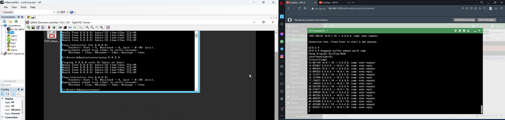

# Packet Sniffer por CLI
```
SITE-A # diagnose sniffer packet port4 icmp
Using Original Sniffing Mode
interfaces=[port4]
filters=[icmp]
14.061164 10.0.1.10 -> 8.8.8.8: icmp: echo request
14.072057 8.8.8.8 -> 10.0.1.10: icmp: echo reply
15.082424 10.0.1.10 -> 8.8.8.8: icmp: echo request
15.094323 8.8.8.8 -> 10.0.1.10: icmp: echo reply
16.121377 10.0.1.10 -> 8.8.8.8: icmp: echo request
16.131998 8.8.8.8 -> 10.0.1.10: icmp: echo reply
17.136812 10.0.1.10 -> 8.8.8.8: icmp: echo request
17.148429 8.8.8.8 -> 10.0.1.10: icmp: echo reply
38.363189 10.0.1.10 -> 8.8.8.8: icmp: echo request
38.374271 8.8.8.8 -> 10.0.1.10: icmp: echo reply
39.390959 10.0.1.10 -> 8.8.8.8: icmp: echo request
39.401555 8.8.8.8 -> 10.0.1.10: icmp: echo reply
40.409235 10.0.1.10 -> 8.8.8.8: icmp: echo request
40.424508 8.8.8.8 -> 10.0.1.10: icmp: echo reply
41.422689 10.0.1.10 -> 8.8.8.8: icmp: echo request
41.435227 8.8.8.8 -> 10.0.1.10: icmp: echo reply
236.223140 10.0.1.10 -> 1.1.1.1: icmp: 10.0.1.10 udp port 60614 unreachable
```

Ahora cuando hacemos un ping como prueba en el CLI se ve que está apuntado hacía ping google.com


Pero si voy a google.com a través del navegador nos indica que es inalcanzable

```
365.857297 10.0.1.10 -> 1.1.1.1: icmp: 10.0.1.10 udp port 59754 unreachable
```
Podemos agregar más cosas a nuestro sniffer, en este caso solo esta analizando la computadora con la ip 10.0.1.10
```
SITE-A # diagnose sniffer packet port4 "icmp && src host 10.0.1.10"
Using Original Sniffing Mode
interfaces=[port4]
filters=[icmp && src host 10.0.1.10]
16.619767 10.0.1.10 -> 172.217.15.14: icmp: echo request
17.639169 10.0.1.10 -> 172.217.15.14: icmp: echo request
18.675029 10.0.1.10 -> 172.217.15.14: icmp: echo request
19.724220 10.0.1.10 -> 172.217.15.14: icmp: echo request
^C
4 packets received by filter
0 packets dropped by kernel

SITE-A # diagnose sniffer packet port4 "icmp && dst host 10.0.1.10"
Using Original Sniffing Mode
interfaces=[port4]
filters=[icmp && dst host 10.0.1.10]
3.822961 172.217.15.14 -> 10.0.1.10: icmp: echo reply
4.843801 172.217.15.14 -> 10.0.1.10: icmp: echo reply
5.886665 172.217.15.14 -> 10.0.1.10: icmp: echo reply
6.919011 172.217.15.14 -> 10.0.1.10: icmp: echo reply
```
Podemos revisar también los puertos UDP y el puerto especificado en este caso 53

```
SITE-A # diagnose sniffer packet port4 "udp && port 53 && host 10.0.1.10"
Using Original Sniffing Mode
interfaces=[port4]
filters=[udp && port 53 && host 10.0.1.10]
0.911310 8.8.8.8.53 -> 10.0.1.10.60440: udp 110
0.919013 8.8.8.8.53 -> 10.0.1.10.63251: udp 37
0.921444 10.0.1.10.50324 -> 8.8.8.8.53: udp 35
1.008526 10.0.1.10.50324 -> 1.1.1.1.53: udp 35
1.017433 8.8.8.8.53 -> 10.0.1.10.50324: udp 35
1.030162 10.0.1.10.62335 -> 8.8.8.8.53: udp 33
1.069049 1.1.1.1.53 -> 10.0.1.10.50324: udp 35
1.083327 8.8.8.8.53 -> 10.0.1.10.62335: udp 33
1.085224 10.0.1.10.49216 -> 8.8.8.8.53: udp 30
1.089580 8.8.8.8.53 -> 10.0.1.10.49216: udp 98
1.134984 10.0.1.10.64369 -> 8.8.8.8.53: udp 30
1.188834 8.8.8.8.53 -> 10.0.1.10.64369: udp 105
1.193086 10.0.1.10.64235 -> 8.8.8.8.53: udp 40
1.261943 8.8.8.8.53 -> 10.0.1.10.64235: udp 115
1.265766 10.0.1.10.59754 -> 8.8.8.8.53: udp 45
1.324262 8.8.8.8.53 -> 10.0.1.10.59754: udp 120
1.328335 10.0.1.10.61434 -> 8.8.8.8.53: udp 45
1.380075 8.8.8.8.53 -> 10.0.1.10.61434: udp 120
39.089174 10.0.1.10.59754 -> 8.8.8.8.53: udp 27
39.145392 8.8.8.8.53 -> 10.0.1.10.59754: udp 43
^C
20 packets received by filter
0 packets dropped by kernel

SITE-A #

Nota: Revisar el documento de verbosidad.
```