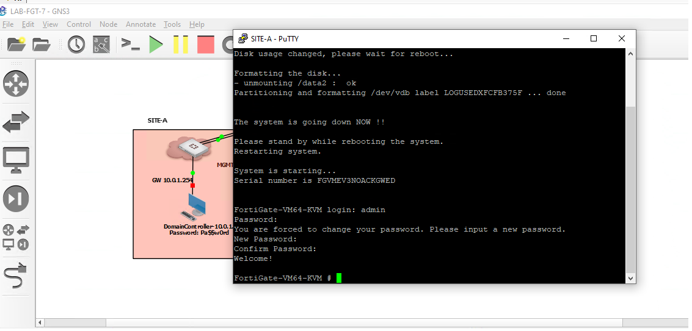
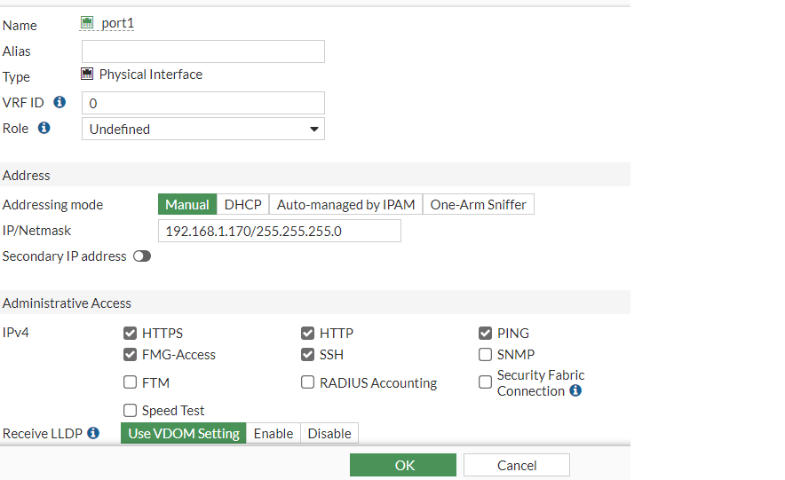
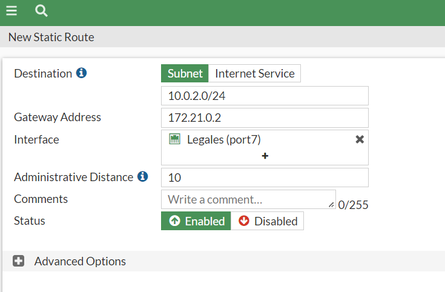
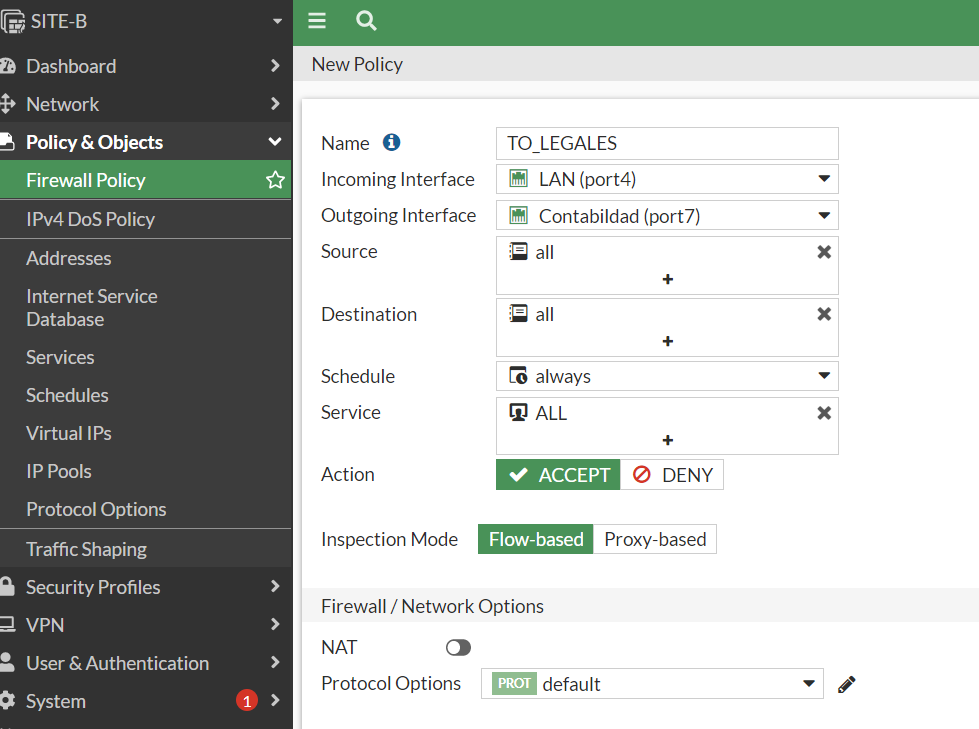
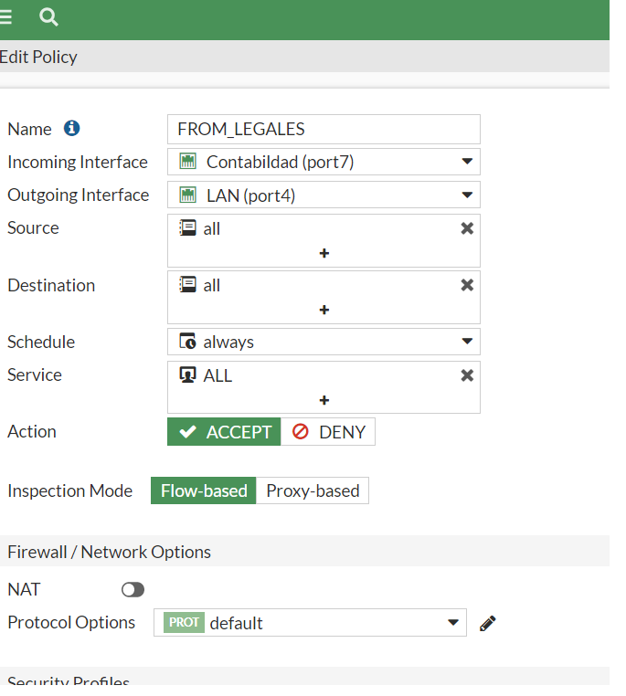
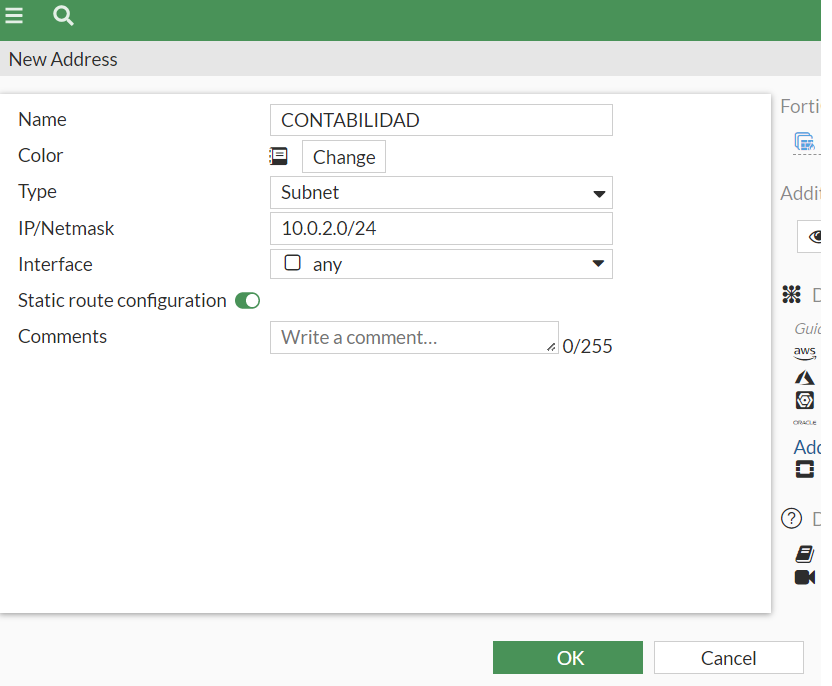
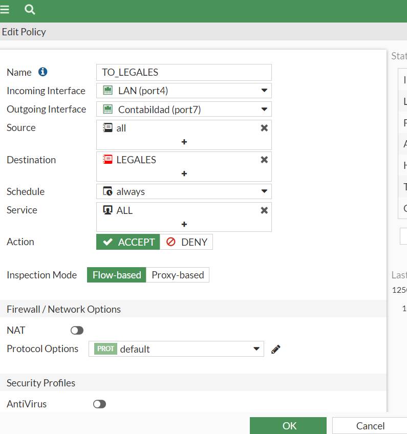
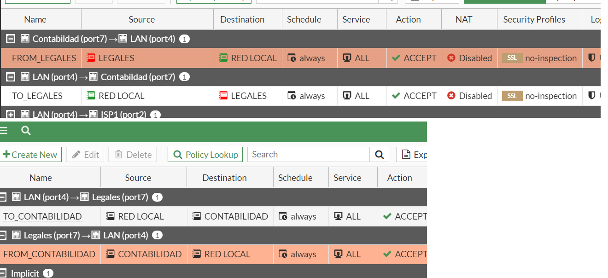

# Laboratorio Fortinet 7.0
Estos son apuntes personales del curso Fortinet 7: De principiante a experto, impartido por Eduardo Nazareno Anselmi [Adquirir el curso aquí](https://www.udemy.com/course/fortinet-7-de-principiante-a-experto/)

En este curso se require los siguientes programas para el laboratorio:
* [GNS3](https://gns3.com/software) descargar la versión servidor y cliente

* [VMWARE](https://www.vmware.com/products/workstation-player/workstation-player-evaluation.html)

Una vez descargado los programas vamos a configurar el Vmware:

Para conectarnos al GNS3 y que nos permita jalar el laboratorio tenemos que copiar los datos de la ip que en este caso es la 192.168.1.166 y al puerto 80, el usuario es gns3 al igual que el password


Lo primero que vamos hacer es acomador los equipos superpuestos y a cambia el icono de los equipos fortinet para hacer eso presionamos botón derecho del mouse y click en cambiar simbolos.


Después seleccionar usar simbolo personalizado y click en examinar, seleccionamos el icono y click en aplicar y ok, tenemos que hacer lo cambios en todos los dispositivos que se muestran en el laboratorio(LB)


una vez aplicado los cambios tenemos que cerrar y volver abrir el LB y click en start para arrancar todos los dispositivos.


Cambiar IP DHCP por una estatica:
Abrimos GNS3 luego click en ok y nos dirigimos a la sección de Network y nos pedirá reiniciar una vez echo los cambios, presionamos yes


Ahora de donde dice #networ hacía abajo vamos a quitar el comentario y remplazar la iP y el gateway:


Debemos respetar la identación, y una vez hecho los cambios con cntrl + x para salir y click en yes, y nos saldrá un cuadro de dialogo que nos indica que se modificara el archivo presionamos enter


Una vez que se reinicio el equipo nos aparecerá la modificación y en el GNS 3 también tenemos que modicar la ip de conexión en edición->Preference->Server


Snapshots
Se realiza con los equipos FGT apagados, vamos a edit-> manangment spanshots, click en crear 

Es importante crearlos en cada modificación importante, ya que en caso de borrar algún dispositivo forti podremos restaurarlo.

Y para restauralo son los mismos pasos excepto que en vez de presionar crear, debemos presionar restore


Temas que se van a ver en esta primera parte:


Primer acceso a nuestro firewall:


Nos vamos a conectar a un equipo fortinet, usuario:admin y password:(blank), nos pedirá que cambiemos la contraseña:


Primeros comandos:
Tenemos que ingresar a ver la ip del equipo:

FortiGate-VM64-KVM # get system interface
== [ port1 ]
name: port1   mode: dhcp    ip: 192.168.1.170 255.255.255.0   status: up    netbios-forward: disable    type: physical   ring-rx: 0   ring-tx: 0   netflow-sampler: disable    sflow-sampler: disable    src-check: enable    explicit-web-proxy: disable    explicit-ftp-proxy: disable    proxy-captive-portal: disable    mtu-override: disable    wccp: disable    drop-overlapped-fragment: disable    drop-fragment: disable
== [ port2 ]
== [ port3 ]
== [ port4 ]

*Después veremos la configuración del equip
FortiGate-VM64-KVM # conf sys interface

*Ahora vamos activar http para ingresar a través de la web
FortiGate-VM64-KVM (interface) # edit port1

FortiGate-VM64-KVM (port1) # show
config system interface
    edit "port1"
        set vdom "root"
        set mode dhcp
        set allowaccess ping https ssh fgfm
        set type physical
        set snmp-index 1
    next
end

*Con este puerto se permite el acceso a través del http
FortiGate-VM64-KVM (port1) # append allowaccess http

* show para confirmar que el puerto este activo
FortiGate-VM64-KVM (port1) # show
config system interface
    edit "port1"
        set vdom "root"
        set mode dhcp
        set allowaccess ping https ssh http fgfm
        set type physical
        set snmp-index 1
    next
end

*Para guardar cambios con end
FortiGate-VM64-KVM (port1) # end

Comprobamos con el navegador, ingresamos el usuario y contraseña


Opcional: En este caso seleccione begin


Nombramos el equipo como SITE-A y click en ok


Seleccionamos Optimal y click en ok


Dashboard de inicio


Configuramos de la misma manera el SITE-B.

En ambos equipos Fortigate el puerto 1 será para la administración y el puerto 2 y 3 similarán ser direcciones IP Pueblicas (ISP) y el puerto 4 será la LAN de las Pc's.

Ahora si hacemos un ping a google a través del CLI que se encuentra en el dashboard en ambos equipos nos dará salida:

SITE-A # exec ping google.com
PING google.com (142.251.34.206): 56 data bytes
64 bytes from 142.251.34.206: icmp_seq=0 ttl=117 time=13.4 ms
SITE-B # exec ping google.com

¿Por qué pasa esto si aún no hemos configurado? (laboratorio)se debe a que el puerto 1 tiene configuración DHCP

Para ello vamos a ingresar vía web a uno de los forti y nos vamos a Network-> Interfaces y vermos que ahí está tomando la DNS configurado en nuestro router, entonces tenemos que deshabilitar la opción que dice Rerieve default gateway from server y la que dice override Internal DNS, 


Ahora si volver hacer ping ya no nos permitira hacer ping y está bien porqué el puerto uno es para la configuración y administración.

admin@192.168.1.170's password:
SITE-A # exec ping google.com
Unable to resolve hostname.

SITE-A #

Ahora vamos a ingresar a configurar la zona horaria a través de la interfaz gráfica:
System->Settings 

En esta misma sección tenemos que darle el máximo tiempo de conexión antes de que se cierre la sesión que es de 480 minutos(solo se aplica en laboratorio)

Idle timeout : 480

Auto file system check: check
(esto en caso de que se apague mal el equipo)

Ahora vamos hacer una pequeña revisión:


¿Que és un dashboard?
Colección de widget, encontraremos información del sistema, estado de licencias
¿Qué es un monitor?
nos muestra tráfico o destino, cosas que el forti está procesando o preceso, es como ver un widget

En el menú en la parte de NEtwork: no serán vistas en el curso debido a que no es el scope del curso, ya que no se toman en cuentan las certificaciones.
RIP,OSPF,BGP,Routing Objets, Multicas

Vamos a empezar poniendo una IP fija a nuestros dos dispositivos forti

1.- Forma web
Una vez ingresando a nuestro dispositivo vamos a network->interfaces->Port1->seleccionamos la opción manual y le ponemos la ip que deseamos.


Dejaré los mismos que me dió por default y click en ok



2.- Ahora a través de la consola con el comando set ip 192.168.1.6/24
```
edit port
set mode static
show
set ip ip/ip mask
show
end
```
```
SITE-B (interface) # edit port1

SITE-B (port1) # show
config system interface
    edit "port1"
        set vdom "root"
        set mode dhcp
        set allowaccess ping https ssh http fgfm
        set type physical
        set snmp-index 1
        config ipv6
            set ip6-send-adv enable
            set ip6-other-flag enable
        end
        set defaultgw disable
        set dns-server-override disable
    next
end

SITE-B (port1) # set mode static

SITE-B (port1) # show
config system interface
    edit "port1"
        set vdom "root"
        set ip 192.168.1.172 255.255.255.0
        set allowaccess ping https ssh http fgfm
        set type physical
        set snmp-index 1
        config ipv6
            set ip6-send-adv enable
            set ip6-other-flag enable
        end
        set dns-server-override disable
    next
end

SITE-B (port1) # set ip 192.168.1.6

incomplete command in the end
Command fail. Return code -160

SITE-B (port1) # set ip 192.168.1.6/24

SITE-B (port1) # show
config system interface
    edit "port1"
        set vdom "root"
        set ip 192.168.1.6 255.255.255.0
        set allowaccess ping https ssh http fgfm
        set type physical
        set snmp-index 1
        config ipv6
            set ip6-send-adv enable
            set ip6-other-flag enable
        end
        set dns-server-override disable
    next
end

SITE-B (port1) #
```

Con get system status, revisamos cuando vencen las licencias.

```

SITE-A # get system status
Version: FortiGate-VM64-KVM v7.0.3,build0237,211207 (GA)
Virus-DB: 1.00000(2018-04-09 18:07)
Extended DB: 1.00000(2018-04-09 18:07)
Extreme DB: 1.00000(2018-04-09 18:07)
AV AI/ML Model: 0.00000(2001-01-01 00:00)
IPS-DB: 6.00741(2015-12-01 02:30)
IPS-ETDB: 6.00741(2015-12-01 02:30)
APP-DB: 6.00741(2015-12-01 02:30)
INDUSTRIAL-DB: 6.00741(2015-12-01 02:30)
IPS Malicious URL Database: 1.00001(2015-01-01 01:01)
Serial-Number: FGVMEV3NOACKGWED
License Status: Valid
Evaluation License Expires: Thu Oct  6 07:11:01 2022
VM Resources: 1 CPU/1 allowed, 997 MB RAM/2048 MB allowed
Log hard disk: Available
Hostname: SITE-A
Operation Mode: NAT
Current virtual domain: root
Max number of virtual domains: 1
Virtual domains status: 1 in NAT mode, 0 in TP mode
Virtual domain configuration: disable
FIPS-CC mode: disable
Current HA mode: standalone
Branch point: 0237
Release Version Information: GA
FortiOS x86-64: Yes
System time: Mon Sep 26 15:29:21 2022
Last reboot reason: warm reboot
```

## Configuración de interfaces

Primero vamos a trabajar con el Site A.
Puerto 2 sera nuestro ISP1 (La IP es la que nos muestra en el laboratorio)


Puerto 3 (La IP es la que nos muestra en el laboratorio)


Ahora para probar hacemos un ping al gateway 
al router del microtic del laboratorio
```
SITE-A # exec ping 180.45.22.2
PING 180.45.22.2 (180.45.22.2): 56 data bytes
64 bytes from 180.45.22.2: icmp_seq=0 ttl=64 time=8.3 ms
64 bytes from 180.45.22.2: icmp_seq=1 ttl=64 time=3.7 ms
64 bytes from 180.45.22.2: icmp_seq=2 ttl=64 time=3.3 ms
64 bytes from 180.45.22.2: icmp_seq=3 ttl=64 time=3.3 ms
64 bytes from 180.45.22.2: icmp_seq=4 ttl=64 time=3.8 ms

--- 180.45.22.2 ping statistics ---
5 packets transmitted, 5 packets received, 0% packet loss
round-trip min/avg/max = 3.3/4.4/8.3 ms

```
```

SITE-A # exec ping 200.212.31.2
PING 200.212.31.2 (200.212.31.2): 56 data bytes
64 bytes from 200.212.31.2: icmp_seq=0 ttl=64 time=8.4 ms
64 bytes from 200.212.31.2: icmp_seq=1 ttl=64 time=3.4 ms
64 bytes from 200.212.31.2: icmp_seq=2 ttl=64 time=5.5 ms
64 bytes from 200.212.31.2: icmp_seq=3 ttl=64 time=4.0 ms
64 bytes from 200.212.31.2: icmp_seq=4 ttl=64 time=2.3 ms

--- 200.212.31.2 ping statistics ---
5 packets transmitted, 5 packets received, 0% packet loss
round-trip min/avg/max = 2.3/4.7/8.4 ms

```
Ahora si tratamos de realizar un ping a google nos saldra que no es posible, esto es debido a que nos falta la default route, y esto aplica para cualquier router no importa la marca.

```
SITE-A # ping google.com
Unknown action 0
```
Para eso nos vamos a Network->static route->create new


Como podemos ver es agregar el gateway (sin mascara)de los proveedores anteriormente añadidos


En esta segunda configuración en la opción de distancia la ponemos más alta, eso se debe a que uno será la red principal(10) y la otra (15) el backup en caso de que se caiga o falle la red entra la otra en función. 


Ahora si hacemos nuevamente ping, podremos salir a internet:

```
SITE-A # exec ping google.com
PING google.com (142.250.72.174): 56 data bytes
64 bytes from 142.250.72.174: icmp_seq=0 ttl=109 time=90.1 ms
64 bytes from 142.250.72.174: icmp_seq=1 ttl=109 time=62.2 ms
64 bytes from 142.250.72.174: icmp_seq=2 ttl=109 time=60.6 ms
64 bytes from 142.250.72.174: icmp_seq=3 ttl=109 time=61.5 ms
64 bytes from 142.250.72.174: icmp_seq=4 ttl=109 time=62.0 ms

--- google.com ping statistics ---
5 packets transmitted, 5 packets received, 0% packet loss
round-trip min/avg/max = 60.6/67.2/90.1 ms
```

Ahora vamos a configurar el puerto 4.

Agregamos la IP y habilitamos el ping


Ahora nos conectamos a la pc y hacemos la pruba de ping al 10.0.1.254


Ahora vamos a repetir los mimos pasos anteriores para el forti SITE-B pero en este caso a través de la terminal.

Configuración puerto 2
```
SITE-B # confi sys interface


SITE-B (interface) # edit port2

SITE-B (port2) # show
config system interface
    edit "port2"
        set vdom "root"
        set type physical
        set snmp-index 2
    next
end

SITE-B (port2) # set ip 69.89.123.1/30

SITE-B (port2) # set alias ISP1

SITE-B (port2) # set role wan

SITE-B (port2) # show
config system interface
    edit "port2"
        set vdom "root"
        set ip 69.89.123.1 255.255.255.252
        set type physical
        set alias "ISP1"
        set role wan
        set snmp-index 2
    next
end

SITE-B (port2) # end
```

Ahora el puerto 3 

```

SITE-B (interface) # edit port3

SITE-B (port3) # show
config system interface
    edit "port3"
        set vdom "root"
        set type physical
        set snmp-index 3
    next
end


SITE-B (port3) # set ip 45.32.12.1/30

SITE-B (port3) # set alias ISP-2

SITE-B (port3) # set role wan

SITE-B (port3) # show
config system interface
    edit "port3"
        set vdom "root"
        set ip 45.32.12.1 255.255.255.252
        set type physical
        set alias "ISP-2"
        set role wan
        set snmp-index 3
    next
end

SITE-B (port3) # end {nota: en caso de seguir configurando en vez de usar end podemos usar next para no salir de la configuración}

```
SITE-B (interface) # edit port4

SITE-B (port4) # show
config system interface
    edit "port4"
        set vdom "root"
        set type physical
        set snmp-index 4
    next
end

SITE-B (port4) # set ip 10.0.2.254/24

SITE-B (port4) # show
config system interface
    edit "port4"
        set vdom "root"
        set ip 10.0.2.254 255.255.255.0
        set type physical
        set snmp-index 4
    next
end

SITE-B (port4) # set allowaccess ping

SITE-B (port4) # set alias lan

SITE-B (port4) # set role lan

SITE-B (port4) # show
config system interface
    edit "port4"
        set vdom "root"
        set ip 10.0.2.254 255.255.255.0
        set allowaccess ping
        set type physical
        set alias "lan"
        set role lan
        set snmp-index 4
    next
end

SITE-B (port4) # end

``
Ahora colocaremos las rutas

Ya que si tratamos de hacer un ping no nos dejará
```
SITE-B # ping google.com
Unknown action 0
```
ISP 1
```
SITE-B # config router static

SITE-B (static) # show
config router static
end

SITE-B (static) # edit 1
new entry '1' added

SITE-B (1) # show
config router static
    edit 1
    next
end

SITE-B (1) # get
seq-num             : 1
status              : enable
dst                 : 0.0.0.0 0.0.0.0
gateway             : 0.0.0.0
distance            : 10
weight              : 0
priority            : 0
device              :
comment             :
blackhole           : disable
dynamic-gateway     : disable
sdwan-zone          :
dstaddr             :
internet-service    : 0
internet-service-custom:
link-monitor-exempt : disable
bfd                 : disable


SITE-B (1) # set gateway 60.89.123.2

SITE-B (1) # set device port2

SITE-B (1) # show
config router static
    edit 1
        set gateway 69.89.123.2
        set device "port2"
    next
end

SITE-B (1) # next

```
ISP 2

```

SITE-B (1) # set gateway 60.89.123.2

SITE-B (1) # set device port2

SITE-B (1) # show
config router static
    edit 1
        set gateway 69.89.123.2
        set device "port2"
    next
end

SITE-B (1) # next

SITE-B (static) # end

SITE-B # conf router static

SITE-B (static) # edit 2
new entry '2' added

SITE-B (2) # show
config router static
    edit 2
    next
end

SITE-B (2) # set gateway 45.32.12.2

SITE-B (2) # set device port3

SITE-B (2) # set distance 15

SITE-B (2) # show
config router static
    edit 2
        set gateway 45.32.12.2
        set distance 15
        set device "port3"
    next
end

SITE-B (2) # end

```
Con show full-configuration podemos ver todos los valores por defecto y todos los que hemos modificado

```
SITE-B # show full-configuration
#config-version=FGVMK6-7.0.3-FW-build0237-211207:opmode=1:vdom=0:user=admin
#conf_file_ver=282647502847925
#buildno=0237
#global_vdom=1
config system global
    set admin-concurrent enable
    set admin-console-timeout 0
    set admin-forticloud-sso-login disable
    set admin-https-pki-required disable
    unset admin-https-ssl-banned-ciphers
    set admin-https-ssl-ciphersuites TLS-AES-128-GCM-SHA256 TLS-AES-256-GCM-SHA384 TLS-CHACHA20-POLY1305-SHA256
    set admin-https-ssl-versions tlsv1-2
    set admin-lockout-duration 60
    set admin-lockout-threshold 3
    set admin-login-max 100
    set admin-maintainer enable
    set admin-port 80
    set admin-restrict-local disable
    set admin-scp disable
    set admin-server-cert "self-sign"
    set admin-sport 443
    set admin-ssh-grace-time 120
    set admin-ssh-password enable
    set admin-ssh-port 22
    set admin-ssh-v1 disable
    set admin-telnet enable
    set admin-telnet-port 23
    set admintimeout 448
    set alias "FortiGate-VM64-KVM"
    set allow-traffic-redirect enable
    set anti-replay strict
    set arp-max-entry 131072
    set auth-cert "self-sign"
    set auth-http-port 1000
    set auth-https-port 1003
    set auth-keepalive disable
    set auth-session-limit block-new
    set auto-auth-extension-device enable
    set autorun-log-fsck disable
    set av-affinity "0"
    set av-failopen pass
    set av-failopen-session disable
    set batch-cmdb enable
    set block-session-timer 30
    set br-fdb-max-entry 8192
    set cert-chain-max 8
    set cfg-save automatic
    set check-protocol-header loose
    set check-reset-range disable
    set cli-audit-log disable
    set cloud-communication enable

```

```
SITE-B # conf rout static

SITE-B (static) # show
config router static
    edit 1
        set gateway 69.89.123.2
        set device "port2"
    next
    edit 2
        set gateway 45.32.12.2
        set distance 15
        set device "port3"
    next
end


```

Hacemos un ping a google para rectificar

```
SITE-B # exec ping google.com
PING google.com (142.251.34.142): 56 data bytes
64 bytes from 142.251.34.142: icmp_seq=0 ttl=111 time=11.9 ms
64 bytes from 142.251.34.142: icmp_seq=1 ttl=111 time=11.0 ms
64 bytes from 142.251.34.142: icmp_seq=2 ttl=111 time=11.3 ms
64 bytes from 142.251.34.142: icmp_seq=3 ttl=111 time=20.4 ms
64 bytes from 142.251.34.142: icmp_seq=4 ttl=111 time=13.8 ms

--- google.com ping statistics ---
5 packets transmitted, 5 packets received, 0% packet loss
round-trip min/avg/max = 11.0/13.6/20.4 ms

SITE-B #

Y un ping a la pc-2

SITE-B # exec ping 10.0.2.10
PING 10.0.2.10 (10.0.2.10): 56 data bytes
64 bytes from 10.0.2.10: icmp_seq=0 ttl=64 time=2.8 ms
64 bytes from 10.0.2.10: icmp_seq=1 ttl=64 time=1.9 ms
64 bytes from 10.0.2.10: icmp_seq=2 ttl=64 time=3.6 ms
64 bytes from 10.0.2.10: icmp_seq=3 ttl=64 time=4.7 ms
64 bytes from 10.0.2.10: icmp_seq=4 ttl=64 time=1.9 ms

--- 10.0.2.10 ping statistics ---
5 packets transmitted, 5 packets received, 0% packet loss
round-trip min/avg/max = 1.9/2.9/4.7 ms

```

## Backups & Restore

### Opción web

Ir a configuración, luego backup y si se requiere, podemos restaurar.


En caso de querer editar el archivo backup para pasarlo a otro equipo similar de dónde se realizado la copia debemos tener en cuenta, la cantidad de puertos y la versión del firewall tiene que ser el mismo del equipo original.

```
#config-version= FGVMK6-7.0.3-FW-build0237-211207:opmode=0:vdom=0:user=admin

#conf_file_ver=282763466964943
#buildno=0237
#global_vdom=1
config system global
    set alias "FortiGate-VM64-KVM"
    set hostname "SITE-A"
    set timezone 04
end
```
## Ahora a traves de la linea de comandos

Lista de opción con ? 
```
SITE-B # execute backup ?
config           config
disk             disk
full-config      full-config
ipsuserdefsig    ipsuserdefsig
memory           memory
```

### Con el siguiente comando respaldamos a través de un servidor FTP

***excute backup config ftp "Nombre que asiganaremos al archivo" "IP del servidor FTP" "Usuario" "Password"***

```
SITE-B # execute backup config ftp SITE-B-27092022 200.212.31.2 ftp ftp
Please wait...

Connect to ftp server 200.212.31.2 ...
Send config file to ftp server OK.

```

### Con siguiente comando resturamos el backup con el comando restore


***excute restore config ftp "Nombre del archivo" "IP del servidor FTP" "Usuario" "Password"***

Al hacer esto el equipo se va reiniciar automáticamente
```
SITE-B # execute restore config ftp SITE-B-27092022 200.212.31.2 ftp ftp
This operation will overwrite the current setting and could possibly reboot the system!
Do you want to continue? (y/n)y

Please wait...

Connect to ftp server 200.212.31.2 ...
Get config file from ftp server OK.
File check OK.
```
Si uno tiene dudas si se reinició o no el equipo el comando para revisar es el siguiente
```
SITE-B # get system performance status
CPU states: 0% user 2% system 0% nice 94% idle 1% iowait 3% irq 0% softirq
CPU0 states: 0% user 2% system 0% nice 94% idle 1% iowait 3% irq 0% softirq
Memory: 1021528k total, 714496k used (69.9%), 163128k free (16.0%), 143904k freeable (14.1%)
Average network usage: 1 / 0 kbps in 1 minute, 1 / 0 kbps in 10 minutes, 0 / 0 kbps in 30 minutes
Average sessions: 14 sessions in 1 minute, 17 sessions in 10 minutes, 12 sessions in 30 minutes
Average session setup rate: 0 sessions per second in last 1 minute, 0 sessions per second in last 10 minutes, 0 sessions per second in last 30 minutes
Virus caught: 0 total in 1 minute
IPS attacks blocked: 0 total in 1 minute
Uptime: 0 days,  0 hours,  5 minutes

```
### Renovar licencia de laboratorio, en la vida real se contrata un partner.

En este caso como es laboratorio tenemos que revisar cuando vence la experiencia para renovarlo, para ello realice un respaldo antes.

En este caso vence el 6 de octubre
```
admin@192.168.1.170's password:
SITE-A # execute backup config ftp sitea2809 200.212.31.2 ftp ftp
Please wait...

Connect to ftp server 200.212.31.2 ...
Send config file to ftp server OK.

SITE-A # get sys status
Version: FortiGate-VM64-KVM v7.0.3,build0237,211207 
License Status: Valid
Evaluation License Expires: Thu Oct  6 07:11:01 2022
VM Resources: 1 CPU/1 allowed, 997 MB RAM/2048 MB 
```
#### Con este comando reiniciamos a default el equipo FTG de su caja pero solo en la versión de laboratorio permite restaurar las licencias otros 15 días más de prueba
En este caso tendremos que configurar de nuevo la configuración de interfaces una vez que restauremos el backup.
```
SITE-A # execute factoryreset
```
#### Pero si ejectamos este otro comando nos permite restaurar el equipo a default pero con la excepción de que no borra la configuración de la red.

```
SITE-A # execute factoryreset2
```
#### ejecutamos comando, tener en cuenta que tardará unos minutos.
```
SITE-A # exec factoryreset2
This operation will reset the system to factory default except system.global.vdom-mode/system.global.long-vdom-name/VDOMs/system.virtual-switch/system.interface/system.settings/router.static/router.static6!
Do you want to continue? (y/n)y
```

Si nos volvemos a conectar a través de la terminal no pedira nuevamente que coloquemos una contraseña nueva
```
login as: admin
You are forced to change your password. Please input a new password.
```
Si revisamos de nuevo el equipo veremos que el nombre del eequipo cambió así como la fecha de fin de licencia y que los puertos configurados continuan.

```
FortiGate-VM64-KVM # get syst stat
Version: FortiGate-VM64-KVM v7.0.3,build0237,211207 (GA)
Evaluation License Expires: Thu Oct 13 12:33:32 2022
System time: Wed Sep 28 12:43:39 2022
Last reboot reason: warm reboot
```

Si revisamos la configuración de los puertos vermos que continuán gracias a que fue un exec resetfactory2

```

FortiGate-VM64-KVM # show syst inte
config system interface
    edit "port1"
        set vdom "root"
        set ip 192.168.1.170 255.255.255.0
        set allowaccess ping https ssh http fgfm
        set type physical
        set alias "MGMT"
        set device-identification enable
        set lldp-transmission enable
        set role lan
        set snmp-index 1
        config ipv6
            set ip6-send-adv enable
            set ip6-other-flag enable
        end
        set dns-server-override disable
    next
    edit "port2"
        set vdom "root"
        set ip 200.212.31.1 255.255.255.252
        set type physical
        set alias "ISP1"
        set lldp-reception enable
        set role wan
        set snmp-index 2
        config ipv6
            set ip6-send-adv enable
            set ip6-other-flag enable
        end
    next
    edit "port3"
        set vdom "root"
        set ip 180.45.22.1 255.255.255.252
        set type physical
        set alias "ISP2"
        set lldp-reception enable
        set role wan
        set snmp-index 3
        config ipv6
            set ip6-send-adv enable
            set ip6-other-flag enable
        end
    next
    edit "port4"
        set vdom "root"
        set ip 10.0.1.254 255.255.255.0
        set allowaccess ping
        set type physical
        set alias "LAN"
        set device-identification enable
--More--

```

Ahora vamos a restaurar el respaldo antes realizado.

```
FortiGate-VM64-KVM # exec rest conf ftp sita2809 200.212.31.2 ftp ftp
This operation will overwrite the current setting and could possibly reboot the system!
Do you want to continue? (y/n)

```

### Revisiones

Son Backups locales guardadas en los equipos de FTG, no es recomendable debido a que si falla el equipo y no almacenamos externamente podemos perder el backup.

## Aprendiendo a usar CLI
? si apretamos nos mostrará el menú

SITE-A #
config      Configure object.
get         Get dynamic and system information.
show        Show configuration.
diagnose    Diagnose facility.
execute     Execute static commands.
alias       Execute alias commands.
exit        Exit the CLI.

Aquí podemos hacer una busqueda por filtro, donde grep es quien recibe la sentencia y -f es el filtro
```
SITE-A # show syst int | grep -f "port1"
config system interface
    edit "port1" <---
        set vdom "root"
        set ip 192.168.1.170 255.255.255.0
        set allowaccess ping https ssh http fgfm
        set type physical
        set alias "MGMT"
        set device-identification enable
        set lldp-transmission enable
        set role lan
        set snmp-index 1
        set dns-server-override disable
    next
    edit "port10" <---
        set vdom "root"
        set type physical
        set snmp-index 10
    next
end
```
otro ejemplo pero ahora con filtro y el insensitive
```
SITE-A # show | grep -f "Sitea"

SITE-A # show | grep -f "SITE-A"
config system global
    set alias "FortiGate-VM64-KVM"
    set hostname "SITE-A" <---
    set timezone 04
end
```
En este ejemplo podemos ver que se agrega la opción -i que indica que es insensitive, por lo tanto no importa si lo busco con mayusculas o minúsculas
```
SITE-A (global) # get | grep -i "HOST"
gui-allow-default-hostname: disable
gui-display-hostname: disable
hostname            : SITE-A
```
```
SITE-A # show | grep -fi "vpn"
config system accprofile
    edit "prof_admin"
        set secfabgrp read-write
        set ftviewgrp read-write
        set authgrp read-write
        set sysgrp read-write
        set netgrp read-write
        set loggrp read-write
        set fwgrp read-write
        set vpngrp read-write <---
        set utmgrp read-write
        set wanoptgrp read-write
        set wifi read-write
    next
end
config system interface
    edit "ssl.root"
        set vdom "root"
        set type tunnel
        set alias "SSL VPN interface" <---
        set snmp-index 13
    next
end
config system replacemsg sslvpn "sslvpn-login" <---
end
config system replacemsg sslvpn "sslvpn-header" <---
end
config system replacemsg sslvpn "sslvpn-limit" <---
end
config system replacemsg sslvpn "hostcheck-error" <---
end
config system replacemsg sslvpn "sslvpn-provision-user" <---
end
config system replacemsg sslvpn "sslvpn-provision-user-sms" <---
end
config firewall address
    edit "SSLVPN_TUNNEL_ADDR1" <---
        set uuid 3b4c13ee-39b7-51ed-2d2b-35f95759a991
        set type iprange
        set start-ip 10.212.134.200
        set end-ip 10.212.134.210
    next
end
config firewall address6
    edit "SSLVPN_TUNNEL_IPv6_ADDR1" <---
        set uuid 3b4c1560-39b7-51ed-b4ee-9c4b5cc838c5
        set ip6 fdff:ffff::/120
    next
end
config vpn certificate ca <---
end
config vpn certificate local <---
end
config vpn ssl web host-check-software <---
end
config vpn ssl web portal <---
    edit "full-access"
        set tunnel-mode enable
        set ipv6-tunnel-mode enable
        set web-mode enable
        set ip-pools "SSLVPN_TUNNEL_ADDR1" <---
        set ipv6-pools "SSLVPN_TUNNEL_IPv6_ADDR1" <---
    next
end
config vpn ssl settings <---
    set servercert ''
    set port 443
end
config vpn ocvpn <---
end
config report layout
    edit "default"
        set title "FortiGate System Analysis Report"
        set style-theme "default-report"
        set options include-table-of-content view-chart-as-heading
        config body-item
            edit 1701
                set text-component heading1
                set content "VPN Usage" <---
            next
            edit 1711
                set type chart
                set top-n 80
                set chart "vpn.bandwidth.static-tunnels_c" <---
            next
            edit 1721
                set type chart
                set top-n 80
                set chart "vpn.bandwidth.dynamic-tunnels_c" <---
            next
            edit 1731
                set type chart
                set top-n 80
                set chart "vpn.bandwidth.ssl-tunnel.users_c" <---
            next
            edit 1741
                set type chart
                set top-n 80
                set chart "vpn.bandwidth.ssl-web.users_c" <---
            next
        end
    next
end

```
## Gestionando administradores
Aquí vamos administrar los permisos y crear usuarios
System-> administrators
System-> admin profiles


## Nuestra primer policy vía web
Estos pasos se realizan en ambos dispositivos forti

Policy objets->Firewall Policy

Como vemos ha sido creado


Ahora si hacemos un ping en la pc1 vemos que ahora si lo hace:


## Nuestra primer policy vía CLI
Estos pasos se realizan en ambos dispositivos forti

```
login as: admin
admin@192.168.1.170's password:

SITE-A # config firewall policy

SITE-A (policy) # show
config firewall policy
end

SITE-A (policy) # show full-configuration
config firewall policy
end
```
Aquí vamos a crear el primer Policy
```
SITE-A (policy) # edit 1
new entry '1' added
```
Aquí vamos hacer un show y get para obtener información de como se encuentra el policy antes de ponerle el nombre, el origine, destino, el servicio
```
SITE-A (1) # show
config firewall policy
    edit 1
        set uuid eed54a0e-4a4f-51ed-b12a-4affe695a569
    next
end

SITE-A (1) # get
policyid            : 1
status              : enable
name                :
uuid                : eed54a0e-4a4f-51ed-b12a-4affe695a569
srcintf             :
dstintf             :
action              : deny
ztna-status         : disable
srcaddr             :
dstaddr             :
srcaddr6            :
dstaddr6            :
internet-service    : disable
internet-service-src: disable
reputation-minimum  : 0
src-vendor-mac      :
rtp-nat             : disable
schedule            :
schedule-timeout    : disable
service             :
tos-mask            : 0x00
anti-replay         : enable
logtraffic          : utm
logtraffic-start    : disable
session-ttl         : 0
vlan-cos-fwd        : 255
vlan-cos-rev        : 255
fec                 : disable
wccp                : disable
groups              :
users               :
fsso-groups         :
natip               : 0.0.0.0 0.0.0.0
tcp-mss-sender      : 0
tcp-mss-receiver    : 0
comments            :
block-notification  : disable
custom-log-fields   :
replacemsg-override-group:
srcaddr-negate      : disable
dstaddr-negate      : disable
service-negate      : disable
captive-portal-exempt: disable
dsri                : disable
radius-mac-auth-bypass: disable
delay-tcp-npu-session: disable
vlan-filter         :
sgt-check           : disable
send-deny-packet    : disable
match-vip           : disable
```
Ahora si vamos a ponerle un nombre
```
SITE-A (1) # set name Internet
```
Ahora el Incoming Interface en este caso es el Puerto 4
```
SITE-A (1) # set srcintf port4
```
Después el Outgoing Interface en este caso es el Puerto 3
```
SITE-A (1) # set dstintf port3
```
Ahora vamos a poner all la dirección de origen, destino, la agenda y servicio que este último tiene que ser en mayúscula
```
SITE-A (1) # set srcaddr all

SITE-A (1) # set dstaddr all

SITE-A (1) # set schedule always

SITE-A (1) # set service ALL
```
Ahora vamos a observar los cambios con un show y un show full-fullconfiguration
```
SITE-A (1) # show
config firewall policy
    edit 1
        set name "Internet"
        set uuid eed54a0e-4a4f-51ed-b12a-4affe695a569
        set srcintf "port4"
        set dstintf "port3"
        set srcaddr "all"
        set dstaddr "all"
        set schedule "always"
        set service "ALL"
    next
end

SITE-A (1) # show full-configuration
config firewall policy
    edit 1
        set status enable
        set name "Internet"
        set uuid eed54a0e-4a4f-51ed-b12a-4affe695a569
        set srcintf "port4"
        set dstintf "port3"
```
Aquí podemos observar que  la opción de actión está como denegado y no aparece la opción de NAT en la lista
```
        set action deny

```        
        set ztna-status disable
        set srcaddr "all"
        set dstaddr "all"
        set internet-service disable
        set internet-service-src disable
        unset reputation-minimum
        set rtp-nat disable
        set schedule "always"
        set schedule-timeout disable
        set service "ALL"
        set tos-mask 0x00
        set anti-replay enable
        set logtraffic utm
        set logtraffic-start disable
        set session-ttl 0
        set vlan-cos-fwd 255
        set vlan-cos-rev 255
        set fec disable
        set wccp disable
        set natip 0.0.0.0 0.0.0.0
        set tcp-mss-sender 0
        set tcp-mss-receiver 0
        set comments ''
        set block-notification disable
        set replacemsg-override-group ''
        set srcaddr-negate disable
        set dstaddr-negate disable
        set service-negate disable
        set captive-portal-exempt disable
        set dsri disable
        set radius-mac-auth-bypass disable
        set delay-tcp-npu-session disable
        unset vlan-filter
        set send-deny-packet disable
        set match-vip disable
    next
end
```

Aquí vamos a poner la opción Action en modo ACCEPT (lowcase) y 
```
SITE-A (1) # set action accept
```
De nuevo hacemos un show full y aquí podremos ver como la opción NAT aparece en la lista
```
SITE-A (1) # show full-configuration
config firewall policy
    edit 1
        set status enable
        set name "Internet"
        set uuid eed54a0e-4a4f-51ed-b12a-4affe695a569
        set srcintf "port4"
        set dstintf "port3"
```
        set action accept
        set nat64 disable
        set nat46 disable
```      
        set ztna-status disable
        set srcaddr "all"
        set dstaddr "all"
        set internet-service disable
        set internet-service-src disable
        unset reputation-minimum
        set rtp-nat disable
        set schedule "always"
        set schedule-timeout disable
        set service "ALL"
        set tos-mask 0x00
        set anti-replay enable
        set dynamic-shaping disable
        set passive-wan-health-measurement disable
        set utm-status disable
        set inspection-mode flow
        set profile-protocol-options "default"
        set ssl-ssh-profile "no-inspection"
        set logtraffic utm
        set logtraffic-start disable
        set capture-packet disable
        set auto-asic-offload enable
        set nat disable
        set session-ttl 0
        set vlan-cos-fwd 255
        set vlan-cos-rev 255
        set fec disable
        set wccp disable
        set disclaimer disable
        set email-collect disable
        set natip 0.0.0.0 0.0.0.0
        set diffserv-forward disable
        set diffserv-reverse disable
        set tcp-mss-sender 0
        set tcp-mss-receiver 0
        set comments ''
        set block-notification disable
        set replacemsg-override-group ''
        set srcaddr-negate disable
        set dstaddr-negate disable
        set service-negate disable
        set timeout-send-rst disable
        set captive-portal-exempt disable
        set dsri disable
        set radius-mac-auth-bypass disable
        set delay-tcp-npu-session disable
        unset vlan-filter
        set traffic-shaper ''
        set traffic-shaper-reverse ''
        set per-ip-shaper ''
    next 
    end

Habilitamos el NAT
```
SITE-A (1) # set nat enable
```
Volvemos a hacer un show full

```
SITE-A (1) # show full-configuration
config firewall policy
    edit 1
        set status enable
        set name "Internet"
        set uuid eed54a0e-4a4f-51ed-b12a-4affe695a569
        set srcintf "port4"
        set dstintf "port3"
        set action accept
        set ztna-status disable
        set srcaddr "all"
        set dstaddr "all"
        set internet-service disable
        set internet-service-src disable
        unset reputation-minimum
        set rtp-nat disable
        set schedule "always"
        set schedule-timeout disable
        set service "ALL"
        set tos-mask 0x00
        set anti-replay enable
        set dynamic-shaping disable
        set passive-wan-health-measurement disable
        set utm-status disable
        set inspection-mode flow
        set profile-protocol-options "default"
        set ssl-ssh-profile "no-inspection"
        set logtraffic utm
        set logtraffic-start disable
        set capture-packet disable
        set auto-asic-offload enable
        set nat enable
        set permit-any-host disable
        set permit-stun-host disable
        set fixedport disable
        set ippool disable
        set session-ttl 0
        set vlan-cos-fwd 255
        set vlan-cos-rev 255
        set fec disable
        set wccp disable
        set disclaimer disable
        set email-collect disable
        set natip 0.0.0.0 0.0.0.0
        set diffserv-forward disable
        set diffserv-reverse disable
        set tcp-mss-sender 0
        set tcp-mss-receiver 0
        set comments ''
        set block-notification disable
        set replacemsg-override-group ''
        set srcaddr-negate disable
        set dstaddr-negate disable
        set service-negate disable
        set timeout-send-rst disable
        set captive-portal-exempt disable
        set dsri disable
        set radius-mac-auth-bypass disable
        set delay-tcp-npu-session disable
        unset vlan-filter
        set traffic-shaper ''
        set traffic-shaper-reverse ''
        set per-ip-shaper ''
    next
end

SITE-A (1) # end

SITE-A #

```
Crear objetos de tipo Address, Schedule y service
Esto los encontramos en la opción de Policy & Objects


Primero vamos a crear un objeto tipo Address

Vamos escoger del tipo subnet en este caso, pero el que me parece interesante es la opción demografica para prohibir conexiones de otros países como Isarel, la India, China

En este caso la IP es del servidor del laboratorio  y vemos también que ya se ve en la lista con el nombre Active Directory


Vamos a la policy del firewall y en origen seleccionamos el active directory


Lo que hace es que el único equipo que va a salir a través de internet será el servidor windows y no la terminal, en este ejemplo cree otro equipo con windows 7 conectado al puerto 5 en vez del 4 entonces al hacer la prueba de ping ya no tiene salida a internet


Respecto a la opción de horario se cambia en igual en el policy en vez de alway personalizar el servicio o salida a internet.


## SERVICE
En la opción de Service se encuentra una opción que se llama Web Access que cubre salidas a http, https y la resolución de nombres DNS esto con el fin de poder navegar en internet lo que impide realizar ping pero si navegar a través de internet.


Otra opción en la parte de service sería seleccionar invidualmente los permisos de salida http, https, DNS.


## Schedules
En este ejemplo creamos un schedules para implementar el servicio de internet en horario en el que estará disponible.


Aquí lo implementamos en nuestro policy 


Esto hará que el servicio de internet en esta computadora o grupo de equipos el servicio de internet se suspenda.

Lo que noté en esta prueba es que funciona con la opción one time y no con la opción Recurrening


## Internet Services

La lista servicios que están por default o se pueden crear, sirven para la opción destination en firewall police.


Aquí podemos agregar a la lista servicios como teamviewer, telegram y bloquearlo, pero no se recomienda hacerlo desde aquí que para eso Forti tiene opción para bloquear paginas web y servicios, aplicaciones.


Ahora con respecto a las firewall policy recordar que arriba debe de ir los de bloqueo y abajo a los de permiso.


## Configurar Rutas estáticas

En este ejemplo se van a conectar los dos routers simulado que el Site-A es LEgales con la IP 172.21.0.1/30 y el Site-B 
y hacer un ping de la computadora win7 (site A) al dominio windows server(Site A)

Primero vamos a ir a configurar en el Site B en Network->Static Route->Create New
Se coloca en Destino la IP (10.0.1.0/24) debido a que pertenece al grupo del puerto 4 y como Gateway (172.21.0.1) porque pertenece al grupo de IP de conexión del puerto 7 de FG de Legales.


Y haremos lo mismo en el Site A
Se coloca en Destino la IP (10.0.2.0/24) debido a que pertenece al grupo del puerto 4 y como Gateway (172.21.0.2) porque pertenece al grupo de IP de conexión del puerto 7 de FG de Legales.



Después necesitamos crear una politica, nos vamos a Policy & Objects->Firewall Policy->Create New, ya que el que teniamos no sirve para la conexión entre routers, servía para la salida a internet.

Primero lo vamos hacer en el Site-B, que la nueva política se llamará TO_LEGALES, se desactiva el NAT debido a que será una conexión device to device y salida a internet.

En este caso solo es de IDA, necesitamos uno de Reversa



Y para eso vamos a dar botón derecho encima de TO_LEGALES y Seleccionar la opción que dice REVERSE o hacerlo de forma manual, y nos queda así,



Lo mismo se hace para el Site-A y podremos hacer ping en ambas computadoras y obtener comunicación entre ellas


Todo funciona bien hasta ahí, pero podemos hacerle unas modificaciones por ejemplo vamos a crear un Address en ambos FG.

Policy & Objects->Adresses->Create New
Esto es muy útil si esta subnet la utilizamos en otros lugares y solo mandarlo a llamar sin necesidad de estar escribiendo esto manualmente.



Ahora vamos a rutas estaticas y lo agregamos el objeto de contabilidad


Y ahora nos vamos a las politicas de TO/FROM(CONTABILIDAD/LEGALES)
en la opción TO_LEGALES / TO_CONTABILIDAD VA en Destination
Policy & Objects->Firewall Policy y en la opción de destination cambiar all por CONTABILIDAD



en la opción FROM_LEGALES / TO_CONTABILIDAD VA en Source
Policy & Objects->Firewall Policy y en la opción de source cambiar all por CONTABILIDAD


Ahora vamos a crear un objeto address llamado RED LOCAL
Apuntando a su propia RED de acuerdo al FG, en este caso es el SITE B y la IP es 10.0.2.0/24 en el SITE A sería la IP 10.0.1.0/24
 

Y volvemos a Firewall Policy y cambiamos el Source y Destination



Después de realizar el cambio probamos haciendo ping y funciona correctamente.


Ahora vamos a Policy Routes


```
```