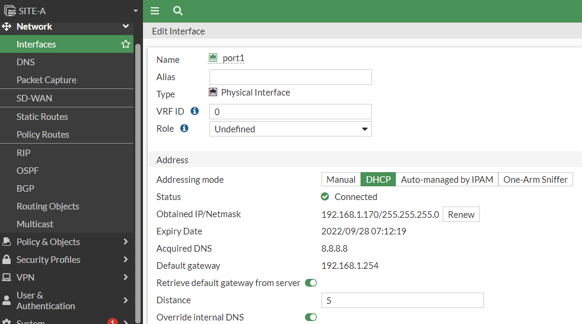

# Laboratorio Fortinet 7.0
Estos son apuntes personales del curso Fortinet 7: De principiante a experto, impartido por Eduardo Nazareno Anselmi [Adquirir el curso aquí](https://www.udemy.com/course/fortinet-7-de-principiante-a-experto/)

En este curso se require los siguientes programas para el laboratorio:
* [GNS3](https://gns3.com/software) descargar la versión servidor y cliente

* [VMWARE](https://www.vmware.com/products/workstation-player/workstation-player-evaluation.html)

Una vez descargado los programas vamos a configurar el Vmware:

Para conectarnos al GNS3 y que nos permita jalar el laboratorio tenemos que copiar los datos de la ip que en este caso es la 192.168.1.166 y al puerto 80, el usuario es gns3 al igual que el password

Lo primero que vamos hacer es acomador los equipos superpuestos y a cambia el icono de los equipos fortinet para hacer eso presionamos botón derecho del mouse y click en cambiar simbolos.

Después seleccionar usar simbolo personalizado y click en examinar, seleccionamos el icono y click en aplicar y ok, tenemos que hacer lo cambios en todos los dispositivos que se muestran en el laboratorio(LB)

una vez aplicado los cambios tenemos que cerrar y volver abrir el LB y click en start para arrancar todos los dispositivos.

Cambiar IP DHCP por una estatica:
Abrimos GNS3 luego click en ok y nos dirigimos a la sección de Network y nos pedirá reiniciar una vez echo los cambios, presionamos yes

Ahora de donde dice #networ hacía abajo vamos a quitar el comentario y remplazar la iP y el gateway:

Debemos respetar la identación, y una vez hecho los cambios con cntrl + x para salir y click en yes, y nos saldrá un cuadro de dialogo que nos indica que se modificara el archivo presionamos enter

Una vez que se reinicio el equipo nos aparecerá la modificación y en el GNS 3 también tenemos que modicar la ip de conexión en edición->Preference->Server

Snapshots
Se realiza con los equipos FGT apagados, vamos a edit-> manangment spanshots, click en crear 

Es importante crearlos en cada modificación importante, ya que en caso de borrar algún dispositivo forti podremos restaurarlo.

Y para restauralo son los mismos pasos excepto que en vez de presionar crear, debemos presionar restore

Temas que se van a ver en esta primera parte:

Primer acceso a nuestro firewall:

Nos vamos a conectar a un equipo fortinet, usuario:admin y password:(blank), nos pedirá que cambiemos la contraseña:

Primeros comandos:
Tenemos que ingresar a ver la ip del equipo:

FortiGate-VM64-KVM # get system interface
== [ port1 ]
name: port1   mode: dhcp    ip: 192.168.1.170 255.255.255.0   status: up    netbios-forward: disable    type: physical   ring-rx: 0   ring-tx: 0   netflow-sampler: disable    sflow-sampler: disable    src-check: enable    explicit-web-proxy: disable    explicit-ftp-proxy: disable    proxy-captive-portal: disable    mtu-override: disable    wccp: disable    drop-overlapped-fragment: disable    drop-fragment: disable
== [ port2 ]
== [ port3 ]
== [ port4 ]

*Después veremos la configuración del equip
FortiGate-VM64-KVM # conf sys interface

*Ahora vamos activar http para ingresar a través de la web
FortiGate-VM64-KVM (interface) # edit port1

FortiGate-VM64-KVM (port1) # show
config system interface
    edit "port1"
        set vdom "root"
        set mode dhcp
        set allowaccess ping https ssh fgfm
        set type physical
        set snmp-index 1
    next
end

*Con este puerto se permite el acceso a través del http
FortiGate-VM64-KVM (port1) # append allowaccess http

* show para confirmar que el puerto este activo
FortiGate-VM64-KVM (port1) # show
config system interface
    edit "port1"
        set vdom "root"
        set mode dhcp
        set allowaccess ping https ssh http fgfm
        set type physical
        set snmp-index 1
    next
end

*Para guardar cambios con end
FortiGate-VM64-KVM (port1) # end

Comprobamos con el navegador, ingresamos el usuario y contraseña

Opcional: En este caso seleccione begin

Nombramos el equipo como SITE-A y click en ok

Seleccionamos Optimal y click en ok

Dashboard de inicio

Configuramos de la misma manera el SITE-B.

En ambos equipos Fortigate el puerto 1 será para la administración y el puerto 2 y 3 similarán ser direcciones IP Pueblicas (ISP) y el puerto 4 será la LAN de las Pc's.

Ahora si hacemos un ping a google a través del CLI que se encuentra en el dashboard en ambos equipos nos dará salida:

SITE-A # exec ping google.com
PING google.com (142.251.34.206): 56 data bytes
64 bytes from 142.251.34.206: icmp_seq=0 ttl=117 time=13.4 ms
SITE-B # exec ping google.com

¿Por qué pasa esto si aún no hemos configurado? (laboratorio)se debe a que el puerto 1 tiene configuración DHCP

Para ello vamos a ingresar vía web a uno de los forti y nos vamos a Network-> Interfaces y vermos que ahí está tomando la DNS configurado en nuestro router, entonces tenemos que deshabilitar la opción que dice Rerieve default gateway from server y la que dice override Internal DNS, 

Ahora si volver hacer ping ya no nos permitira hacer ping y está bien porqué el puerto uno es para la configuración y administración.

admin@192.168.1.170's password:
SITE-A # exec ping google.com
Unable to resolve hostname.

SITE-A #

Ahora vamos a ingresar a configurar la zona horaria a través de la interfaz gráfica:
System->Settings 

En esta misma sección tenemos que darle el máximo tiempo de conexión antes de que se cierre la sesión que es de 480 minutos(solo se aplica en laboratorio)

Idle timeout : 480

Auto file system check: check
(esto en caso de que se apague mal el equipo)

