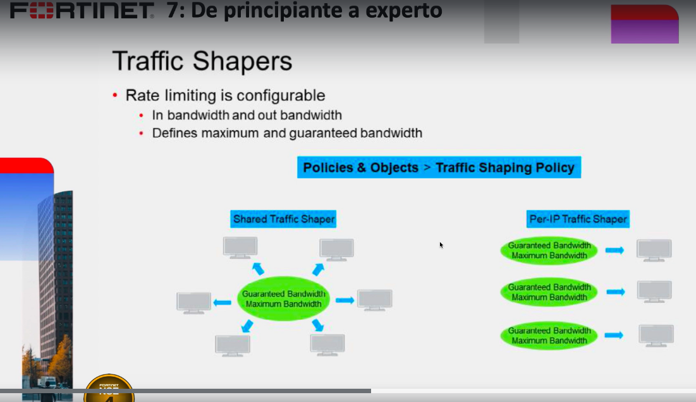

# Traffic Shapers

Acnho de banda de internet.



```
Policy&Objects->Traffic Shaping

Podemos escoger estas 3 opciones:
1.Traffic Shappers
2.Traffic Shaping Policies
3.Traffic Shaping Profiles

De los cuales solo veremos la 1 y 2 en el que creamos en 1 y establecemos parametros en el 2
```
Para este ejemplo vamos a trabajar con el FG-B y el equipo windows 7, en el equipo windows revisaremos el ancho de banda a tráves de fast.com que nos da:
Subida:17.53 Bajada:9.23

Ingresamos a Traffic Shaper y click en crear uno nuevo
```
Type:Shared
Name INTERNET-6Mb
Traffic Priority;High
Bandwidth Unit:Mbps.
Maximun Bandwidth:6Mbps.
Garanted Bandwidth:2

Click en ok
```
Ahora nos vamos a Traficc Shaping Policy y click en crear uno nuevo
```
Name:Internet
Source:all
Destinatation:all
Service:all
Application:(en la vida real se puede aplicar uno)
URL Category:(en la vida real se puede aplicar uno, requiere licencia)
Outping Interface: SDWAN-Internet
Apply Shaper: enable
Shared Shaper:Internet-6 Mbps.(se creo en un paso anterior, bajada)
Reverse Shaper:Internet-6 Mbps.(subida)
click en ok

Tendremos como resultado:
Bajada:5.23 y Subida: 4.60 Mbps.
```

Si revismos el windows 7 podemos comprobar que se quedo con 6 Mbps de subida y bajada.
Nota: Aquí podemos limitar el ancho de banda internamente y no solo para el control de internet

Ahora creamos y aplicamos el otro tipo Per IP-Shaper
```
Create New->
Type:Pre Ip Shaper
Name:PER-IP 6M

Bandwidth:Mbps.
Maximum Bandwidth:6Mbps.
Max concurrer connections:10 (esto significa que ahora solo 10 sesiones o saltos al hacer la busqueda en internet, por eso es recomendable ponerle por ejemplo 50) 
```

Ahora nos vamos a Traficc Shaping Policy y click en crear uno nuevo
```
Name:Internet
Source:all
Destinatation:all
Service:all
Application:(en la vida real se puede aplicar uno)
URL Category:(en la vida real se puede aplicar uno, requiere licencia)
Outging Interface: SDWAN-Internet
Apply Shaper: enable
Per-IP Shaper:Per-IP 6M (la opción que creamos un paso anterior)

click en ok

Tendremos como resultado:
Bajada:5.23 y Subida: 4.60 Mbps.
```