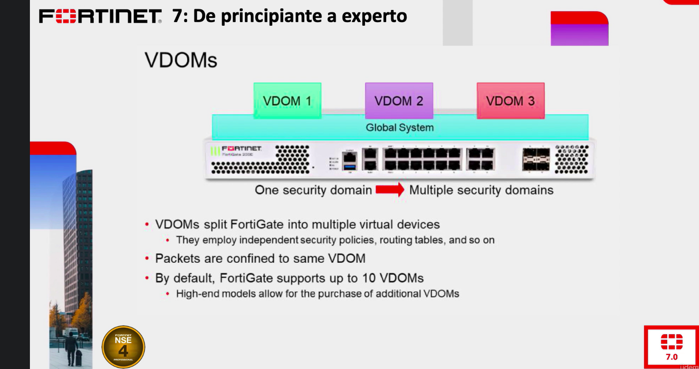
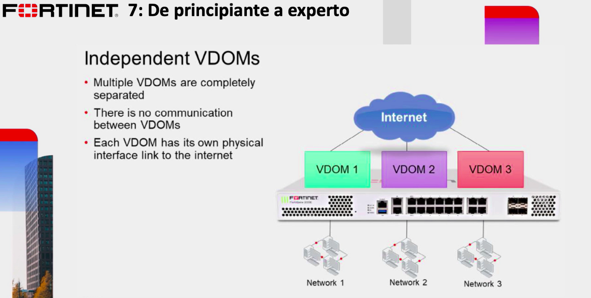
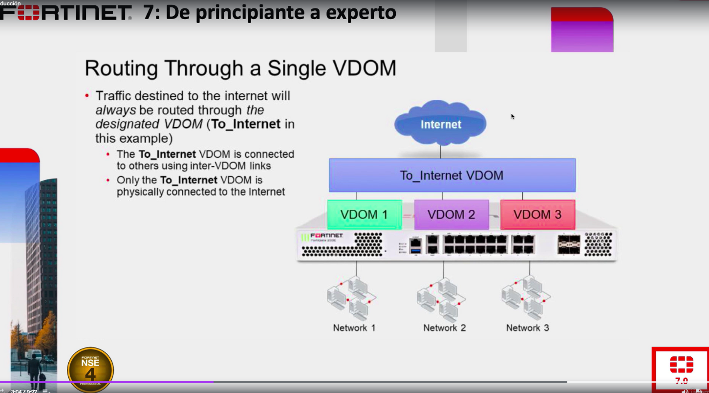
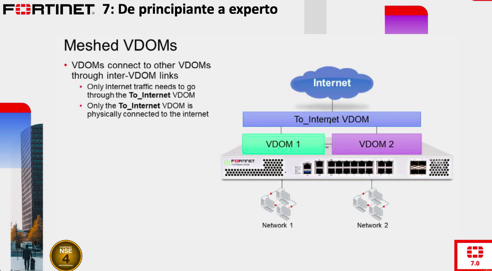
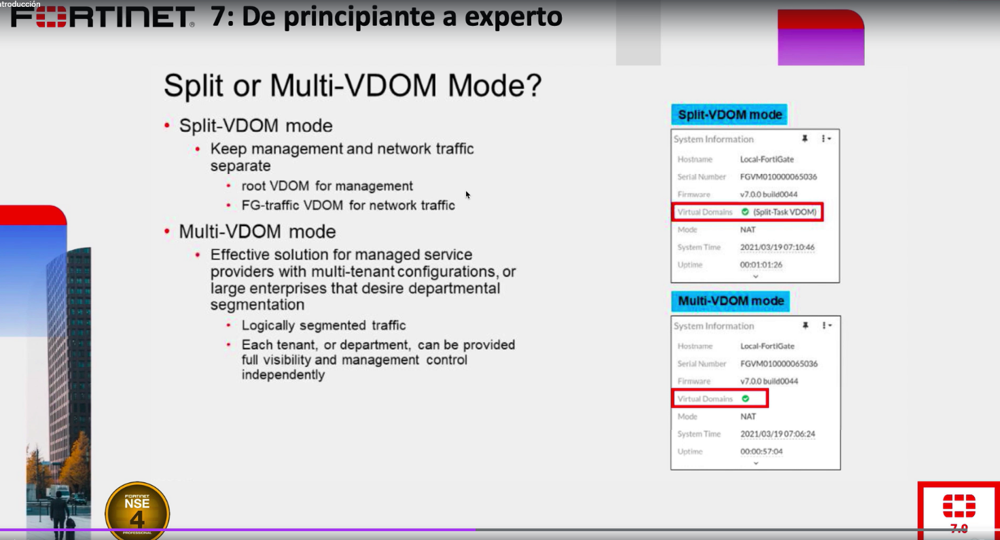
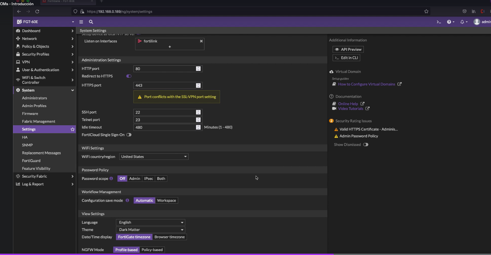
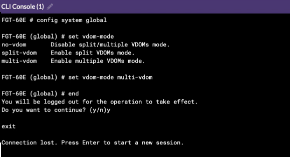
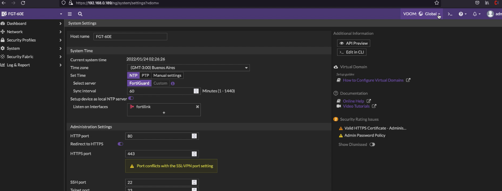

# VDOMS

Lamentablemente en el Laboratorio no se puede implentar así que el profe lo hace directamente en su equipo físco y serán puras capturas de pantalla.

Para crear los VDOM's se realiza de manera gráfica.
System->Settings
sin embargo con ese equipo físco no permite hacerlo de manera gráfica

Por lo tanto se realizará de manera de consola.
>config system global
(global)set vdom-mode ?

Ahora en la parte susperio podremos ver la opción de VDOM

