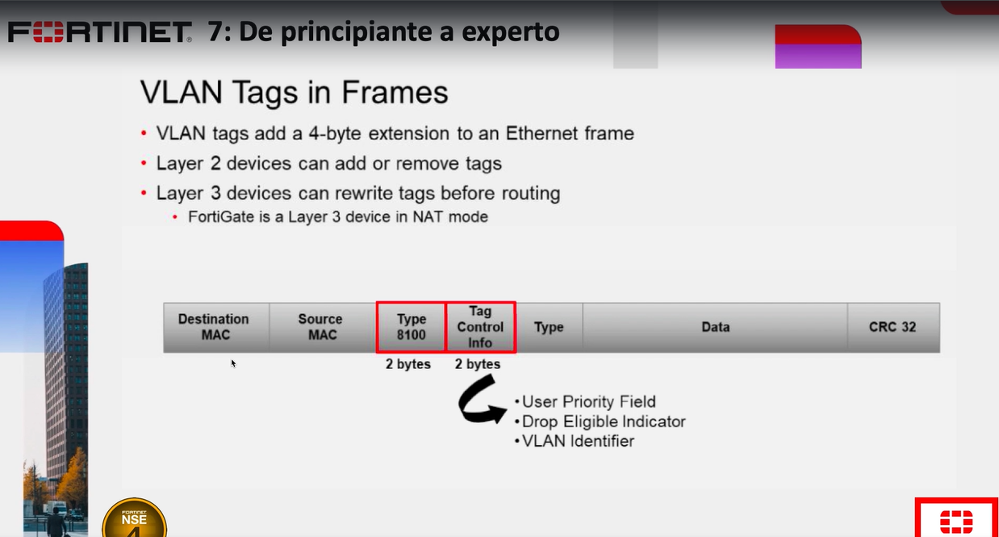
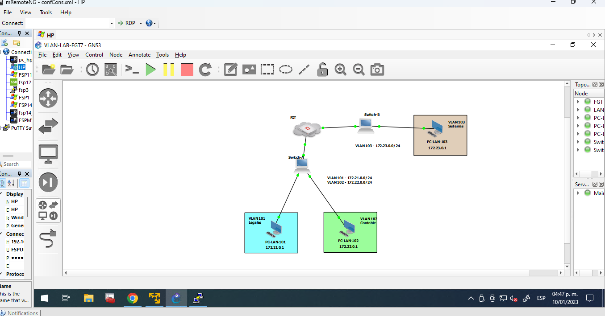
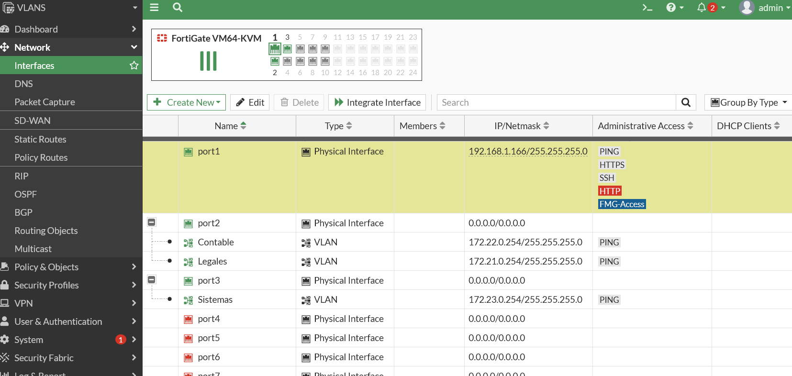
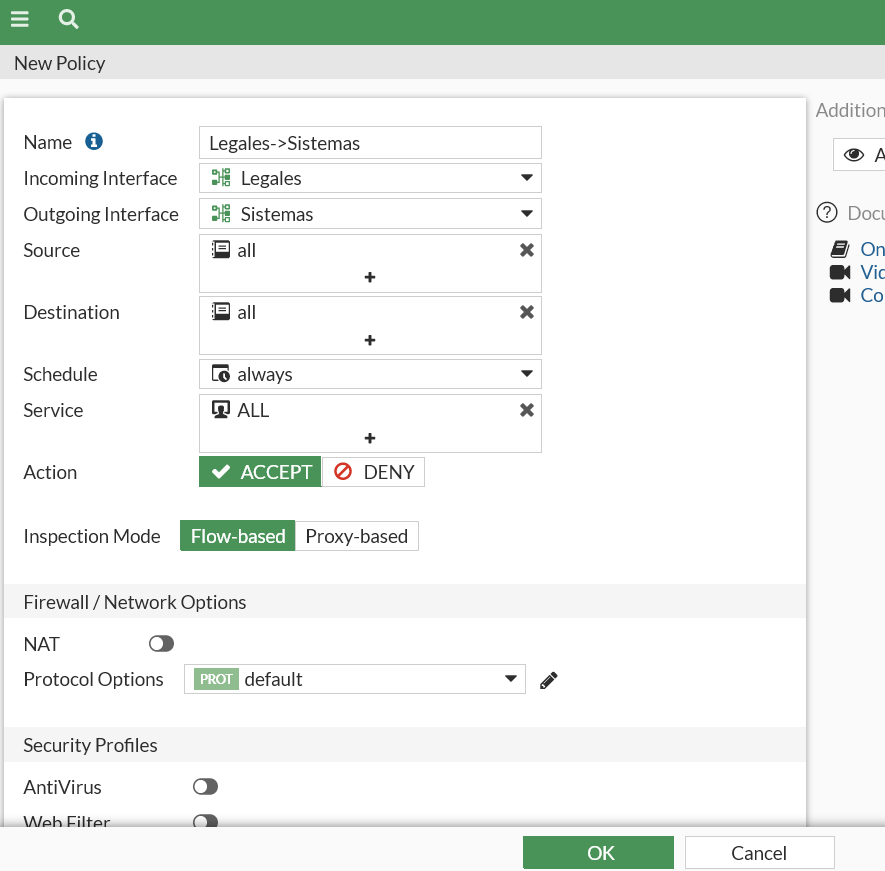

# VLANS



En este laboratorio se van agregar Vlans 



Y esta es la configuración de cada  SW cisco

```
#CONFIGURACION SWITCH A

enable
configure terminal
vlan 101
name Legales
exit
vlan 102
name Contable
exit
interface gigabitEthernet 0/1
switchport mode access
switchport access vlan 101
exit
interface gigabitEthernet 0/2
switchport mode access
switchport access vlan 102
exit
interface gigabitEthernet 0/0
switchport trunk encapsulation dot1q
switchport mode trunk
end


#CONFIGURACION SWITCH B

enable
configure terminal
vlan 103
name Sistemas
exit
interface gigabitEthernet 0/1
switchport mode access
switchport access vlan 103
exit
interface gigabitEthernet 0/0
switchport trunk encapsulation dot1q
switchport mode trunk
end
```

Una vez configurada las vlans en los Sw's ahora vamos a configurar en el equipo FG

Network->Interfaces->Create new Interfaces (x3)
```
1)
Name:Legales
Type:Vlan
Vlan Protocol:802Q
Port2
Vlan Id:101
Role:Lan
IP:172.21.0.254/24
habilitamos ping

2)
Name:Contable
Type:Vlan
802Q
Port2
Vlan Id:102
Role:Lan
IP:172.22.0.254/24
habilitamos ping

3)
Name:Sistemas
Type:Vlan
802Q
Port3
Vlan Id:103
Role:Lan
IP:172.23.0.254/24
habilitamos ping
```




Ahora nos vamos a Policy & Objects -> Firewall policy->Create New

```
Name:Lagales->Sistemas
Icoming:Legales
Outgoing:Sistemas
Source:all
Destination.all
Nat:Disable

Ahora vamos con botón derecho aplicamos en Clone reverso y renombrar 

Sistemas->Legales
```



Ahora si hacemos un ping obtendremos respuesta:
```
PC-LAN-102> ping 172.22.0.254

84 bytes from 172.22.0.254 icmp_seq=1 ttl=255 time=3.340 ms
84 bytes from 172.22.0.254 icmp_seq=2 ttl=255 time=9.338 ms
84 bytes from 172.22.0.254 icmp_seq=3 ttl=255 time=4.445 ms
84 bytes from 172.22.0.254 icmp_seq=4 ttl=255 time=4.386 ms
84 bytes from 172.22.0.254 icmp_seq=5 ttl=255 time=3.250 ms

PC-LAN-102> ping 172.22.0.1

172.22.0.1 icmp_seq=1 ttl=64 time=0.001 ms
172.22.0.1 icmp_seq=2 ttl=64 time=0.001 ms
172.22.0.1 icmp_seq=3 ttl=64 time=0.001 ms
172.22.0.1 icmp_seq=4 ttl=64 time=0.001 ms
172.22.0.1 icmp_seq=5 ttl=64 time=0.001 ms
```