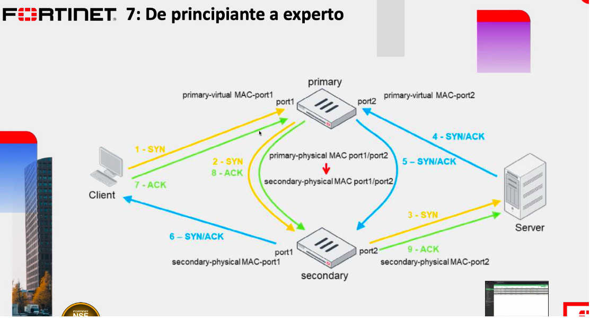
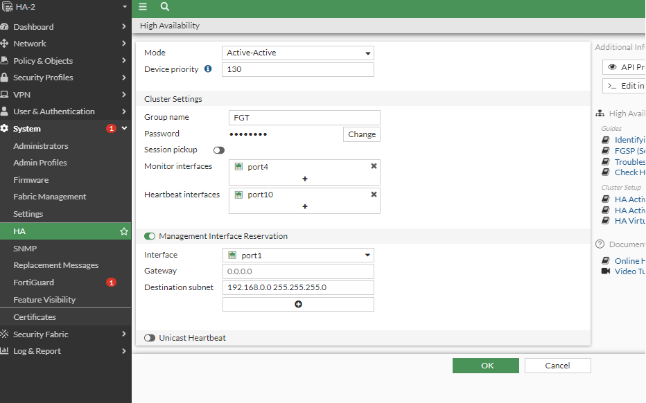
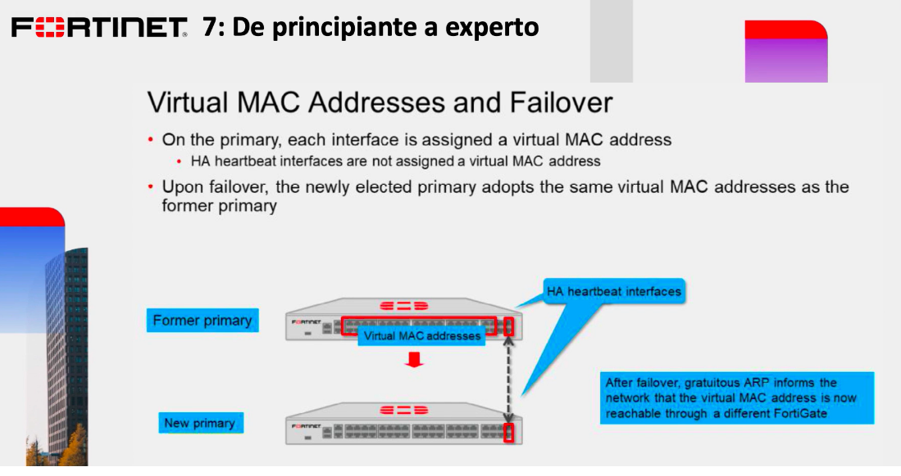
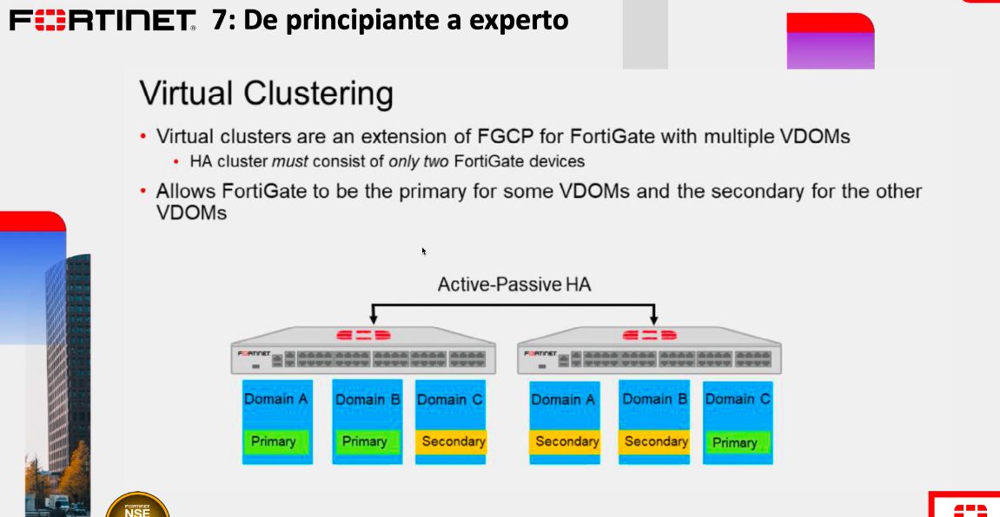

# Configuración Activo-Activo

Modo de balanceo


En el laboratorio solo vamos a cambiar en tipo en modo Activo-Activo, en un solo FG y veremos que nos va desconectar momentaneamente y después se sync y si nos vamos al HA-2 veremos que también se configuro como Activo-Activo de forma automaitca en este caso porque procede de una configuración anterior (ACtivo-Pasivo).







Nota: ¿cómo se actualizan los equipos del cluster? Siempre será desde el FG primario.

## Comandos utiles en la CLI en HA
```
HA-1 # diagnose sys ha status
HA information
Statistics
        traffic.local = s:0 p:73974 b:29268286
        traffic.total = s:0 p:79001 b:30076260
        activity.ha_id_changes = 7
        activity.fdb  = c:0 q:0

Model=80001, Mode=1 Group=0 Debug=0
nvcluster=1, ses_pickup=0, delay=0, load_balance=0, schedule=3, ldb_udp=0, upgrade_mode=0.

[Debug_Zone HA information]
HA group member information: is_manage_primary=0.
FGVMEV84EONV3LE8:    Secondary, serialno_prio=1, usr_priority=128, hostname=HA-1
FGVMEVW3TZQZLPA3:      Primary, serialno_prio=0, usr_priority=130, hostname=HA-2

[Kernel HA information]
vcluster 1, state=work, primary_ip=169.254.0.1, primary_id=0:
FGVMEV84EONV3LE8:    Secondary, ha_prio/o_ha_prio=1/1
FGVMEVW3TZQZLPA3:      Primary, ha_prio/o_ha_prio=0/0


HA-1 # HA-1 # diagnose sys ha checksum cluster

================== FGVMEV84EONV3LE8 ==================

is_manage_primary()=0, is_root_primary()=0
debugzone
global: e5 a0 e9 26 88 8c 90 3d 80 b7 9f 3e 67 68 d3 f9 
root: c2 64 6b f0 96 bf c4 4e be 9b bb e6 be 49 25 c2 
all: 9a 64 9b f8 34 33 71 c1 1a 50 f2 ed 11 18 8d 12 

checksum
global: e5 a0 e9 26 88 8c 90 3d 80 b7 9f 3e 67 68 d3 f9 
root: c2 64 6b f0 96 bf c4 4e be 9b bb e6 be 49 25 c2 
all: 9a 64 9b f8 34 33 71 c1 1a 50 f2 ed 11 18 8d 12 

================== FGVMEVW3TZQZLPA3 ==================

is_manage_primary()=1, is_root_primary()=1
debugzone
global: e5 a0 e9 26 88 8c 90 3d 80 b7 9f 3e 67 68 d3 f9 
root: c2 64 6b f0 96 bf c4 4e be 9b bb e6 be 49 25 c2 
all: 9a 64 9b f8 34 33 71 c1 1a 50 f2 ed 11 18 8d 12 

checksum
global: e5 a0 e9 26 88 8c 90 3d 80 b7 9f 3e 67 68 d3 f9 
root: c2 64 6b f0 96 bf c4 4e be 9b bb e6 be 49 25 c2 
all: 9a 64 9b f8 34 33 71 c1 1a 50 f2 ed 11 18 8d 12 

Pasar de HA primario a secundario o viceversa
HA-2 # execute ha manage 0 admin
Could not manage member 0, num=2.

HA-2 # execute ha manage 1 admin
Warning: Permanently added '169.254.0.2' (ED25519) to the list of known hosts.
admin@169.254.0.2's password: 
HA-1 # execute ha manage 0 admin
admin@169.254.0.1's password: 
HA-2 # exit
Connection to 169.254.0.1 closed.

HA-1 # 

Este comando es para volver primario a uno o a otro FG del cluster

HA-2 # execute ha failover set 1
Caution: This command will trigger an HA failover. 
It is intended for testing purposes.
Do you want to continue? (y/n)y


HA-2 # 
Connection lost. Press Enter to start a new session.

Ahora si hacemos un status veremos que equipo esta como primario

HA-2 # get system  ha status
HA Health Status: OK
Model: FortiGate-VM64-KVM
Mode: HA A-A
Group: 0
Debug: 0
Cluster Uptime: 0 days 2:6:2
Cluster state change time: 2023-01-17 14:31:14
Primary selected using:
    <2023/01/17 14:31:14> FGVMEV84EONV3LE8 is selected as the primary because EXE_FAIL_OVER flag is set on peer member FGVMEVW3TZQZLPA3.
    <2023/01/17 12:52:58> FGVMEVW3TZQZLPA3 is selected as the primary because its override priority is larger than peer member FGVMEV84EONV3LE8.
    <2023/01/17 12:52:58> FGVMEVW3TZQZLPA3 is selected as the primary because it's the only member in the cluster.
    <2023/01/17 12:29:05> FGVMEVW3TZQZLPA3 is selected as the primary because its override priority is larger than peer member FGVMEV84EONV3LE8.
ses_pickup: disable
load_balance: disable
load_balance_udp: disable
schedule: Round robin.
upgrade_mode: unset
override: disable
Configuration Status:
    FGVMEVW3TZQZLPA3(updated 3 seconds ago): in-sync
    FGVMEV84EONV3LE8(updated 4 seconds ago): in-sync
System Usage stats:
    FGVMEVW3TZQZLPA3(updated 3 seconds ago):
        sessions=2, average-cpu-user/nice/system/idle=0%/0%/0%/98%, memory=70%
    FGVMEV84EONV3LE8(updated 4 seconds ago):
        sessions=14, average-cpu-user/nice/system/idle=0%/0%/0%/97%, memory=75%
HBDEV stats:
    FGVMEVW3TZQZLPA3(updated 3 seconds ago):
        port10: physical/1000auto, up, rx-bytes/packets/dropped/errors=19221786/55342/0/0, tx=26332232/53748/0/0
    FGVMEV84EONV3LE8(updated 4 seconds ago):
        port10: physical/1000auto, up, rx-bytes/packets/dropped/errors=26331019/53737/0/0, tx=19218309/55350/0/0
MONDEV stats:
    FGVMEVW3TZQZLPA3(updated 3 seconds ago):
        port4: physical/1000auto, up, rx-bytes/packets/dropped/errors=71101/415/0/0, tx=90/1/0/0
    FGVMEV84EONV3LE8(updated 4 seconds ago):
        port4: physical/1000auto, up, rx-bytes/packets/dropped/errors=8724/47/0/0, tx=4018/37/0/0
Secondary   : HA-2            , FGVMEVW3TZQZLPA3, HA cluster index = 0
Primary     : HA-1            , FGVMEV84EONV3LE8, HA cluster index = 1
number of vcluster: 1
vcluster 1: work 169.254.0.2
Secondary: FGVMEVW3TZQZLPA3, HA operating index = 1
Primary: FGVMEV84EONV3LE8, HA operating index = 0

HA-2 # 

Y para revertir ahora es 

HA-2 # execute ha failover unset 1
Caution: This command may trigger an HA failover. 
It is intended for testing purposes.
Do you want to continue? (y/n)y


HA-2 # get system  ha status
HA Health Status: OK
Model: FortiGate-VM64-KVM
Mode: HA A-A
Group: 0
Debug: 0
Cluster Uptime: 0 days 2:9:29
Cluster state change time: 2023-01-17 14:37:31
Primary selected using:
    <2023/01/17 14:37:31> FGVMEVW3TZQZLPA3 is selected as the primary because its override priority is larger than peer member FGVMEV84EONV3LE8.
    <2023/01/17 14:31:14> FGVMEV84EONV3LE8 is selected as the primary because EXE_FAIL_OVER flag is set on peer member FGVMEVW3TZQZLPA3.
    <2023/01/17 12:52:58> FGVMEVW3TZQZLPA3 is selected as the primary because its override priority is larger than peer member FGVMEV84EONV3LE8.
    <2023/01/17 12:52:58> FGVMEVW3TZQZLPA3 is selected as the primary because it's the only member in the cluster.
ses_pickup: disable
load_balance: disable
load_balance_udp: disable
schedule: Round robin.
upgrade_mode: unset
override: disable
Configuration Status:
    FGVMEVW3TZQZLPA3(updated 0 seconds ago): in-sync
    FGVMEV84EONV3LE8(updated 1 seconds ago): in-sync
System Usage stats:
    FGVMEVW3TZQZLPA3(updated 0 seconds ago):
        sessions=2, average-cpu-user/nice/system/idle=1%/0%/3%/88%, memory=70%
    FGVMEV84EONV3LE8(updated 1 seconds ago):
        sessions=0, average-cpu-user/nice/system/idle=0%/0%/1%/96%, memory=74%
HBDEV stats:
    FGVMEVW3TZQZLPA3(updated 0 seconds ago):
        port10: physical/1000auto, up, rx-bytes/packets/dropped/errors=19881964/57013/0/0, tx=27065588/55458/0/0
    FGVMEV84EONV3LE8(updated 1 seconds ago):
        port10: physical/1000auto, up, rx-bytes/packets/dropped/errors=27064294/55444/0/0, tx=19878151/57018/0/0
MONDEV stats:
    FGVMEVW3TZQZLPA3(updated 0 seconds ago):
        port4: physical/1000auto, up, rx-bytes/packets/dropped/errors=71344/416/0/0, tx=90/1/0/0
    FGVMEV84EONV3LE8(updated 1 seconds ago):
        port4: physical/1000auto, up, rx-bytes/packets/dropped/errors=8967/48/0/0, tx=4018/37/0/0
Primary     : HA-2            , FGVMEVW3TZQZLPA3, HA cluster index = 0
Secondary   : HA-1            , FGVMEV84EONV3LE8, HA cluster index = 1
number of vcluster: 1
vcluster 1: work 169.254.0.1
Primary: FGVMEVW3TZQZLPA3, HA operating index = 0
Secondary: FGVMEV84EONV3LE8, HA operating index = 1
```