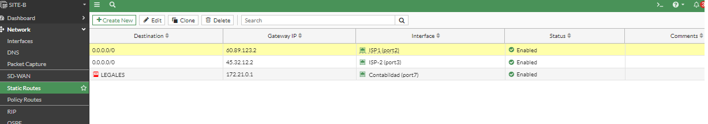
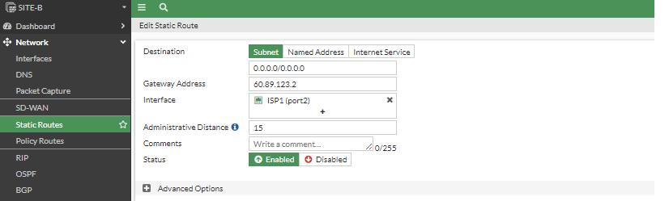
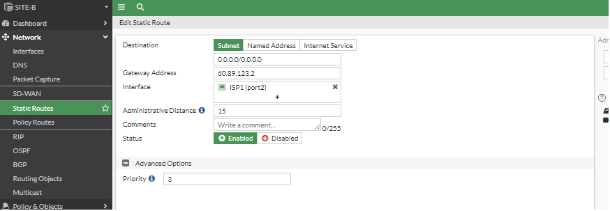
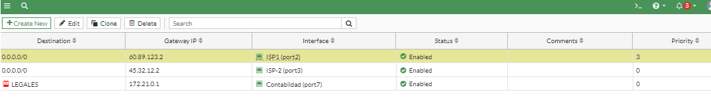
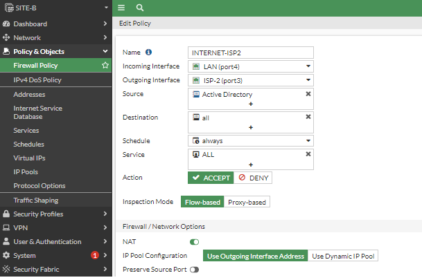
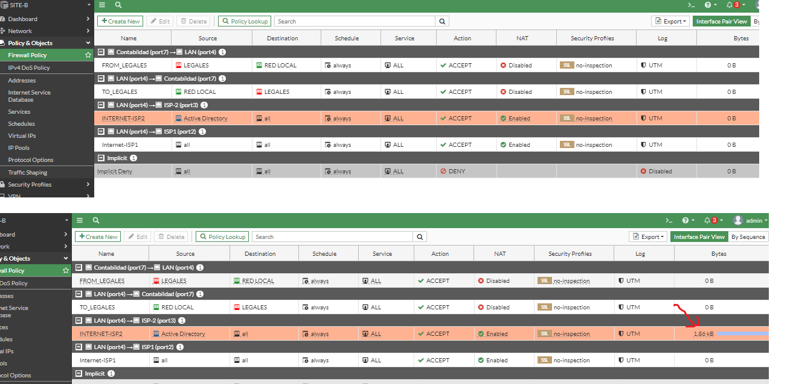
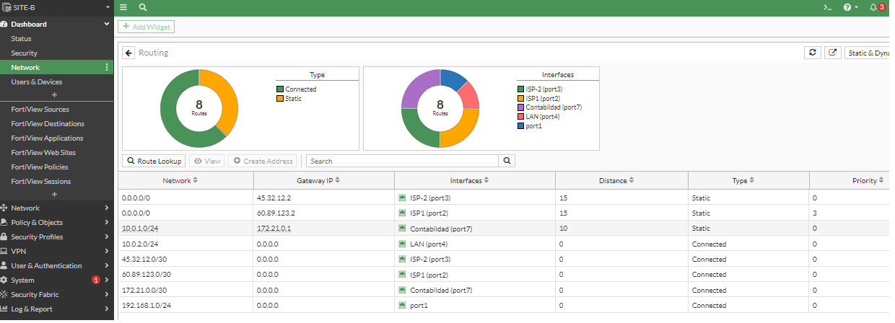

# Atributos de las rutas

¿Qué pasa si los ISP tiene la misma distancia?
En este caso 15 para el ISP1 y ISP2 entonces podemos modificar la opción prioridad.

Para este ejemplo ingresamos en Netowor->Static Routes->
Modificar las ISP's con 15 




Aquí modificamos la prioridad en este ejemplo 3


Habilitamos la casilla Prioridad, en este caso la priopridad se da quien tenga el número más pequeño en este caso es 0 (ISP2,Puerto3)



Vamos a crear un firewall policy con el nombre INTERNET-ISP2(Policy & Objects->Firewall policy->Create New)



Una vez creado hacemos un ping desde la PC2 -10.0.2.10 hacia google y revisamos porque puerto salimos, en la imagen se muestran el antes(arriba) y después(abajo) en este último se muestra que tiene actividad en kb (señalado con la flecha roja)


¿Y porqué pasa esto? Sí tiene que ver con con la secuencia en este caso la prioridad cae en el ISP2 porqué está en 0, mientras el ISP1 tiene la prioridad de 3.



Como sería con CLI

Se interpreta de la siguiente manera
```
SITE-B # get router info routing-table database 
Codes: K - kernel, C - connected, S - static, R - RIP, B - BGP
       O - OSPF, IA - OSPF inter area
       N1 - OSPF NSSA external type 1, N2 - OSPF NSSA external type 2
       E1 - OSPF external type 1, E2 - OSPF external type 2
       i - IS-IS, L1 - IS-IS level-1, L2 - IS-IS level-2, ia - IS-IS inter area
       > - selected route, * - FIB route, p - stale info
```
Aquí se puede observar que el puerto 3 no tiene nada enfrente debido a que las configuraciones por default son cero y no se muestran.

El puerto 2 nos muestra enfren [3/0] ya que la prioridad es 3 y la metrica 0
```
Routing table for VRF=0
S    *> 0.0.0.0/0 [15/0] via 45.32.12.2, port3
     *>           [15/0] via 60.89.123.2, port2, [3/0]
S    *> 10.0.1.0/24 [10/0] via 172.21.0.1, port7
C    *> 10.0.2.0/24 is directly connected, port4
C    *> 45.32.12.0/30 is directly connected, port3
C    *> 60.89.123.0/30 is directly connected, port2
C    *> 172.21.0.0/30 is directly connected, port7
C    *> 192.168.1.0/24 is directly connected, port1
```