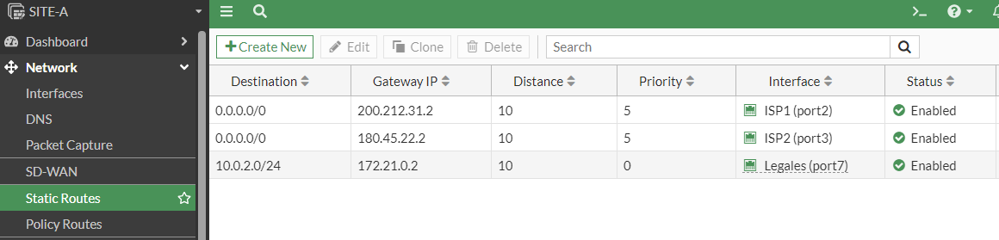
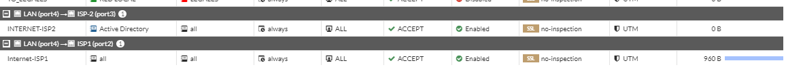
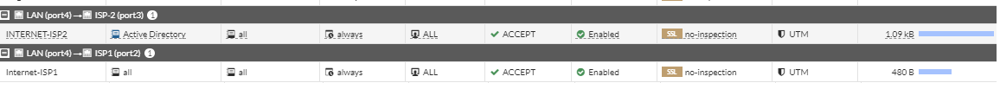
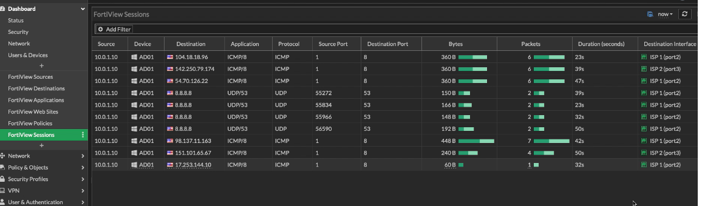

# Ruta de acceso múltiple de igual coste (ECMP)

Balanceo de Carga

Lo primero que se debe de hacer es que la Distancia Administrativa en ambos ISP sea la misma en este caso 10 (Network->Static Routes-> ISP 1 y 2 ->administrativa Distance 10) así como las Prioridades deben de ser iguales en este caso 5.

Con estas configuraciones ya tendriamos nuestro ICMP funcionando (balanceo de carga)


Si hacemos la consulta con el CLI vemos lo siguiente:

```
SITE-A # get rou info routing-table database
Codes: K - kernel, C - connected, S - static, R - RIP, B - BGP
       O - OSPF, IA - OSPF inter area
       N1 - OSPF NSSA external type 1, N2 - OSPF NSSA external type 2
       E1 - OSPF external type 1, E2 - OSPF external type 2
       i - IS-IS, L1 - IS-IS level-1, L2 - IS-IS level-2, ia - IS-IS inter area
       > - selected route, * - FIB route, p - stale info

Routing table for VRF=0
S    *> 0.0.0.0/0 [10/0] via 180.45.22.2, port3, [5/0]
     *>           [10/0] via 200.212.31.2, port2, [5/0]
C    *> 10.0.1.0/24 is directly connected, port4
S    *> 10.0.2.0/24 [10/0] via 172.21.0.2, port7
C    *> 172.21.0.0/30 is directly connected, port7
C    *> 180.45.22.0/30 is directly connected, port3
C    *> 192.168.1.0/24 is directly connected, port1
C    *> 200.212.31.0/30 is directly connected, port2

```
Si hacemos un ping podremos ver que sigue saliendo solo por el ISP, y no ambos (mayor o menor proporción de bytes de transferencia)



La manera de trabajar de ECMP tiene diferntes modos y solo se puede ver a través de la CLI.

Con este comando podemos revisar de que manera está trabajando el ECMP actualmente.

Y lo que indica el Source-ip-based, es que hace una especie de sorte por ejemplo al querer navegar a través de google.com siempre va a salir de ese puerto, si ponemos yahoo.com y de nuevo escoge ese puerto de nuevo va salir por el ISP1, ahora si navegamos en altavista.com y sale por el ISP2 siempre va salir por ese puerto desde ese momento y no se va a modificar.

```
SITE-B (settings) # get | grep ecmp
v4-ecmp-mode        : source-ip-based 
ecmp-max-paths      : 255
``` 

Con este comando podemos ver las opciones en la que puede trabajar el ECMP

```
SITE-B (settings) # set v4-ecmp-mode 
source-ip-based         Select next hop based on source IP.
weight-based            Select next hop based on weight.
usage-based             Select next hop based on usage.
source-dest-ip-based    Select next hop based on both source and destination IPs.
```

Lo que nosotros queremos es que el "sorte" se haga en cualquier ISP, por ejemplo si ponemos google.com salga en este momento por ISP1 y al volver a navegar ahora va salir por ISP2.

Para hacer esto necesitamos del source-dest-ip-based
```
SITE-B # conf systems settings
SITE-B (settings) # set v4-ecmp-mode source-dest-ip-based 

SITE-B (settings) # end
```
Ahora si hacemos una prueba con ping a google.com, yahoo.com, apple.com

Nos va a mostrar lo siguiente


Y si nos vamos a Dashboard->FortiView Sessión veremos que toma distintos puertos para la salida
