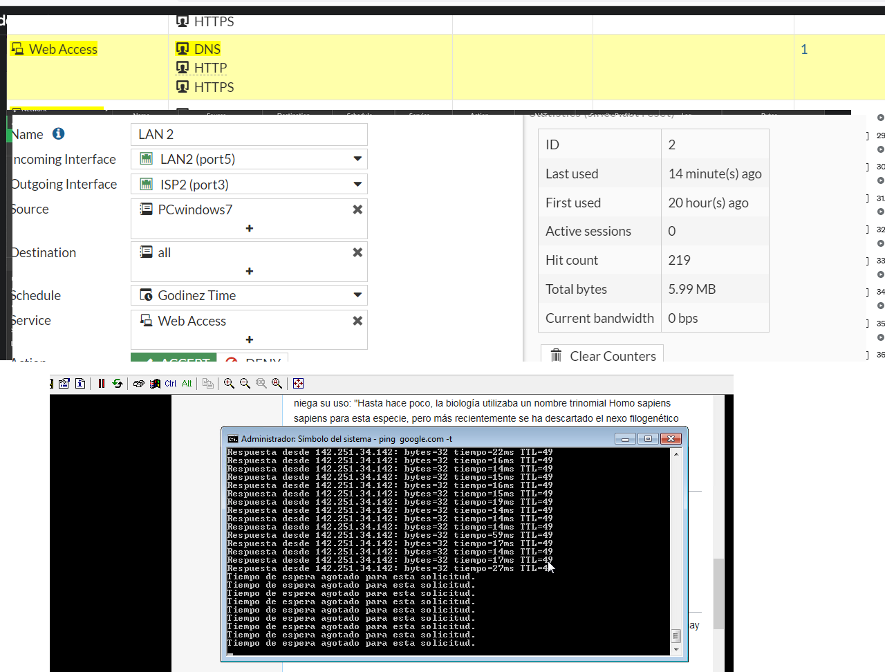
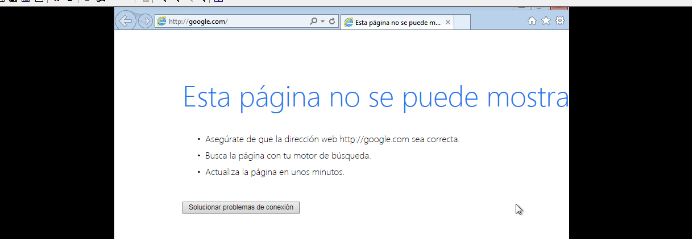
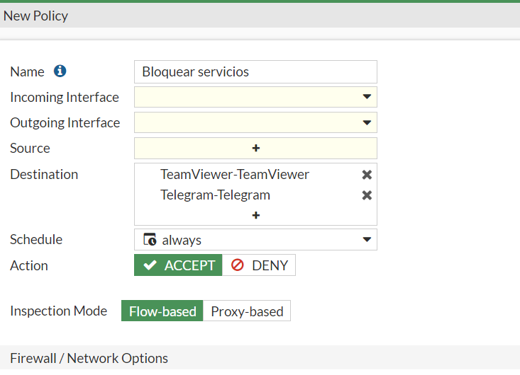

# Crear objetos de tipo Address, Schedule y service
Esto los encontramos en la opción de Policy & Objects

Primero vamos a crear un objeto tipo Address

Vamos escoger del tipo subnet en este caso, pero el que me parece interesante es la opción demografica para prohibir conexiones de otros países como Isarel, la India, China

En este caso la IP es del servidor del laboratorio  y vemos también que ya se ve en la lista con el nombre Active Directory

Vamos a la policy del firewall y en origen seleccionamos el active directory

Lo que hace es que el único equipo que va a salir a través de internet será el servidor windows y no la terminal, en este ejemplo cree otro equipo con windows 7 conectado al puerto 5 en vez del 4 entonces al hacer la prueba de ping ya no tiene salida a internet

Respecto a la opción de horario se cambia en igual en el policy en vez de alway personalizar el servicio o salida a internet.

## SERVICE
En la opción de Service se encuentra una opción que se llama Web Access que cubre salidas a http, https y la resolución de nombres DNS esto con el fin de poder navegar en internet lo que impide realizar ping pero si navegar a través de internet.

Otra opción en la parte de service sería seleccionar invidualmente los permisos de salida http, https, DNS.

## Schedules
En este ejemplo creamos un schedules para implementar el servicio de internet en horario en el que estará disponible.

Aquí lo implementamos en nuestro policy 

Esto hará que el servicio de internet en esta computadora o grupo de equipos el servicio de internet se suspenda.

Lo que noté en esta prueba es que funciona con la opción one time y no con la opción Recurrening

## Internet Services

La lista servicios que están por default o se pueden crear, sirven para la opción destination en firewall police.

Aquí podemos agregar a la lista servicios como teamviewer, telegram y bloquearlo, pero no se recomienda hacerlo desde aquí que para eso Forti tiene opción para bloquear paginas web y servicios, aplicaciones.

Ahora con respecto a las firewall policy recordar que arriba debe de ir los de bloqueo y abajo a los de permiso.

