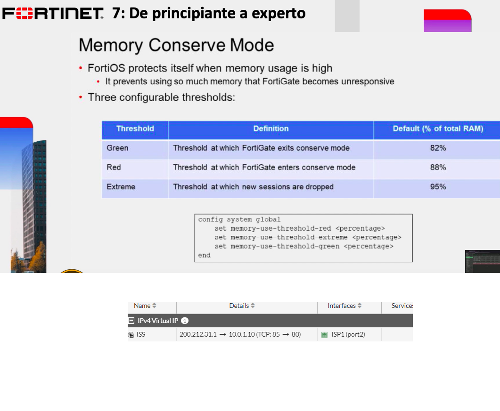
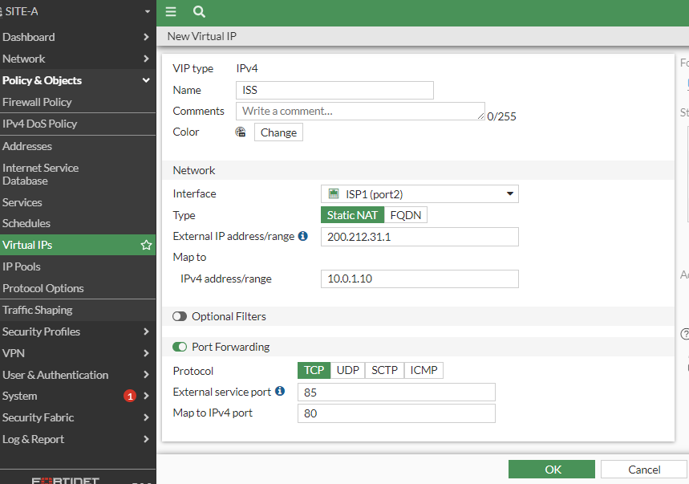
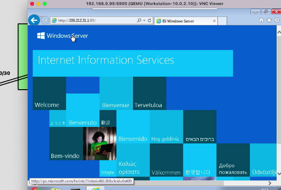

# Port forwarding mediante objetos VIPs
Ejemplo de como trabaja el forwarding de entrada y salida



```
Para hacer el siguiente laboratorio tenemos que itnod s 
Policy&Objets->Virtual IPs->Create New->Virtual IP
Name:ISS
Interface ISP1 (Pdemos seleccionar todos any pero aquí solo el ISP1)
Type: Static NAT->ISP1(no permite SDWAN)
External addres/Range:200.212.31.1
MAP To:10.0.1.10 (Es esta IP porqué es el servidor puede ser un servidor de telefonico etc)
Port Forwardo -> Enable->External Service Port 85 MAP to IPv4 port:80 (tiene que ser el puerto real)

```

```
Vamos Policy, Creamos una nueva policy o botón derecho sobre el anterio VIPs crado click sobre crear firewall policy using this object
Name:ISS
Incoming Interface:SDWAN-LAB (lo pone por default)
Outgoing:LAN (Poart4)
Source:all
Destination:ISS (lo pone por default)
Service:HTTP
NAT:Disable
```
Si vamos al windows 7 y nos tratamos de conectar al servidor podremos acceder sin problemas



En el siguiente laboratorio tenemos que borrar el IPs del proyecto anterior así como las policy.