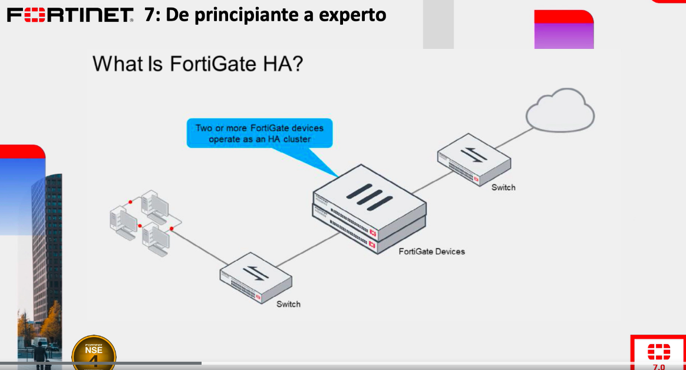
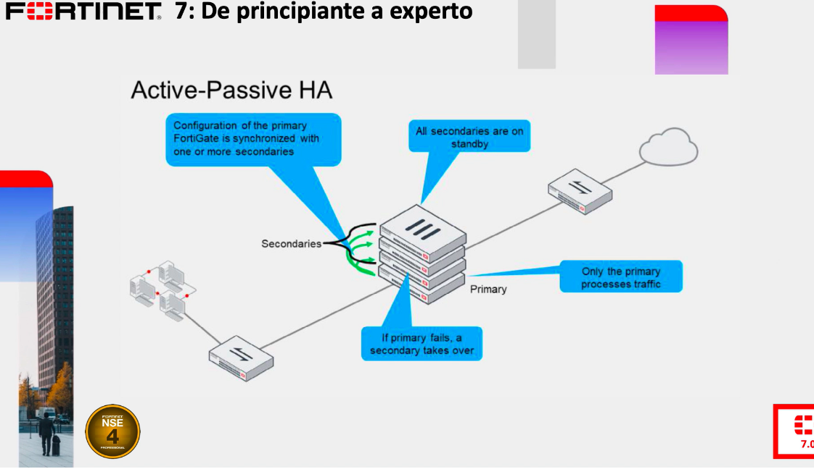
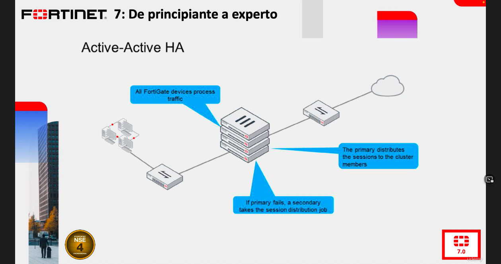
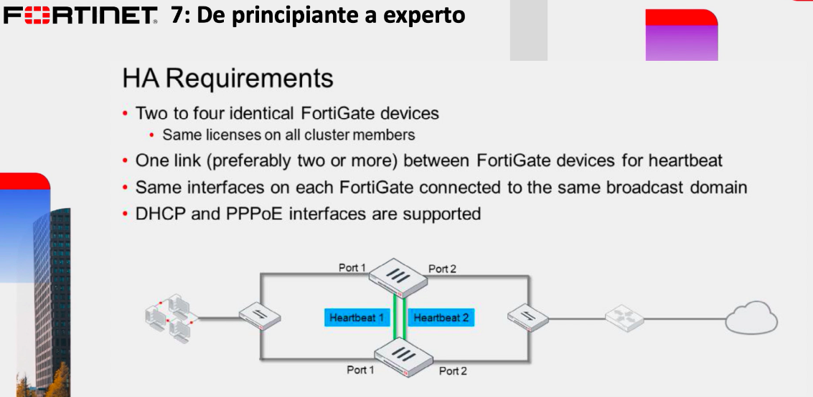
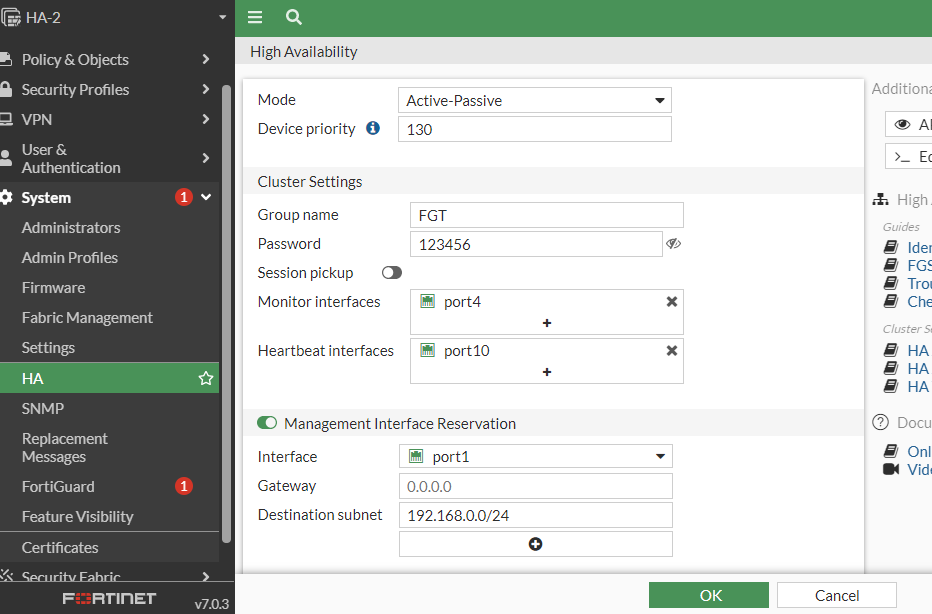
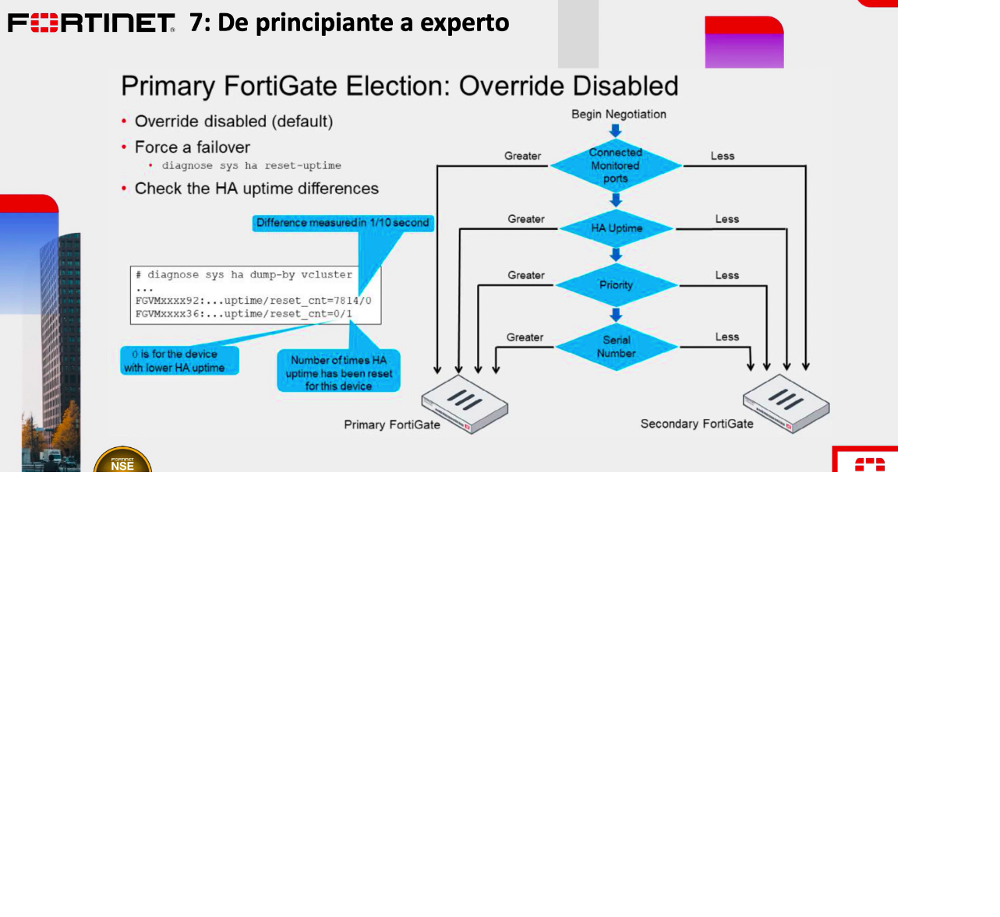

# Alta Disponibilidad (HA)


Existen dos modos
El primero es Activo-Pasivo:

El siguiente es Activo-Activo:

Esto es posible gracias al protoco FGCP


Requerimientos, nota importante es necesario que todos los equipos tengan el mismo tipo de licenciamiento, esto debido a que si alguno de los equipos cuenta con un licenciamiento inferior todo el cluster va a correr o comportarse de la misma manera al inferior. 
También el cluster tiene que tener la misma configuración de cableado en todos los equipos.


Existen elementos que no son syncronizados entre los FG


```
FortiGate-VM64-KVM # conf system interface

FortiGate-VM64-KVM (interface) # edit port2

FortiGate-VM64-KVM (port2) # set ip 45.32.12.1/30

FortiGate-VM64-KVM (port2) # end

hacemos un ping en dónde se encuentra el respaldo 
FG-HA-1 # exec ping 45.32.12.2
PING 45.32.12.2 (45.32.12.2): 56 data bytes
64 bytes from 45.32.12.2: icmp_seq=0 ttl=64 time=2.0 ms
64 bytes from 45.32.12.2: icmp_seq=1 ttl=64 time=1.3 ms
64 bytes from 45.32.12.2: icmp_seq=2 ttl=64 time=1.0 ms
64 bytes from 45.32.12.2: icmp_seq=3 ttl=64 time=3.7 ms
64 bytes from 45.32.12.2: icmp_seq=4 ttl=64 time=3.2 ms

--- 45.32.12.2 ping statistics ---
5 packets transmitted, 5 packets received, 0% packet loss
round-trip min/avg/max = 1.0/2.2/3.7 ms

Ejecutamos la restauración 

FG-HA-1 # exec restore config ftp HA-1-READY 45.32.12.2 ftp ftp
This operation will overwrite the current setting and could possibly reboot the system!
Do you want to continue? (y/n)y

Please wait...

Connect to ftp server 45.32.12.2 ...
Get config file from ftp server OK.
File check OK.

Una vez que restauro el respaldo lo tenemos que poner en modo estatico y asignarle una IP

HA-1 # conf sys in

HA-1 (interface) # edit port1

HA-1 (port1) # set mode static

HA-1 (port1) # set ip 192.168.1.33/24

HA-1 (port1) # append allowaccess http

HA-1 (port1) # end


```
Debemos de configurar el otro FG

```
HA-2 # conf sys int

HA-2 (interface) # edit port1

HA-2 (port1) # set mode static

HA-2 (port1) # set ip 192.168.1.32/24

HA-2 (port1) # append allowaccess http

HA-2 (port1) # end

HA-2 # conf sys global

HA-2 (global) # set hostname HA-2

HA-2 (global) # end
```
Ahora ingresamos al FG HA-1 y nos vamos a System->HA y configuramos:
```
Mode:Active-Pasive
Device Priority:130
Group name:FGT (todo el cluster debe tener el mismo nombre)
Pass:123456 (todo el cluster debe tener el mismo pass)

Session pickup:Disable(Sirve el FG primario va a sync las sesiones de los usuairos en los FG del cluster y en caso de que falle el FG primario inicia el secundario y todas las sesiones estarán disponibles)

Monitor Interface:LAN(Port4) (va a revisar que la conexión este disponible, en caso de que el cable se rompa o se apaqgue el equipo lo que va hacer es decirle al FG secundario que ahora el tiene que ser el primario)es important esolo seleccionar las interfaces importantes no todas las LANS, además se puede agregar las VLANs 

Hearbeat Interfaces:HA(Port10) son las interfacees los por el cual los equipos FG se comunican entre sí

Management Interface REservation: 
Interface: MGMT(Port1)
Destination subnet:192.168.0.0/24

```


La misma configuración se aplica en el FG 2


Nos tenemos que esperar algunos minutos antes de que se hayan sincronizado, al finalizar estaran en verde ambos, en HA1 y HA2.


Ahora si abrimos Network-> INterface
veremos que es una copia HA2 de HA1, al igual que otras configuraciones.


