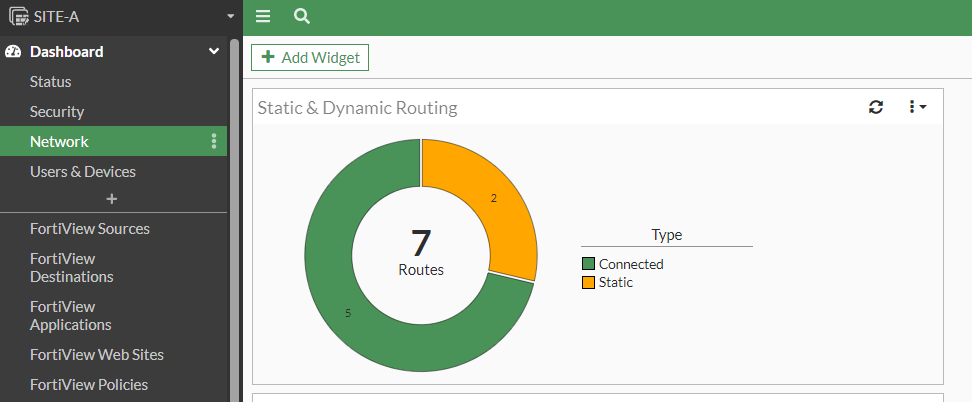
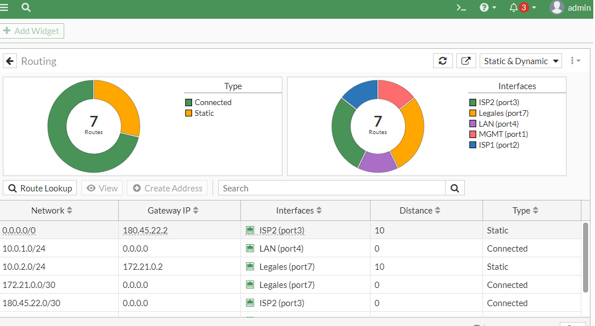

# Monitoreo de Rutas
Policy base rute
Rutas producidas por protocolos de enrutamiento dinamico

El monitoreo a trvés de la web es accediendo a Dashboard->Network->doble click en static & Dynamic Routing

Aquí se puede hacer revisión 






A través del CLI
```

SITE-A # get router info routing-table??
details      show routing table details information
all          show all routing table entries
rip          show rip routing table
ospf         show ospf routing table
bgp          show bgp routing table
isis         show isis routing table
static       show static routing table
connected    show connected routing table
database     show routing information base
```
Con este comando nos lista los puertos conectados 
SITE-A # get router info routing-table connected 
```
Routing table for VRF=0
C       10.0.1.0/24 is directly connected, port4
C       172.21.0.0/30 is directly connected, port7
C       180.45.22.0/30 is directly connected, port3
C       192.168.1.0/24 is directly connected, port1
C       200.212.31.0/30 is directly connected, port2
```
Aquí solo vemos las estaticas
```
SITE-A # get router info routing-table static
Routing table for VRF=0
S*      0.0.0.0/0 [10/0] via 180.45.22.2, port3
S       10.0.2.0/24 [10/0] via 172.21.0.2, port7
```
Nos muestra casi todos excepto el puerto 3 que a pesar de estar conectado no lo muestra por el salto.

```
Con este comando no nos esta mostrado el puerto a pesar de estar conectado no esta siendo utilizada para la transferencia de datos.
SITE-A # get router info routing-table all
Codes: K - kernel, C - connected, S - static, R - RIP, B - BGP
       O - OSPF, IA - OSPF inter area
       N1 - OSPF NSSA external type 1, N2 - OSPF NSSA external type 2
       E1 - OSPF external type 1, E2 - OSPF external type 2
       i - IS-IS, L1 - IS-IS level-1, L2 - IS-IS level-2, ia - IS-IS inter area
       * - candidate default

Routing table for VRF=0
S*      0.0.0.0/0 [10/0] via 180.45.22.2, port3
C       10.0.1.0/24 is directly connected, port4
S       10.0.2.0/24 [10/0] via 172.21.0.2, port7
C       172.21.0.0/30 is directly connected, port7
C       180.45.22.0/30 is directly connected, port3
C       192.168.1.0/24 is directly connected, port1
C       200.212.31.0/30 is directly connected, port2
```
Con este comando si nos muestra el puerto 3 a pesar de que la transferencia de datos aparece como 0.0.0.0/0 que indica que esta activa pero sin uso para la transferencia de datos.
```
SITE-A # get router info routing-table database 
Codes: K - kernel, C - connected, S - static, R - RIP, B - BGP
       O - OSPF, IA - OSPF inter area
       N1 - OSPF NSSA external type 1, N2 - OSPF NSSA external type 2
       E1 - OSPF external type 1, E2 - OSPF external type 2
       i - IS-IS, L1 - IS-IS level-1, L2 - IS-IS level-2, ia - IS-IS inter area
       > - selected route, * - FIB route, p - stale info

Routing table for VRF=0
S    *> 0.0.0.0/0 [10/0] via 180.45.22.2, port3
S       0.0.0.0/0 [15/0] via 200.212.31.2, port2
C    *> 10.0.1.0/24 is directly connected, port4
S    *> 10.0.2.0/24 [10/0] via 172.21.0.2, port7
C    *> 172.21.0.0/30 is directly connected, port7
C    *> 180.45.22.0/30 is directly connected, port3
C    *> 192.168.1.0/24 is directly connected, port1
C    *> 200.212.31.0/30 is directly connected, port2
```
Porque si el puerto estuviera realmente inactivo en la parte de adelante como este ejemplo el puerto 2 esta inactivo debido a que lo puse como estatus disable.
*> la falta de flechita indica que esta inactivo por la falta de transferencia de datos, no porqué esté desactivado.

```
SITE-A # get router info routing-table database
Codes: K - kernel, C - connected, S - static, R - RIP, B - BGP
       O - OSPF, IA - OSPF inter area
       N1 - OSPF NSSA external type 1, N2 - OSPF NSSA external type 2
       E1 - OSPF external type 1, E2 - OSPF external type 2
       i - IS-IS, L1 - IS-IS level-1, L2 - IS-IS level-2, ia - IS-IS inter area
       > - selected route, * - FIB route, p - stale info

Routing table for VRF=0
S    *> 0.0.0.0/0 [10/0] via 180.45.22.2, port3
S       0.0.0.0/0 [15/0] via 200.212.31.2, port2 inactive
C    *> 10.0.1.0/24 is directly connected, port4
S    *> 10.0.2.0/24 [10/0] via 172.21.0.2, port7
C    *> 172.21.0.0/30 is directly connected, port7
C    *> 180.45.22.0/30 is directly connected, port3
C    *> 192.168.1.0/24 is directly connected, port1
```
Ahora para ver la policy route es con el siguinete comando

```
SITE-B # diagnose firewall proute list
list route policy info(vf=root):

id=1 dscp_tag=0xff 0xff flags=0x0 tos=0x00 tos_mask=0x00 protocol=6 sport=0-65535 iif=6 dport=80 path(1) oif=4(port2) gwy=69.89.123.2 
source wildcard(1): 10.0.2.10/255.255.255.255 
destination wildcard(1): 10.0.1.10/255.255.255.255 
hit_count=0 last_used=2022-10-19 15:19:15
```