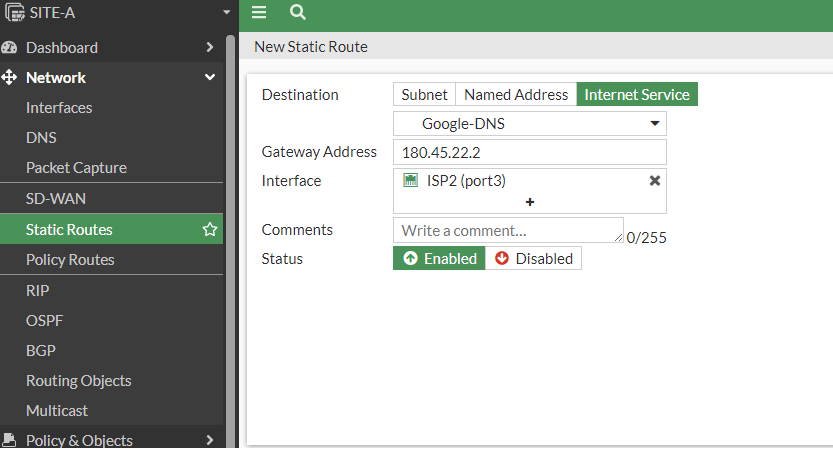

# Routing para servicios de Internet

Es solo teoríco debido a que por el tipo de licencia no se puede realizar.(revisar curso)

Ir a Network->Static Route
En este ejemplo creamos una ruta estatica para salir a través del puerto 3 y hacer una consulta a los servidores DNS de google.

