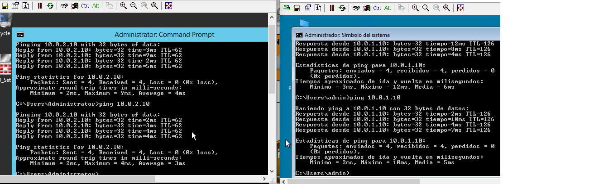

# Configurar Rutas estáticas

En este ejemplo se van a conectar los dos routers simulado que el Site-A es LEgales con la IP 172.21.0.1/30 y el Site-B 
y hacer un ping de la computadora win7 (site A) al dominio windows server(Site A)

Primero vamos a ir a configurar en el Site B en Network->Static Route->Create New
Se coloca en Destino la IP (10.0.1.0/24) debido a que pertenece al grupo del puerto 4 y como Gateway (172.21.0.1) porque pertenece al grupo de IP de conexión del puerto 7 de FG de Legales.

Y haremos lo mismo en el Site A
Se coloca en Destino la IP (10.0.2.0/24) debido a que pertenece al grupo del puerto 4 y como Gateway (172.21.0.2) porque pertenece al grupo de IP de conexión del puerto 7 de FG de Legales.

Después necesitamos crear una politica, nos vamos a Policy & Objects->Firewall Policy->Create New, ya que el que teniamos no sirve para la conexión entre routers, servía para la salida a internet.

Primero lo vamos hacer en el Site-B, que la nueva política se llamará TO_LEGALES, se desactiva el NAT debido a que será una conexión device to device y salida a internet.

En este caso solo es de IDA, necesitamos uno de Reversa

Y para eso vamos a dar botón derecho encima de TO_LEGALES y Seleccionar la opción que dice REVERSE o hacerlo de forma manual, y nos queda así,

Lo mismo se hace para el Site-A y podremos hacer ping en ambas computadoras y obtener comunicación entre ellas

Todo funciona bien hasta ahí, pero podemos hacerle unas modificaciones por ejemplo vamos a crear un Address en ambos FG.

Policy & Objects->Adresses->Create New
Esto es muy útil si esta subnet la utilizamos en otros lugares y solo mandarlo a llamar sin necesidad de estar escribiendo esto manualmente.

Ahora vamos a rutas estaticas y lo agregamos el objeto de contabilidad

Y ahora nos vamos a las politicas de TO/FROM(CONTABILIDAD/LEGALES)
en la opción TO_LEGALES / TO_CONTABILIDAD VA en Destination
Policy & Objects->Firewall Policy y en la opción de destination cambiar all por CONTABILIDAD

en la opción FROM_LEGALES / TO_CONTABILIDAD VA en Source
Policy & Objects->Firewall Policy y en la opción de source cambiar all por CONTABILIDAD

Ahora vamos a crear un objeto address llamado RED LOCAL
Apuntando a su propia RED de acuerdo al FG, en este caso es el SITE B y la IP es 10.0.2.0/24 en el SITE A sería la IP 10.0.1.0/24
 

Y volvemos a Firewall Policy y cambiamos el Source y Destination

Después de realizar el cambio probamos haciendo ping y funciona correctamente.

## Policy Routes
Ahora vamos a realizar las politicas de Enrutamiento, esto no sustituye a las rutas estaticas es un complemento en este caso vamos hacer uso de las rutas estaticas añadidas anteriormente

Aquí podemos indicar son filtros del tipo de tráfico que llega al FG y a que destino queremos enviarlo especificando el protocolo y el puerto.

Network->Policy Routes

En el siguiente ejemplo vamos a mandar datos ICMP a través del puerto 7 con la IP 172.1.0.0/30 y cuando envíe y reciba información http será a través de los puertos de internet Puerto 3 y 4

Esto nos indica esta policy, cuando por el puerto 4 el equipo con la IP 10.0.2.10 quiera mandar info al equipo con la IP 10.0.1.10 contra el puerto TCP 80 haga un forward trafic por el puerto 2 que es el ISP1 con el gateway 60.893123.2 

Entonces cuando quiera ir la pc win7 al pc dominio de servicio no lo haga por la ruta estatica con la ip 172.1.0.0/30 sino que lo haga a través del ISP1
