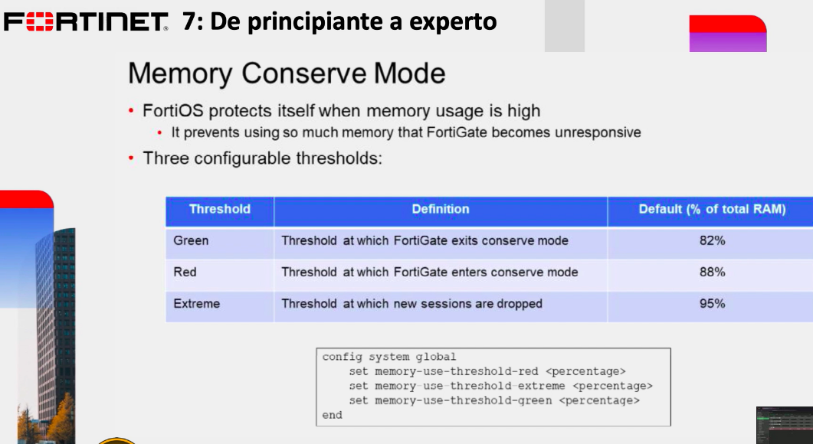

# Comandos para diagnostico




```
Como vemos en este ejemplo el mode de conservación de memoria está desactivado

SITE-A # diagnose hardware sysinfo conserve 
memory conserve mode:                        off
total RAM:                                          997 MB
memory used:                                        749 MB   75% of total RAM
memory freeable:                                    141 MB   14% of total RAM
memory used + freeable threshold extreme:           947 MB   95% of total RAM
memory used threshold red:                          877 MB   88% of total RAM
memory used threshold green: 
```
```
si la interface de red tuviera un error lo vemos en
RX erro, tx error, collision 

SITE-A # diagnose hardware deviceinfo nic port1
Name:            port1
Driver:          e1000
Version:         7.3.21-k8-NAPI
Bus:             0000:00:03.0
Hwaddr:          0c:f1:5f:60:00:00
Permanent Hwaddr:0c:f1:5f:60:00:00
State:           up
Link:            up
Mtu:             1500
Supported:       auto 10half 10full 100half 100full 1000full
Advertised:      auto 10half 10full 100half 100full 1000full
Speed:           1000full
Auto:            enabled
RX Ring:                 256
TX Ring:                 256
Rx packets:              110049
Rx bytes:                17643101
Rx compressed:           0
Rx dropped:              0
Rx errors:               102307
  Rx Length err:         102307
  Rx Buf overflow:       0
  Rx Crc err:            0
  Rx Frame err:          0
  Rx Fifo overrun:       0
  Rx Missed packets:     0
Tx packets:              15008
Tx bytes:                5428703
Tx compressed:           0
Tx dropped:              0
Tx errors:               0
  Tx Aborted err:        0
  Tx Carrier err:        0
  Tx Fifo overrun:       0
  Tx Heartbeat err:      0
  Tx Window err:         0
Multicasts:              0
Collisions: 
```
```
SITE-A #diagnose sys top
Run Time:  1 days, 0 hours and 35 minutes
0U, 0N, 1S, 93I, 1WA, 4HI, 0SI, 1ST; 997T, 105F
       ipshelper     7898      S <     0.7     3.6    0
          lnkmtd     7923      S       0.5     1.2    0
            node     7887      S       0.3     6.2    0
       forticron     7895      S       0.3     3.7    0
          httpsd    11447      S       0.1     1.7    0
          fcnacd     7903      S       0.1     1.1    0
  merged_daemons     7891      R       0.1     0.8    0
         cmdbsvr      117      S       0.0     3.7    0
         src-vis     7917      S       0.0     2.8    0
          cw_acd     7947      S       0.0     2.4    0
         reportd     7906      S       0.0     2.3    0
         miglogd     7905      S       0.0     2.1    0
          httpsd     7886      S       0.0     2.1    0
          newcli    11419      S       0.0     2.0    0
           fgfmd     7946      S       0.0     1.9    0
       forticldd     7896      S       0.0     1.8    0
        dnsproxy     7938      S       0.0     1.7    0
         miglogd     7964      S       0.0     1.6    0
 initXXXXXXXXXXX        1      S       0.0     1.6    0
           authd     7897      S       0.0     1.4    0

Para matar un proceso que nos este causando error hacemos
SITE-A #diagnose kill 11 + PID (7897)

```
```
#############################
          IPSEC
#############################

diagnose debug disable
diagnose vpn ike log filter clear
diagnose vpn ike log filter name <phase1-name>
diagnose debug application ike -1
diagnose debug enable

diagnose debug reset
diagnose debug disable

#############################
      Traffic Flow
#############################

diagnose debug disable 
diagnose debug flow trace stop 
diagnose debug flow filter clear 
diagnose debug reset 

diagnose debug flow filter saddr 10.0.1.10
diagnose debug flow filter daddr 8.8.8.8
diagnose debug flow show function-name enable
diagnose debug console timestamp enable
diagnose debug flow trace start 999
diagnose debug enable
```

Nueva funcionalidad CLI
```
Auditar todas las acciones que se ejecutan en la CLI
config sys global
get | group cli
set cli-audit-log enable
end
```