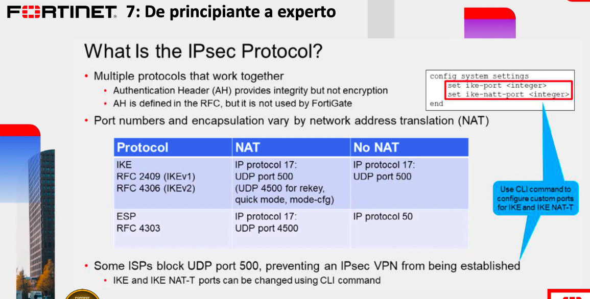
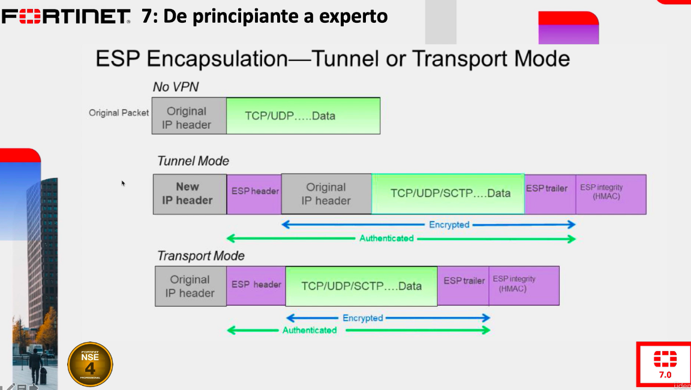
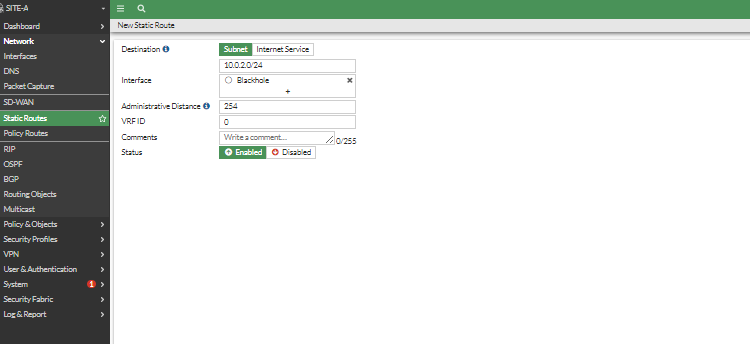

# IPSec (vpn)








```
VPN -> Ipsec Wizard->Custom

Name:vSITEb 

Romete Gateway:Static Ip
IP Address:60.89.123.1
Interface: ISP1
NAT:Disable(en este ejemplo no se útiliza)
Dead Peer Detection: on Demand
Forward error conection: no check

Authentication:
Method:Pre-shared  key: password
version:1
mode:Main(ID protection)

Phase 1
Encryption:DES Authentication:check deffe-heltman group(2)
Lifetime:86400

Phase 2 selectors:
name:v2SITEb
Local Address:10.0.1.0/24
Remote Addres:10.0.2.0/24
Phase Proposal:
Encryption:DES Authentication:MD5
Enable Replay Detection: check

Enable Perfect Foeward Secrecey (PFS):
Deffe-Heltman Group: (2)
Local port: all
Remote Port: all
Protocol:all
Auto-negotiation: check
Lifetime:43200

Guardar

También configuramos el FGB
Name:vSITEa 

Romete Gateway:Static Ip
IP Address:200.2112.31.1

Phase 2 selectors:
name:v2SITEb
Local Address:10.0.2.0/24
Remote Addres:10.0.1.0/24
```


Después de eso se tiene que crear una ruta estatica
```
Network->Statics Routes

```


```
TIP:No es obligatorio pero Es muy recomendable usar, Static Routes:

Network->Static Routes 
Subjet
IP:10.0.2.0/24
Interface:Blackhole
Administrative distance:254 
Click en ok
```




Necesitamos agregar una policy con reversa en ambos FG


##Failover entre 2 tunels

Se hace lo mismo pero ahora con el otro puerto de enlace.